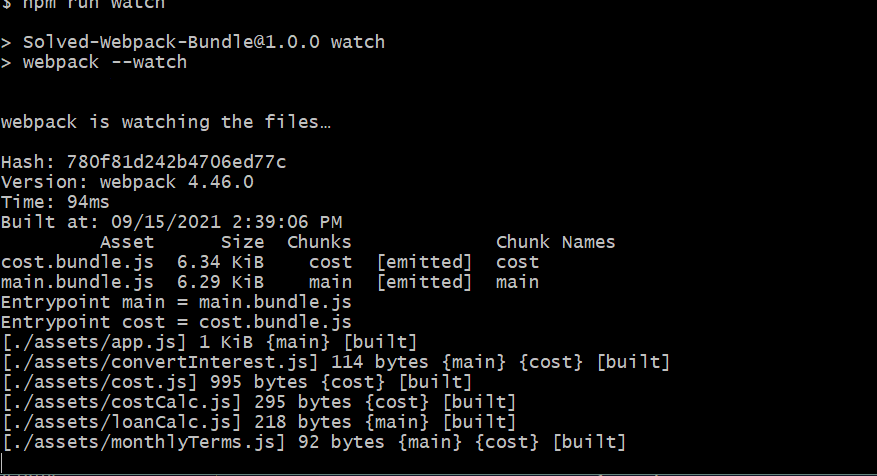

# 🐛 The Bundle Command Fails

Work with a partner to resolve the following issue(s):

* As a developer, I should be able to create a bundle from the command line.

## Expected Behavior

When a developer executes the build command from the command line, a bundle is created in the `dist/` folder.

## Actual Behavior

When a developer executes the build command, an error message is displayed in the terminal.

## Steps to Reproduce the Problem

1. Execute the command `npm install`, to download the web app's dependencies.

2. Execute the command, `npm run build`, from the command line to create a bundle.

3. Instead of a success message that states a bundle is created, an error message indicates the bundle process failed.

## Assets

The following image confirms that a bundle was created by displaying a success message in the terminal:

---

## 💡 Hints

How are the bundles being generated?

## 🏆 Bonus

If you have completed this activity, work through the following challenge with your partner to further your knowledge:

* What does chunking do for us?

Use [Google](https://www.google.com) or another search engine to research this.

---
© 2021 Trilogy Education Services, LLC, a 2U, Inc. brand. Confidential and Proprietary. All Rights Reserved.
