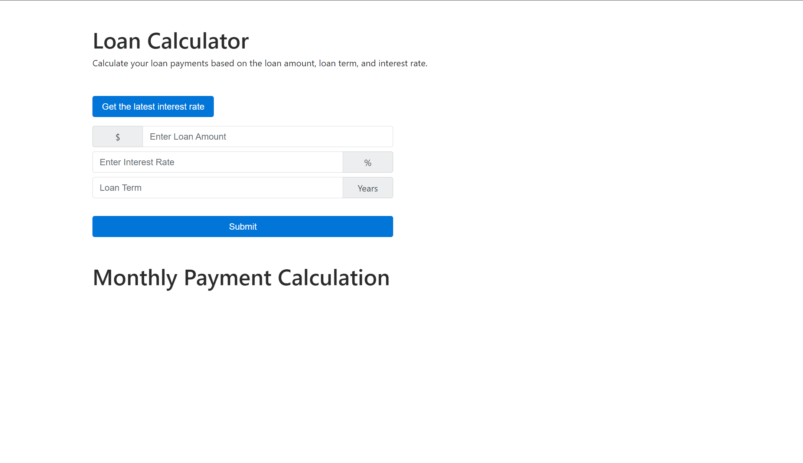

# 🐛 Get the Latest Interest Button Does Not Work

Work with a partner to resolve the following issue(s):

* As a developer, I want to be able to use Async / Await with webpack.

* As a user, I want to be able to get the latest interest rate when I click the appropriate button.

## Expected Behavior

When I click the `Get the latest interest rate` button, an up to date interest rate should appear.

## Actual Behavior

When a user clicks the `Get the latest interest rate` button, an error appears in the console.

## Steps to Reproduce the Problem

1. Execute the command `npm install`, to download the web app's dependencies.

2. Execute the command, `npm run watch`, from the command line to create a bundle.

3. Open up the `index.html` file with live server.

4. Click on the `Get the latest interest rate` button and check the console in Chrome DevTools.

## Assets

The following image confirms that a bundle was created by displaying a success message in the terminal:

---

## 💡 Hints

Which plugins do we need for Async / Await to work in our browser?

## 🏆 Bonus

If you have completed this activity, work through the following challenge with your partner to further your knowledge:

* What Babel plugin would allow object rest and spread operators to be used?

Use [Google](https://www.google.com) or another search engine to research this.

---
© 2021 Trilogy Education Services, LLC, a 2U, Inc. brand. Confidential and Proprietary. All Rights Reserved.
