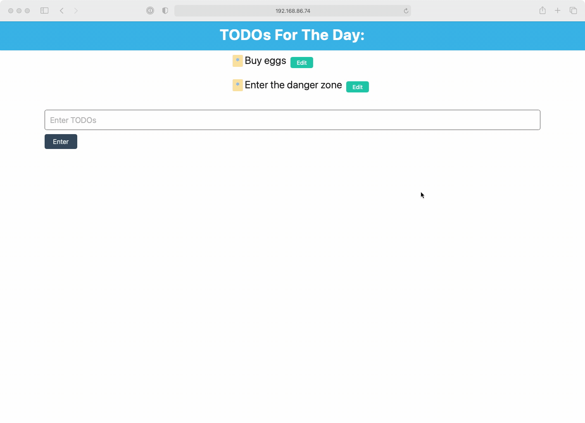

# 🐛 The Delete Button Does Not Remove The Card When Clicked

Work with a partner to resolve the following issue(s):

* As a user, I want to be able to delete on click and edit a list item when I click on the list item.

## Expected Behavior

When a user clicks the delete button, the contact card will be removed from the page.

## Actual Behavior

When a user clicks the delete button, the To Do list item  remains on the page and an error is thrown in the console.

## Steps to Reproduce the Problem

1. In the command line, navigate to `26-Stu_IndexedDB-CRUD/Unsolved`.

2. Run `npm install`.

3. To launch the application, run `npm run dev`.

4. Navigate to `http://localhost:8080` in your browser.

5. Create a new To Do item at the bottom of the page.

6. Click on a list item which should remove the list item.

7. Click on the edit button and we should be able to edit the list item.

## Assets

The following image demonstrates the web application's appearance and functionality:

---

## 💡 Hints

What types of permissions do you need when altering data inside of a database? 

## 🏆 Bonus

If you have completed this activity, work through the following challenge with your partner to further your knowledge:

* How dooes the usage of CRUD operations with IndexedDB compare with their usage with SQL databases? 

Use [Google](https://www.google.com) or another search engine to research this.

---
© 2021 Trilogy Education Services, LLC, a 2U, Inc. brand. Confidential and Proprietary. All Rights Reserved.