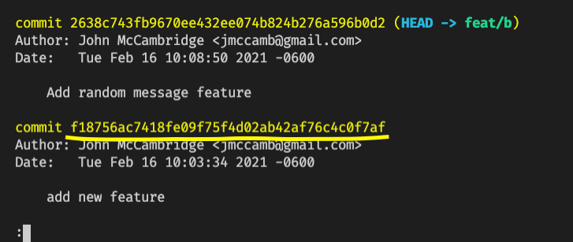

## Git Cherry-Pick

As developers, you will find that some of the code that you are working on may have already been fixed or completed in another commit by another developer. However, if that code hasn't been merged yet, it can put you as the developer in a tricky situation. How does one get the code that another developer made into their own branch without merging their entire branch. Enter, git cherry-pick.

Git cherry-pick allows you to pull in one or multiple commits into your branch if you desire. It might be kind of hard to imagine a situation that this would be useful so we are going to walk through one example together!

* For reference, check out the [Documentation on Git cherry-pick](https://git-scm.com/docs/git-cherry-pick)

## Create an Example Repo

1. Inside this directory, or another directory of your choosing, create a new folder called `git-cherry-pick`. Change into that directory and initialize it as a git repository.

```sh
mkdir git-cherry-pick
cd git-cherry-pick
git init
```

2. After we have created our repo, let's add some files to it. Create `app.js`, `index.html` and `README.md` files. After that, let's commit everything as our initial commit.

```sh
touch app.js index.html README.md
git add .
git commit -m "Initial commit"
```

3. Create a new branch that will be a placeholder for a branch that your coworker or teammate made. Let's name this branch as if the our teammate is working on a new feature. Give it a name of `feature/notifications`.

```
git checkout -b feature/notifications
```

4. Now that our co-worker has a branch of their own, lets add some code to make our app functional. Inside the `index.html`, copy and paste the snippet below and save the `index.html`. Make sure you link your app.js file inside of your HTML file as well.

```html
<html lang="en">
  <head>
    <meta charset="UTF-8" />
    <meta http-equiv="X-UA-Compatible" content="IE=edge" />
    <meta name="viewport" content="width=device-width, initial-scale=1.0" />
    <title>Git Cherry-Pick!</title>
  </head>
  <body>
    <script src="app.js"></script>
    <code>Git Cherry-Pick 🍒</code>
  </body>
</html>
```

5. Inside our `app.js` file, lets add some changes to turn our alert into something a little more complex. Copy and paste the code into your `app.js` file. Every time the `index.html` page has been visited, we should be greeted with a random message in an alert window.

```js
const randomMessage = (notifications) =>
  notifications[Math.floor(Math.random() * notifications.length)];

const notifications = [
  {
    person: 'Mac',
    message: 'Hello! This is git-cherry pick!',
  },
  {
    person: 'Deandre',
    message: 'Hello, I hope to be a comedian one day',
  },
  {
    person: 'Charlie',
    message: 'Hello, I am the king of the rats',
  },
];

const { person, message } = randomMessage(notifications);
alert(`${person} says: ${message}`);
```

6. Now let's imagine that our co-worker or teammate made a commit at this point to cement their new feature in stone.

```sh
git add .
git commit -m "Adds random message feature"
```

7. Let's say that our co-worker decided to scrap that feature entirely and change it to a simple hello world message instead. Let's make a commit that would emulate that change. Highlight everything inside `app.js` and delete it. Change it to simply say `console.log('hello world')`.

```js
console.log('hello world!')
```

8. Make a commit for this change as if you were the co-worker:

```sh
git add .
git commit -m "Remove random message feature"
```

9. Let's take note of our commit that added the feature so that we can reference it later. To do this run:

```sh
git log
```

You will see a list of recent commits. We want the one where the feature was added. Highlight the hash for that commit and paste it somewhere for later.



To exit the git log, press and hold shift and `ZZ` or by typing `:q`.

* To review, we create a repository and a feature branch, `feature/notifications`, that we imagined could be one of our co-workers or teammates. We added a feature to `app.js` and committed that change to the `feature/notifications` branch and then later removed that feature and committed to `feature/notifications`.

* Now, let's imagine that we want to use that feature in our own branch, but in such a way that doesn't bring in all the changes from that `feature/notifications` branch. Now we get to use the wonderful `git cherry-pick` command!

## Using Git Cherry Pick

Let's bring in a specific commit to our own feature branch!

1. Check out the previous branch and create your own `feature/mybranch` branch. *Tip*: You can checkout the previous branch by simply putting a dash in place of the branch name

```sh
git checkout -
git checkout -b feature/mybranch
```

2. Now that we are checked out to our own feature branch, let's cherry pick the commit from branch `feature/notifications` and pull it into our branch. To do this we are finally going to make use of the `git cherry-pick` command. **Note**: You can paste the whole hash string, or provide just the first seven characters. (For example: `f18756ac7418fe09f75f4d02ab42af76c4c0f7af` or `f18756a`)

```sh
git cherry-pick <hash>
```

Thats about it! If you run `git --log` again you can see that the commit has been applied to your `feature/mybranch` branch with a new hash.

It is possible to stage the changes and not commit right away if you so choose. This can be accomplished with the `-n` flag. An example use case for this would be when you want to edit something before committing the cherry pick.

```sh
git cherry-pick f18756a -n
```

## Conclusion

Today we created a small repo and pretended that we were collaborating with a coworker or teammate. We used git `cherry-pick` to bring in a single commit to our branch without needing to pull in the entire branch. This is a super useful feature of git and it just one more tool to add to your git toolbox!
