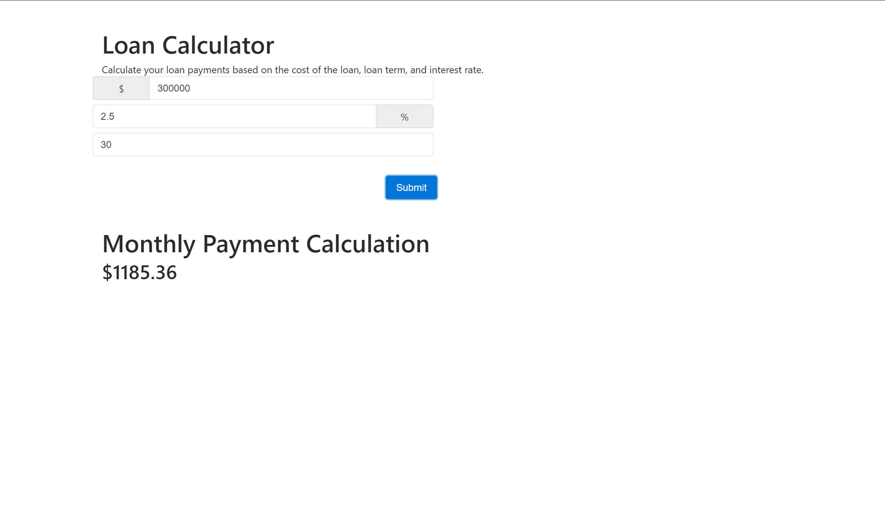

# 🏗️ Generate an HTML file to serve Webpack Bundles

Work with a partner to implement the following user story:

* As a developer, I want to generate HTML files that contain references to the webpack bundles.

## Acceptance Criteria

* It's done when I have successfully installed the `HtmlWebpackPlugin` to generate an HTML file.

* It's done when the generated HTML file follows the template, `index.html`.

* It's done when the generated HTML file has a generated page title.

* It's done when I can generate an HTML file that contains the references to the webpack bundle.

## Assets

The following image demonstrates the web application's appearance and functionality:

---

## 💡 Hints

How do we ensure the format of the HTML file that's generated follows with our template, `index.html`?

## 🏆 Bonus

If you have completed this activity, work through the following challenge with your partner to further your knowledge:

* Why do we have to use the `new` syntax with webpack plugins?

Use [Google](https://www.google.com) or another search engine to research this.

---
© 2021 Trilogy Education Services, LLC, a 2U, Inc. brand. Confidential and Proprietary. All Rights Reserved.