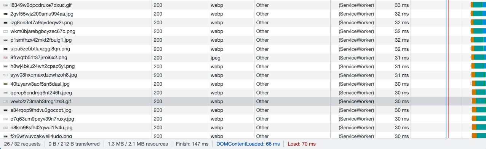

# 🐛 Images Are Not Being Cached Properly

Work with a partner to resolve the following issue:

* As a developer, I want to be able to rely on the browser to cache images so that I can create a faster application for the end user.

## Expected Behavior

The browser should load images almost instantly from the cache and not need to download fresh images from the server. You can verify that the cache is working properly by opening the developer console, clicking the application tab, and looking for a cache name of `my-image-cache`. Additionally, on subsequent visits to the application, the service worker will respond with a 200 response to network requests for images.

## Actual Behavior

When a user visits the page even after the first time, the browser is still making network requests to the server to retrieve the images.

## Steps to Reproduce the Problem

To reproduce the problem, follow these steps:

1. Start the dev server by running `npm run dev`.

2. Open a new browser tab and navigate to the page at `http://localhost:3000/`.

3. Open the developer tools in your browser, click on the network tab, and notice that there are multiple requests to the server for the images that were not cached.

## Assets

The following image demonstrates the properly functioning network requests to the cache:

---

## 💡 Hints

What is a cache miss, and how can we use the advanced recipe to resolve this issue?

## 🏆 Bonus

If you have completed this activity, work through the following challenge with your partner to further your knowledge:

* What is the Cache Storage API? How do we use it?

Use [Google](https://www.google.com) or another search engine to research this.

---
© 2021 Trilogy Education Services, LLC, a 2U, Inc. brand. Confidential and Proprietary. All Rights Reserved.
