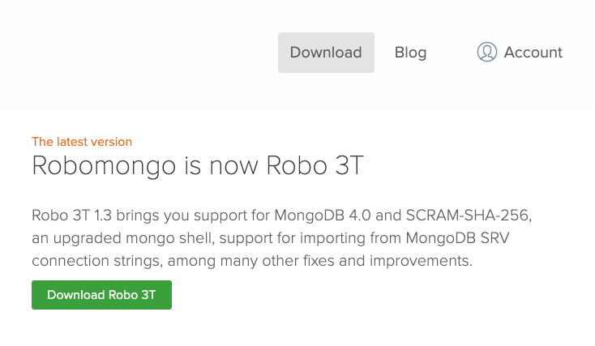
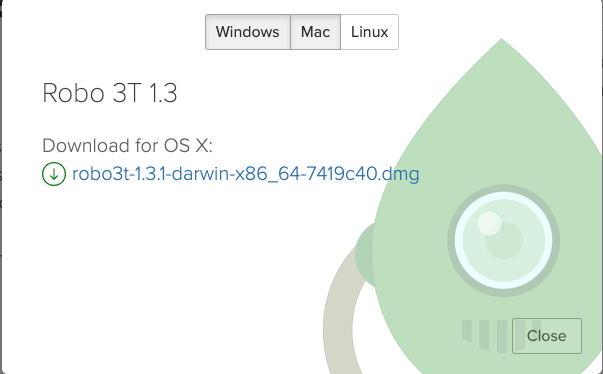
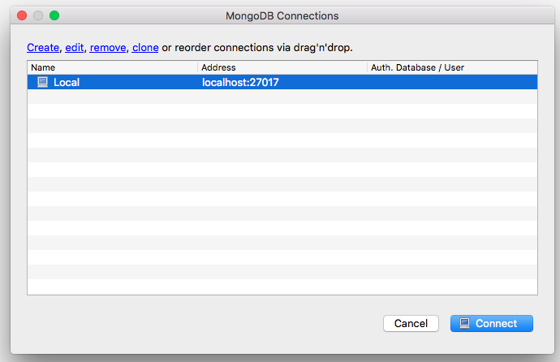

# 09.3 Full-Time Lesson Plan: Technical Interview and MongoDB

## Overview

In today's class, you will prepare students for technical interviews through the Unit 17 mini-project. Then we will start a new unit on NoSQL databases. You will introduce the concept of the NoSQL database with MongoDB, go over its pros and cons compared with MySQL, and ultimately detail all of the required steps to employ MongoDB in future projects. 

## Instructor Notes

* In this lesson, students will complete activities `28-Stu_Mini-Project` in Unit 17 through `08-Stu_Robo-3T` in Unit 18.

* Be sure to review the activities before class and try to anticipate any questions that students might have.

* The Unit 17 mini-project will not be in a typical group project setting, but rather in smaller groups of 2&ndash3 students. Students will simulate a technical interview, with one student assuming the role of the interviewer and the other assuming the role of the candidate. If students struggle to adjust to the new format, emphasize that practicing interviews will help them clarify and organize their thoughts so that they are more prepared for a real interview. They should also revisit this on their own time because additional practice will make them more prepared and comfortable with the process. Try to share a personal anecdote of the interview process if possible.

* Be sure students have MongoDB installed! Direct students to the [MongoDB installation guide on The Full-Stack Blog](https://coding-boot-camp.github.io/full-stack/mongodb/how-to-install-mongodb) if they haven't installed it already. If needed, use the FLEX time to help students with the install.

* If you haven't used MongoDB much in the past, take a look at this week's queries and solutions. This should prime you for the lecture.

* Remind students to do a `git pull` of the class repo to have today's activities ready and open in VS Code. 

* If you are comfortable doing so, live-code the solutions to the activities. If not, just use the solutions provided and follow the prompts and talking points for review.

* Let students know that the Bonus at the end of each activity is not meant to be extra coding practice, but instead is a self-study on topics beyond the scope of this unit for those who want to further their knowledge.

## Learning Objectives

* Articulate and implement sorting algorithms in a technical interview setting.

* Identify and explain the differences between SQL and noSQL databases.

* Create a MongoDB database.

* Perform basic CRUD actions on their Mongo database.

## Slide Deck

* [Unit 18 Slide Deck](https://docs.google.com/presentation/d/1JHT8-zZ-JWHg_zKDXEVy-leNegSipr26HBTNIEl3J3Y/edit?usp=sharing)

## Time Tracker

| Start  | #   | Activity Name                         | Duration |
|---     |---  |---                                    |---       |
| 10:00AM| 1   | Instructor Demo: Mini Project         | 0:05     |
| 10:05AM| 2   | Student Do: Mini Project              | 0:60     |
| 11:05AM| 3   | Instructor Review: Mini Project       | 0:10     |
| 11:15AM| 4   | Introduce Homework                    | 0:05     |
| 11:20AM| 5   | FLEX                                  | 0:30     |
| 11:50PM| 6   | Instructor Do: Stoke Curiosity        | 0:10     |
| 12:00PM| 7   | BREAK                                 | 0:30     |
| 12:30PM| 8   | Instructor Demo: Create Insert Find   | 0:05     |
| 12:35PM| 9   | Student Do: Create Insert Find        | 0:15     |
| 12:50PM| 10  | Instructor Review: Create Insert Find | 0:10     |
| 1:00PM | 11  | Instructor Demo: Update Delete Drop   | 0:05     |
| 1:05PM | 12  | Student Do: Update Delete Drop        | 0:15     |
| 1:20PM | 13  | Instructor Review: Update Delete Drop | 0:10     |
| 1:30PM | 14  | Instructor Demo: Sorting in Mongo     | 0:05     |
| 1:35PM | 15  | Student Do: MongoJS Sorting           | 0:15     |
| 1:50PM | 16  | Instructor Review: MongoJS Sorting    | 0:10     |
| 2:00PM | 17  | Student Do: Mongo CRUD                | 0:05     |
| 2:05PM | 18  | Instructor Review: Mongo CRUD         | 0:15     |
| 2:20PM | 19  | Student Do: Robo 3T                   | 0:10     |
| 2:30PM | 20  | END                                   | 0:00     |

---

## Class Instruction

### 1. Instructor Demo: Mini Project (5 min) 

* Welcome students to class.

* Open `28-Stu_Mini-Project/README.md` in your IDE and explain the following:

  * 🔑 Technical interviews are intimidating for even the most experienced developers, so it's good to practice either with others or on your own to build confidence.

  * 🔑 The questions asked during an interview are sometimes purposefully ambiguous and will require the candidate to follow up with some questions or assumptions. This gives the interviewer an idea of how the candidate approaches problems, even if they do not know the solution.

* Ask the class the following questions (☝️) and call on students for the answers (🙋):

  * ☝️ What happens if we don't know the answer to a question asked?

  * 🙋 During an interview, be honest about it and talk your way through it anyway, asking questions as needed. In this environment, work together to come to a solution.

* Answer any questions before inviting students to start the mini-project.

### 2. Student Do: Mini Project (60 min)

* Direct students to the activity instructions found in `28-Stu_Mini-Project/README.md`.

* Break your students into groups that will work together on this activity.

  ```md
  # Mini-Project: Technical Interview Practice (Sorting Algorithms)

  In this mini-project, you and a partner will simulate a technical interview by taking turns as the interviewer and job candidate. 

  ## Roles

  * **The Interviewer**: The role of the interviewer is to pose the question, ensure the candidate understands what is expected of them as they work towards a solution, and respond to any questions the candidate has without giving away the answer. 

  * **The Candidate**: The role of the candidate is to ensure that the problem stated by the interviewer is clear by asking clarifying questions and stating assumptions, pseudocoding a solution, and then implementing it (if time allows).

  ## Instructions

  * Take turns playing each role and go through each interview question. 

  * Spend about 20 minutes on each, allowing time for research of the problem, pseudocoding the solution, implementing the solution, and discussing throughout for clarification.

  * The interviewer can use the prompts and solutions laid out for each question in the [Main](./Main) directory.

  * The candidate can use the prompts, notes, and workspace for each question in the [Develop](./Develop) directory.

  * During each question, allow the candidate to do some research on the question using Google to help outline a solution. The interviewer can spend that time reviewing the solution code and come up with prompts to support the candidate.

  * Take this seriously, but don't put too much pressure on yourself to get to an answer! The idea is to be conversational about these questions to help both of you come to a solution that you can understand and explain in an interview setting.
  ```

* While breaking everyone into groups, be sure to remind students and instructional staff that questions on Slack or otherwise are welcome and will be handled. It's a good way for your team to prioritize students who need extra help.

### 3. Instructor Review: Mini Project (10 min)  

* Ask the class the following questions (☝️) and call on students for the answers (🙋):

  * ☝️ How comfortable do you feel with this mini-project? (Poll via Fist to Five, Slack, or Zoom)

* Assure students that we will cover the solution to help solidify their understanding. If questions remain, remind them to use office hours to get extra help!

* Use the prompts and talking points (🔑) below to review the following key points:

  * ✔️ Sorting algorithms

  * ✔️ The role of the interviewer

  * ✔️ The role of the candidate

* Open `28-Stu_Mini-Project/Main/01_bubble-sort/bubble-sort.js` in your IDE and explain the following: 

  * 🔑 A bubble sort function can be implemented in a couple of ways. One way involves sorting the array one index at a time, the other will iterate the entire array multiple times and sort elements gradually until it doesn't need to sort anymore. The second way is slightly more efficient because we build in a base condition to end early if the array is sorted:

    ```js
    while (!sorted) {
      sorted = true;
      for (let i = 0; i < array.length; i++) {
        if (array[i] > array[i + 1]) {
          const tmp = array[i];

          array[i] = array[i + 1];

          array[i + 1] = tmp;

          sorted = false;
        }
      }
    }
    ```

  * 🔑 The interviewer will likely want the candidate to be able to articulate the differences between the two implementations and why one might be more efficient than the other.

  * 🔑 The candidate should be able to articulate the need for a temporary variable to hold an element being swapped and how a flag can be set to determine if the array has been sorted yet or not. 

* Open `28-Stu_Mini-Project/Main/02_quick-sort/quick-sort.js` in your IDE and explain the following: 

  * 🔑 A quick sort algorithm works by recursively splitting an array in two based on greater than or less than values compared to a pivot element until there are numerous arrays in order that can be concatenated back together and returned in a sorted fashion:

    ```js
    const quickSort = (array) => {
      if (array.length <= 1) {
        return array;
      }

      const pivot = array.splice(Math.floor(Math.random() * array.length), 1);

      const left = [];
      const right = [];

      array.forEach((el) => {
        if (el <= pivot) {
          left.push(el);
        } else {
          right.push(el);
        }
      });

      return quickSort(left).concat(pivot, quickSort(right));
    };
    ```

  * 🔑 The interviewer might ask this question to see if the candidate has a good understanding of recursion.

  * 🔑 The candidate should be able to visualize the recursive nature of this type of algorithm and be able to explain why the selection of a random pivot point works for this type of algorithm. 

* Open `28-Stu_Mini-Project/Main/03_merge-sort/merge-sort.js` in your IDE and explain the following: 

  * 🔑 A merge sort algorithm involves using recursion to continuously break apart an array until we're left with a series of single-element arrays:

    ```js
    const mergeSort = (array) => {
      if (array.length <= 1) {
        return array;
      }

      const middle = Math.floor(array.length / 2);

      const left = array.slice(0, middle);
      const right = array.slice(middle);

      return mergeArrays(mergeSort(left), mergeSort(right));
    };
    ```

  * All of these arrays are then compared to one another and used to build a new array that's sorted and eventually returned:

    ```js
    const mergeArrays = (leftArray, rightArray) => {
      const resultArray = [];

      let leftIndex = 0;
      let rightIndex = 0;

      while (leftIndex < leftArray.length && rightIndex < rightArray.length) {
        if (leftArray[leftIndex] < rightArray[rightIndex]) {
          resultArray.push(leftArray[leftIndex]);
          leftIndex++;
        } else {
          resultArray.push(rightArray[rightIndex]);
          rightIndex++;
        }
      }
    
      return resultArray
        .concat(leftArray.slice(leftIndex))
        .concat(rightArray.slice(rightIndex));
    };
    ```

  * 🔑 This is a difficult interview question, so the interviewer might ask this when they are confident in the previous answers a candidate has provided. Because it's a bit longer to implement in code, the interviewer will likely want to ensure that the candidate can accurately describe a solution in pseudocode first so that time isn't lost. 

  * 🔑 The candidate should be able to again visualize the recursive nature of this algorithm and explain that rather than trying to sort a large set of data, we break our data into smaller sets and iteratively sort them back together.

* Ask the class the following questions (☝️) and call on students for the answers (🙋):

  * ☝️ How can we prepare ourselves for questions like this during an interview?

  * 🙋 We can practice and not be discouraged if we can't always get to an answer!

  * ☝️ What can we do if we don't completely understand this?

  * 🙋 We can refer to supplemental material, undertake more interview practice among ourselves, and stay for office hours to ask for help.

* Answer any questions before proceeding to the next activity.

### 4. Instructor Demo: Introduce Homework (5 min)

* Open `02-Homework/README.md` in your browser and explain the following:

  * Sometimes the best way to learn or fully understand a topic is to challenge yourself with teaching it to others. Web developers often do this by writing tutorials and blog posts. 

  * In this homework, you will write a tutorial that explains the components that go into a specific regular expression, or regex.

  * You will have to do some research on regex in order to properly write your tutorial.

* Ask the class the following questions (☝️) and call on students for the answers (🙋):

  * ☝️ What are we learning?

  * 🙋 We are learning regex by writing a tutorial about it.

  * ☝️ How does this project build off or extend previously learned material?

  * 🙋 The more knowledge we have about certain tools and algorithms, the more effective we will be as developers.

  * ☝️ How does this project relate to your career goals?

  * 🙋 Regex is a powerful tool that we can implement, just like an algorithm. Knowledge about it will make us more confident in our skills both on the job and during a technical interview.

* Ask TAs to direct students to the Homework Requirements found in `02-Homework/README.md`.

### 5. FLEX (30 min)

* This time can be utilized for reviewing key topics learned so far in Unit 17 or getting started on the homework.

* If there are students who haven't installed MongoDB on their machines yet, direct them to the [MongoDB installation guide on The Full-Stack Blog](https://coding-boot-camp.github.io/full-stack/mongodb/how-to-install-mongodb) and help with the installation as needed.

* Direct students to install Robo 3T, a native cross-platform MongoDB management tool that will make working with MongoDB easier and more intuitive.

  * Direct the students to the Robo 3T install page [https://robomongo.org/download](https://robomongo.org/download) and have them click the green download button.

  

  * Next have them choose their OS and download the application.

  
  
  * After installing students should be able to successfully open Robo 3T on their machine.

### 6. Instructor Do: Stoke Curiosity (10 min)

* Open the [slide deck](https://docs.google.com/presentation/d/1JHT8-zZ-JWHg_zKDXEVy-leNegSipr26HBTNIEl3J3Y/edit?usp=sharing) and follow these prompts with their corresponding slides:

  * **Introduction to MongoDB (Title)**: Today's class will be an introduction to MongoDB. 

  * **What's MongoDB?**: MongoDB is a very popular noSQL database that uses a document-oriented model as opposed to a table-based relational model (SQL). MongoDB stores data in BSON format (effectively, compressed JSONs).

  * **Relational Databases**: Relational databases rely heavily on joins to combine relevant data.

  * **Document Database (NoSQL)**: NoSQL databases on the other hand are effectively JSON objects and are very flexible. 
  
  * **MongoDB Storage**: Mongo databases contain collections which contain documents. 

  * **Mongo Terms**: Use this slide to cover the relevant Mongo terms.

* Answer any questions before proceeding.

### 7. BREAK (30 min)

### 8. Instructor Demo: Create Insert Find (5 min) 

* In order to get set up for the activity, direct the students to:
  
  * Run `mongod` in one tab, if they haven't already. Explain that `mongod` is the primary daemon process for the MongoDB system that handles data access and requests and background management operations. Tell them that when you start `mongod` you're telling your machine to start the MongoDB process and run it in the background.
  
  * Run `mongo` to start up the mongo shell in another tab. Explain that `mongo` is the command-line shell that connects to the specific instance of `mongod` that they just started.

* Next explain that you'll be going over how to create a database, insert data into a collection and find stored data using MongoDB.

* Following the comments and queries located in `01-Ins-Create-Insert-and-Find/README.md`, demonstrate to the class how to create a new database, insert and find new records.

* Switch to a new database:

  ```
  use lessondb
  ```

* Show the current db:

  ```
  db
  ```

* Insert data:

  ```js
  db.places.insert({"continent": "Africa", "country":"Morocco", "majorcities": ["Casablanca", "Fez", "Marrakech"]})
  ```

* As a class, come up with five more countries and insert them into the db using the same syntax as above.

  * Observe where the data was entered in the MongoDB instance (in mongod).

* Find all data in the collection:

  ```js
  db.places.find()
  ```

  * NOTE: the MongoDB `_id` was created automatically.

  * This id is specific for each doc in the collection:

* Add `.pretty()` to make your data more readable:

  ```
  db.places.find().pretty()
  ```

* Find specific data by matching a field:

  ```js
  db.places.find({"continent": "Africa"})
  db.places.find({"country": "Morocco"})
  ```

* Find specific data by matching an _id:

  ```js
  db.places.find({_id: ObjectId("5416fe1d94bcf86cd785439036")})`
  ```

* When you are done tell the class that this is just the beginning as they will be sharpening their mongo skills in the coming days and weeks.

* Ask the students the following question(s):

  * ☝️ What keyword do we use to switch to a new database?

  * 🙋 The `use` keyword.

  * ☝️ What keyword do we use to find data?

  * 🙋 The `find` keyword.

* Answer any questions before proceeding to the next activity.

* In preparation for the activity, ask TAs to start directing students to the activity instructions found in `02-Stu-Create-Insert-and-Find/README.md`.

### 9. Student Do: Create Insert Find (15 min) 

* Direct students to the activity instructions found in `02-Stu-Create-Insert-and-Find/README.md`.

* Break your students into pairs that will work together on this activity.

  ```md
  # Creating, Inserting and Finding in MongoDB

  ## Instructions

  * Use the command line to create a classroom database. 

  * Insert entries for yourself and the people in your row in a `students` collection.

  * Each document should have:

    * A field of `name` with the person's name.

    * A field of `rownumber` which will contain the row number that they are in.

    * A field of `os` which will contain the Operating System of the computer they are using: 'Mac', 'Win', etc

    * A field of `hobbies` with an array of the hobbies the person likes to do.

  * Use find commands to get:

    * A list of everyone in your row.

    * An entry for a single person.

    * The entries for all the Mac users in your row.

  ## 💡 Hint(s)

  * Use the [Mongo guides](https://docs.mongodb.com/guides/) if you are stuck.

  ## 🏆 Bonus 

  * If you finish early, check out the MongoDB documentation and figure out how to find users by an entry in an array.
  ```

* While breaking everyone into groups, be sure to remind students and the rest of the instructional staff that questions on Slack or otherwise are welcome and will be handled. It's a good way for your team to prioritize students who need extra help.

### 10. Instructor Review: Create Insert Find (10 min) 

* Open `02-Stu-Create-Insert-and-Find/Solved/README.md` in your IDE and run the following commands.

* Create a classroom db and insert a classmate**

  ```sql
  use classroom
  db.students.insert({name: 'Steve', row:3, os:'Mac', hobbies:['Coding', 'Reading', 'Running'] })
  ```

* Find all students in row 3**

  ```sql
  db.students.find({row:3})
  ```

* Find students named Steve**

  ```sql
  db.students.find({name:'Steve'})
  ```

* Find students in row 3 that use Mac's**

  ```sql
  db.students.find({row:3, os:'Mac'})
  ```

* BONUS: Find by entry in an array**

  ```sql
  db.students.find({"hobbies": {$in: ["Coding"]}})
  ```

* Ask the students the following question(s):

  * ☝️ How do we find a record inside an array?

  * 🙋 Review the syntax using `db.students.find({"hobbies": {$in: ["Coding"]}})` as an example.

* Answer any questions before proceeding to the next activity.

### 11. Instructor Demo: Update Delete Drop (5 min) 

* Use the prompts and talking points below to review the following key point(s):

  * ✔ We use `update` to update a value.

  * ✔ We use `$set` to replace the value of a field with the specified value.

  * ✔ We use `push` to update values in an array.

  * ✔ We use `remove` to delete items.

  * ✔ We use `drop` to drop a collection.

* Open `03-Ins-Update-Delete-and-Drop/README.md` in your IDE and lead students the following commands.

* Make sure you are using the database, `lessondb`,  that we created earlier.

  ```sql
  db
  use lessondb
  ```

**Update**

* Tell the class that we update data using `db.[COLLECTION_NAME].update()`

  ```sql
  db.places.update({"country": "Morocco"}, {$set: {"continent": "Antarctica"}})
  ```

* Note that the above will only update the first entry it matches.
  
* Explain that to update multiple entries we add `{multi: true}`.

  ```sql
  db.places.update({"country": "Morocco"}, {$set: {"continent": "Antarctica"}}, {multi: true})
  ```

* Recall from the earlier demo the structure of our document:

  ```sql
  db.places.insert({"continent": "Africa", "country": "Morocco", "majorCities": ["Casablanca", "Fez", "Marrakech"]})
  ```

* Ask the students the following question(s):

  * ☝️ What do you think will happen when I run the following command, even though there is not a `capital` field in the document?

    ```sql
    db.places.update({"country": "Morocco"}, {$set: {"capital": "Rabat"}})
    ```

  * 🙋 `$set` will create the field `capital`.

* Tell the class that the newly created field can now be updated with the same command:

  ```sql
  db.places.update({"country": "Morocco"}, {$set: {"capital": "RABAT"}})
  ```

* We can update the values in an array with `$push`:

  ```sql
  db.places.update({"country": "Morocco"}, {$push: {"majorcities": "Agadir"}})
  ```

**Delete**

* We delete an entry with `db.[COLLECTION_NAME].remove()`

  ```sql
  db.places.remove({"country": "Morocco"})
  ```

* We can also empty a collection with `db.[COLLECTION_NAME].remove()`

  ```sql
  db.places.remove({})
  ```

**Drop**

* We drop a collection with `db.[COLLECTION_NAME].drop()`

  ```sql
  db.places.drop()
  ```

* To drop a database:

  ```sql
  db.dropDatabase()
  ```

* Ask the students the following question(s):

  * ☝️ What does the `$push` method do?

  * 🙋 It updates the values in an array, `db.places.update({"country": "Morocco"}, {$push: {"majorcities": "Agadir"}})`

  * ☝️ Which method deletes an entry from a collection?

  * 🙋 We can use remove, `db.[COLLECTION_NAME].remove()`

* Answer any questions before proceeding to the next activity.

* In preparation for the activity, ask TAs to start directing students to the activity instructions found in `04-Stu-Update-Delete-and-Drop/README.md`.

### 12. Student Do: Update Delete Drop (15 min) 

* Direct students to the activity instructions found in `04-Stu-Update-Delete-and-Drop/README.md`.

* Break your students into pairs that will work together on this activity.

  ```md
  # Update, Delete and Drop in MongoDB

  * Go back to your classroom database. You've decided to take on a new hobby, extreme basket weaving. While practicing for your Extreme Basket Weaving Competition, you broke the computer of the person next to you. They're now using a new operating system now. Another student in your row saw you break that computer and wisely decided to move. You are worried everyone else will leave and you'll have to sit all alone. You decide to bribe everyone who didn’t leave with candy. All this work made you hungry, so you bought yourself some candy. 
    
  ## Instructions

  * **Your Task:**

  * Add Extreme Basket Weaving to your array of hobbies.

  * Change the operating system of the student next to you.

  * Remove the student to the other side of you from your database.

  * Add a field of `gavecandy` with a value of `false` to everyone in the array.

  * Change the value of `gavecandy` to true for yourself.

  ## 🏆 Bonus

  * Insert five more documents with one command. Use [https://docs.mongodb.com/manual/tutorial/insert-documents/](https://docs.mongodb.com/manual/tutorial/insert-documents/) to see how you can accomplish this.

  ## 💡 Hint(s)

  * Use the [Mongo guides](https://docs.mongodb.com/guides/) if you are stuck.
  ```

* While breaking everyone into groups, be sure to remind students and the rest of the instructional staff that questions on Slack or otherwise are welcome and will be handled. It's a good way for your team to prioritize students who need extra help.

### 13. Instructor Review: Update Delete Drop (10 min) 

* Open `04-Stu-Update-Delete-and-Drop/Solved/README.md` in your IDE and walk students through the queries.

* Go back to your classroom database.

  ```sql
  db
  use classroom
  ```

* You've decided to take on a new hobby. Add Extreme Basketweaving to your array of hobbies.

  ```sql
  db.students.update({name: "Steve"}, {$push: {"hobbies":"Extreme Basket weaving"}})
  ```

* While practicing for your Extreme Basket weaving Competition, you broke the computer of the person next to you. They're using a new Operating System now. Change their os field.

  ```sql
  db.students.update({name: [name of neighbor]}, {$set: {os:[name of another os]}})
  ```

* Another student in your row saw you break that computer and wisely decided to move. Remove them from your database.

  ```sql
  db.students.remove({name: [name of another neighbor]})
  ```

* You are worried everyone else will leave and you'll have to sit all alone. You decide to bribe everyone who didn't leave with candy. Add a field of `gavecandy` with a value of false to everyone in the array so you can keep track.

  ```sql
  db.students.update({}, {$set: {gavecandy:false}}, {multi:true})
  ```

* All this work made you hungry, so you bought yourself some candy. Change the value of `gavecandy` to `true` in your entry.

  ```sql
  db.students.update({name:'Steve'}, {$set: {gavecandy:true}})
  ```

## Bonus

* Insert five more documents with one command.

  ```sql
  db.students.insertMany([
    {name: 'Jane', row:1, os:'Mac', hobbies:['Coding', 'Sleeping', 'Karate'] },
    {name: 'Mary', row:2, os:'Mac', hobbies:['Baseball', 'Basketball', 'Tai Chi'] },
    {name: 'Alexis', row:3, os:'Lin', hobbies:['Gaming', 'Reading', 'Gardening'] },
    {name: 'Gary', row:4, os:'Mac', hobbies:['Walking', 'Reading', 'Mountain Climbing'] },
    {name: 'Ed', row:5, os:'Win', hobbies:['Coding', 'Karate', 'Scuba Diving'] }
  ]);
  ```

* Return all documents of students who have reading as a hobby or a mac operating system.

  ```sql
  db.students.find(
    {$or:[
      {"hobbies":{"$in":["Reading"]}},
      {"os":{"$in":["mac"]}}
    ]}
  )
  ```

* Ask the students the following question(s):

  * ☝️ What does the `$push` method do?

  * 🙋 It updates the values in an array, `db.places.update({"country": "Morocco"}, {$push: {"majorcities": "Agadir"}})`

  * ☝️ Which method deletes an entry from a collection?

  * 🙋 We can use remove, `db.[COLLECTION_NAME].remove()`

* Answer any questions before proceeding to the next activity.

### 14. Instructor Demo: Sorting in Mongo (5 min) 

* Use the prompts and talking points below to demonstrate the following key point(s):

  * ✔ MongoDB has a way to sort results just like MySQL.

  * ✔ We can sort by `integer`, `_id` and `class`.

* Tell the students to create a new db named `zoo` and insert 5 animals with the following attributes:

  * `numLegs` an integer that points to the number of legs.

  * `class` as string that points to the animal's class ("reptile", "mammal" etc).

  * `weight` an integer that points to the animals weight.

  * `name` a string that points to the animal's name.

* Example:

  ```js
  {
    "name": "Panda",
    "numLegs": 4,
    "class": "mammal",
    "weight": 254
  }

  db.animals.insert({"name":"Panda", "numLegs":4, "class":"mammal", "weight": 254, "whatIWouldReallyCallIt":"Captain Fuzzy Face"});
  db.animals.insert({"name":"Dog", "numLegs":4, "class":"mammal", "weight": 60, "whatIWouldReallyCallIt":"Captain Fuzzy Face II"});
  db.animals.insert({"name":"Ostrich", "numLegs":2, "class":"aves", "weight": 230, "whatIWouldReallyCallIt":"Steve"});
  db.animals.insert({"name":"Kangaroo", "numLegs":2, "class":"marsupial", "weight": 200, "whatIWouldReallyCallIt":"Bouncer"});
  db.animals.insert({"name":"Chameleon", "numLegs":4, "class":"reptile", "weight": 5, "whatIWouldReallyCallIt":"Scales"});
  ```

* Open `05-Ins-Sorting-In-Mongo/README.md` in your IDE and demonstrate some of the most common ways we sort using MongoDB.

* In the mongo shell, run the following commands one at a time having students follow along.

* **Sort by id:**

* The id contains a timestamp, so sorting by id will sort by when they were entered to the database.

  * Explain that a value of `1` is for ascending order and `-1` is for descending order.

  ```sql
  db.animals.find().sort({ _id:1 });
  db.animals.find().sort({ _id:-1 });
  ```

* **Sort by an integer - numLegs:**

```sql
db.animals.find().sort({ numLegs:1 });
db.animals.find().sort({ numLegs:-1 });
```

* **Sort by a string - class:**

```sql
db.animals.find().sort({ class:1 });
db.animals.find().sort({ class:-1 });
```

* Tell the class that now that they have an understanding of how MongoDB works we are going to dive into MongoJS.

* MongoJS wraps `mongodb-native` and emulates the official MongoDB API.

  * We are going to use this to interact with our Node.JS applications.
  
* Ask the students the following question(s):

  * ☝️ What does the `sort` method use to determine what order to put records in?

  * 🙋 The `timestamp`.

* When you are done take any clarifying questions before moving on.

* Use the prompts and talking points below to demonstrate the following key point(s):

  * ✔ MongoJS wraps `mongodb-native` and emulates the official MongoDB API.

* Have the students visit [MongoJS](https://www.npmjs.com/package/mongojs) in their browser.

* Ask for a volunteer to guess how you might use `MongoJS`: `find`, `insert`, `remove` and `sort`.

* These methods are nearly identical to running them in the `mongo` shell so they will feel comfortable with MongoJS.

* Tell the class not to worry if they are confused, they will get plenty of practice moving forward.

* Answer any questions before proceeding to the next activity.

* In preparation for the activity, ask TAs to start directing students to the activity instructions found in `06-Stu-MongoJS-Sorting/README.md`.

### 15. Student Do: MongoJS Sorting (15 min) 

* Direct students to the activity instructions found in `06-Stu-MongoJS-Sorting/README.md`.

* Break your students into pairs that will work together on this activity.

  ```md
  # MongoJS Sorting

  ## Instructions

  * Review the two routes provided to you and speak with a partner about what the code is doing.

    * Get `/`: Displays a simple "Hello World" message (no mongo required).
    
    * Get `/all`: Send JSON response with all animals. (Uses the same animals collection created in [05-Ins-Sorting-In-Mongo](../05-Ins-Sorting-In-Mongo/README.md))

  * Make two routes that display results from your zoo collection:

    * Name: Send JSON response sorted by name in ascending order.

    * Weight: Send JSON response sorted by weight in descending order.

  ## 💡 Hint(s)

  * Use the [Mongo guides](https://docs.mongodb.com/guides/) if you are stuck.

  ## 🏆 Bonus

  * Create an additional route that returns the heaviest animal.

  ## Seed Zoo DB
  Run the following in the mongo shell if you did not add at least 5 animals in the previous activity:

  use zoo;
  db.animals.insertMany([
    {"name":"Panda", "numLegs":4, "class":"mammal", "weight": 254, "whatIWouldReallyCallIt":"Captain Fuzzy Face"},
    {"name":"Dog", "numLegs":4, "class":"mammal", "weight": 60, "whatIWouldReallyCallIt":"Captain Fuzzy Face II"},
    {"name":"Ostrich", "numLegs":2, "class":"aves", "weight": 230, "whatIWouldReallyCallIt":"Steve"},
    {"name":"Kangaroo", "numLegs":2, "class":"marsupial", "weight": 200, "whatIWouldReallyCallIt":"Bouncer"},
    {"name":"Chameleon", "numLegs":4, "class":"reptile", "weight": 5, "whatIWouldReallyCallIt":"Scales"}
  ]);
  ```

* While breaking everyone into groups, be sure to remind students and the rest of the instructional staff that questions on Slack or otherwise are welcome and will be handled. It's a good way for your team to prioritize students who need extra help.

### 16. Instructor Review: MongoJS Sorting (10 min) 

* Open `06-Stu-MongoJS-Sorting/Solved/server.js` solution on your machine, and run `server.js` with Node.

* Visit the different routes in your web browser to show students the results:

  * `/` will display a simple hello world message.

  * `/all` will display JSON with every animal in your zoo collection.

  * `/name` will display JSON with every animal, sorted by name.

  * `/weight` will display JSON with every animal, sorted by weight.

* After each route, start the `server.js` file and use your web browser to check the route. 

* Answer any questions before proceeding to the next activity.

### 17. Student Do: Mongo CRUD (5 min) 

* Open `07-Stu-Mongo-CRUD/Solved/server.js` on your machine and demonstrate the solved version of the app by creating, updating and deleting a few notes.

  * Note that to update a note you have to click on it's title, then update the form and submit.

* After demoing, direct students to the activity instructions found in `07-Stu-Mongo-CRUD/README.md`.

* Break your students into pairs that will work together on this activity.

  ```md
  # MongoJS CRUD

  In this activity you will build the backend for a note-taking app.

  ## Instructions

  * Update the [server.js](Unsolved/server.js) file to include the following six routes.

  * Save a note to the database's collection `POST: /submit`.

  * Retrieve all notes from the database's collection `GET: /all`.

  * Retrieve one note in the database's collection by it's ObjectId `GET: /find/:id`.

  * Update one note in the database's collection by it's ObjectId `POST: /update/:id`.

  * Delete one note from the database's collection by it's ObjectId `DELETE: /delete/:id`.

  * Clear the entire note collection `DELETE: /clearall`.

  ## 💡 Hint(s)

  * You can see a list of methods available to you here. [https:github.com/mafintosh/mongojs#api](https://github.com/mafintosh/mongojs#api).
  ```

* While breaking everyone into groups, be sure to remind students and the rest of the instructional staff that questions on Slack or otherwise are welcome and will be handled. It's a good way for your team to prioritize students who need extra help.

### 18. Instructor Review: Mongo CRUD (15 min) 

* Open [07-Stu-Mongo-CRUD/Solved/server.js](../../../../01-Class-Content/18-NoSQL/01-Activities/07-Stu-Mongo-CRUD/Solved/server.js) and walk students through the code.

* Answer any questions before proceeding.

* Instruct your students to open the Robo 3T application. They should see a window like this:

  

* They should hit the connect button. Do the same to show students what comes next.

  * `/all` will display JSON with every animal in your zoo collection.

  * `/name` will display JSON with every animal, sorted by name.

  * `/weight` will display JSON with every animal, sorted by weight.

* Answer any questions before proceeding to the next activity.

* In preparation for the activity, ask TAs to start directing students to the activity instructions found in `08-Stu-Robo-3T/README.md`.

### 19. Student Do: Robo 3T (10 min) 

* Direct students to the activity instructions found in `08-Stu-Robo-3T/README.md`.

* Break your students into pairs that will work together on this activity.

  ```md
  # Robot 3T

  * In this activity, you will practice using Robo 3T.

  ## Instructions

  * Drop your classroom collection and create a new one.

  * In a new classroom collection, re-enter your `name`, `os`, and `hobby` info array. 

    * This should be entered using the `right-click -> Insert Object` method. 

  * Next, Slack out your `name`, `os` and `hobbies` into the classroom chat.

  * As students enter their BSON info into slack, insert it into your database.

  * By the end of the exercise, you should have every student's information in your classroom collection.
  ```

* Answer any questions before ending the class.

### 20. END (0 min)

How did today’s lesson go? Your feedback is important. Please take 5 minutes to complete this [anonymous survey](https://forms.gle/RfcVyXiMmZQut6aJ6).

---
© 2021 Trilogy Education Services, LLC, a 2U, Inc. brand. Confidential and Proprietary. All Rights Reserved.
