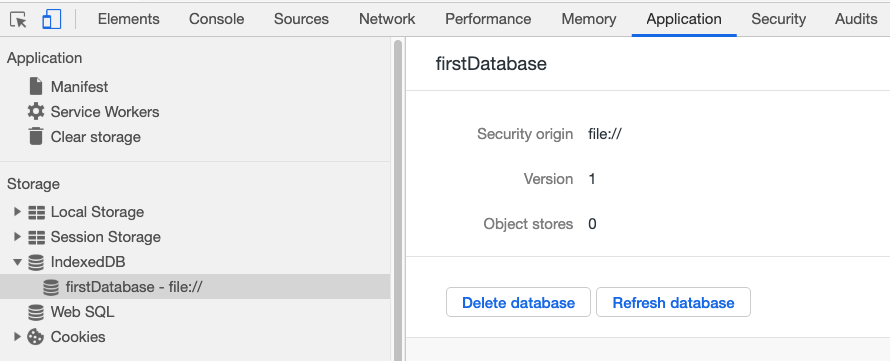
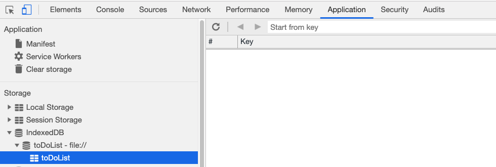

# 09.4 Full-Time Lesson Plan: Introduction to Mongoose

## Overview

In this class, you will explain MongoDB skip, sort, and limit methods. You will also introduce students to Mongoose, a Node.js package that provides a schema-based solution that you can use to model your Node.js application data. Students will build upon their knowledge of MongoDB and learn about how Mongoose makes it easier to handle data from the database.

## Instructor Notes

* In this lesson, students will complete activities `09-Ins_Cursor-Methods` through `19-Ins_Aggregates`.

* Today's activities do not have a front end and all routes will be tested using Insomnia. Please make sure you have Insomnia installed locally prior to class. Refer to the [Insomnia installation docs](https://insomnia.rest/download) as needed.

* As we continue to work with MongoDB, Mongoose will be the focus of today's activities. Reassure students that Mongoose is simply a "wrapper" around MongoDB that uses a schema to map to a MongoDB collection and makes it easier to manage relationships among data. This relationship is similar to how Sequelize works with MySQL.

* Remind students to do a `git pull` of the class repo to have today's activities ready and open in VS Code. 

* If you are comfortable doing so, live-code the solutions to the activities. If not, just use the solutions provided and follow the prompts and talking points for review.

* Let students know that the Bonus at the end of each activity is not meant to be extra coding practice, but instead is a self-study on topics beyond the scope of this unit for those who want to further their knowledge.

## Learning Objectives

* Create a Mongoose schema to dictate rules for their MongoDB data.

* Create custom methods in Mongoose to set and update data purely on the back end.

* Implement Mongoose CRUD methods to create, read, update and delete data.

* Utilize Mongoose's populate method to create relationships between the collections in their database.

* Explain the pros and cons of storing client side data with cookies and IndexedDB.

* Request an IndexedDB instance.

* Create an object store and add data with the `add` method.

## Time Tracker

| Start  | #   | Activity Name                             | Duration |
|---     |---  |---                                        |---       |
| 10:00AM| 1   | Instructor Demo: MongoJS Warmup           | 0:05     |
| 10:05AM| 2   | Student Do: MongoJS Review                | 0:15     |
| 10:20AM| 3   | Instructor Review: MongoJS Review         | 0:10     |
| 10:30AM| 4   | Instructor Do: Stoke Curiosity            | 0:10     |
| 10:40AM| 5   | Instructor Demo: Mongoose Schema          | 0:05     |
| 10:45AM| 6   | Student Do: Mongoose Schema               | 0:15     |
| 11:00AM| 7   | Instructor Review: Mongoose Schema        | 0:10     |
| 11:10AM| 8   | Instructor Demo: Custom Methods           | 0:05     |
| 11:15AM| 9   | Student Do: Custom Methods                | 0:15     |
| 11:30AM| 10  | Instructor Review: Custom Methods         | 0:10     |
| 11:40AM| 11  | FLEX                                      | 0:20     |
| 12:00PM| 12  | BREAK                                     | 0:30     |
| 12:30PM| 13  | Instructor Demo: Populate                 | 0:05     |
| 12:35PM| 14  | Student Do: Populate                      | 0:15     |
| 12:50PM| 15  | Instructor Review: Populate               | 0:10     |
| 1:00PM | 16  | Instructor Demo: Opening IndexedDB        | 0:05     |
| 1:05PM | 17  | Student Do: Opening IndexedDB             | 0:15     |
| 1:20PM | 18  | Instructor Review: Opening IndexedDB      | 0:10     |
| 1:30PM | 19  | Instructor Demo: Creating Object Stores   | 0:05     |
| 1:35PM | 20  | Student Do: Creating Object Stores        | 0:15     |
| 1:50PM | 21  | Instructor Review: Creating Object Stores | 0:10     |
| 2:00PM | 22  | FLEX                                      | 0:30     |
| 2:30PM | 23  | END                                       | 0:00     |

---

## Class Instruction

### 1. Instructor Demo: MongoJS Warmup (5 min) 

* Welcome students to class.

* Start class with a quick review by opening up `09-Stu-MongoJS-Review/Solved/server.js` on your machine. Run `npm install` then `node server.js` to launch the application.

* Demonstrate to the students how the app lets you add books as well as mark books read or unread.

  * Note the fact that an explicit route for the root, `http://localhost:3000` does not exist. However, the page still loads `index.html` from the `/public` folder. 

* Explain to the students that this is a convention from the static middleware that we are using. 

  * Point to this line: `app.use(express.static("public"));`

* Tell the class that in the next activity they will complete the routes in the server file so the site can display and edit the book data.

* Answer any questions before proceeding to the next activity.

* In preparation for the activity, ask TAs to start directing students to the activity instructions found in `09-Stu-MongoJS-Review/README.md`.

### 2. Student Do: MongoJS Review (15 min) 

* Direct students to the activity instructions found in `09-Stu-MongoJS-Review/README.md`.

* Break your students into pairs that will work together on this activity.

  ```md
  # MongoJS Review

  ## Instructions

  * Complete the routes in the server file so the site can display and edit the book data. 

  ## 💡 Hint(s)

  * Use the [Mongo guides](https://docs.mongodb.com/guides/) if you are stuck.

  ## 🏆 Bonus

  * Insert five more documents with one command. Use [https://docs.mongodb.com/manual/tutorial/query-documents/](https://docs.mongodb.com/manual/tutorial/query-documents/) to see how you can accomplish this.
  ```

* While breaking everyone into groups, be sure to remind students and the rest of the instructional staff that questions on Slack or otherwise are welcome and will be handled. It's a good way for your team to prioritize students who need extra help.

### 3. Instructor Review: MongoJS Review (10 min) 

* Open `09-Stu-MongoJS-Review/Solved/server.js` and scroll down to the routes.

* Use the prompts and talking points below to review each route.

* Our `/submit` route uses `save` to create a new record.

```js
app.post("/submit", ({ body }, res) => {
  const book = body;

  book.read = false;

  db.books.save(book, (error, data) => {
    if (error) {
      res.send(error);
    } else {
      res.send(data);
    }
  });
});
```

* Our `/read` route uses `find` to return books that have `read: true`.

```js
app.get("/read", (req, res) => {
  db.books.find({ read: true }, (error, data) => {
    if (error) {
      res.send(error);
    } else {
      res.json(data);
    }
  });
});
```

* Our `/unread` route uses `find` to return books that have `read: false`.

```js
app.get("/unread", (req, res) => {
  db.books.find({ read: false }, (error, data) => {
    if (error) {
      res.send(error);
    } else {
      res.json(data);
    }
  });
});
```

* Our `/markread/:id` route finds a book by `ObjectID` and uses `update` to set `read: true`.

```js
app.put("/markread/:id", ({ params }, res) => {
  db.books.update(
    {
      _id: mongojs.ObjectId(params.id)
    },
    {
      $set: {
        read: true
      }
    },

    (error, data) => {
      if (error) {
        res.send(error);
      } else {
        res.send(data);
      }
    }
  );
});
```

* Our `/markunread/:id` route finds a book by `ObjectID` and uses `update` to set `read: false`.

```js
app.put("/markunread/:id", ({ params }, res) => {
  db.books.update(
    {
      _id: mongojs.ObjectId(params.id)
    },
    {
      $set: {
        read: false
      }
    },

    (error, data) => {
      if (error) {
        res.send(error);
      } else {
        res.send(data);
      }
    }
  );
});
```

* Answer any questions before proceeding to the next activity.

### 4. Instructor Do: Introduce Mongoose (10 mins)

* Tell the class that they are now going to be introduced to Mongoose, an Object Data Modeling (ODM) library for Mongo and Node. 

* Use the prompts and talking points below to demonstrate the following key point(s):

  * ✔ Mongoose lets you define schemas for your collections.

  * ✔ It also helps manage data relationships and enforce validations.

* Next open `10-Ins-Mongoose-Schema` in your IDE and run `npm install` followed by `node server.js`.

* In your terminal you should see the following if the connection was successful.

```js
{ array: [ 'item1', 'item2', 'item3' ],
  _id: 5d445e4e98a11a33f37d6010,
  boolean: false,
  string:
   '"Don\'t worry if it doesn\'t work right. If everything did, you\'d be out of a job" - Mosher\'s Law of Software Engineering',
  number: 42,
  date: 2019-08-02T16:01:18.500Z,
  __v: 0 }
```

* Step through the code that we used to make our db connection and schema.

* We first require the Mongoose package and our `exampleModel` file, which contains our schema.

  ```js
  const mongoose = require("mongoose");
  const Example = require("./exampleModel.js"); // we will go over this file next as it contains our schema
  ```

* We then open a connection `mongodb://localhost/dbExample` on our locally running instance of MongoDB.

  ```js
  mongoose.connect("mongodb://localhost/dbExample", { useNewUrlParser: true });
  ```

* Then we create some data to insert into our database.

  ```js
  const data = {
    array: ["item1", "item2", "item3"],
    boolean: false,
    string:
      "We are learning mongoose!",
    number: 42
  };
  ```

* Next we call `create` on our `Example` schema and pass in our data.

  ```js
  Example.create(data)
    .then(dbExample => {
      console.log(dbExample);
    })
    .catch(({ message }) => {
      console.log(message);
    });
  ```

* Now open `10-Ins-Mongoose-Schema/exampleModel.js` in your editor.

* Tell the class that Mongoose models are similar to those in sequelize. 

* We define a schema for the model and then use the model to query our database. 

* Next, step through each section of the code.

* First we import mongoose and create a `Schema` reference.

  ```js
  const mongoose = require("mongoose");
  const Schema = mongoose.Schema;
  ```

* Next we create a new schema called `ExampleSchema`.

  ```js
  const ExampleSchema = new Schema({
    string: {
      type: String,
      trim: true,
      required: "String is Required" // validator
    },

    number: {
      type: Number,
      unique: true, // this is not a validator, but a built in helper
      required: true // validator
    },

    email: {
      type: String,
      match: [/.+@.+\..+/, "Please enter a valid e-mail address"]
    },

    boolean: Boolean,

    array: Array,

    date: {
      type: Date,
      default: Date.now
    },

    longstring: {
      type: String,
      validate: [({ length }) => length >= 6, "Longstring should be longer."]
    }
  });
  ```
  
* We then compile our schema into a Model.

  ```js
  const Example = mongoose.model("Example", ExampleSchema);
  export default Example;
  ```

* Tell the class that all schema types have the built-in `required` validator. 

* Point out that numbers have `min` and `max` validators while strings have `enum`, `match`, `minlength`, and `maxlength` validators.

* Ask the students the following question(s):

  * ☝️ What are the benefits of using Mongoose?

  * 🙋 It let's use create a schema, enforce validations and overall make it easier to interface with a Mongoose database.

* Answer any questions before proceeding to the next activity.

### 5. Instructor Demo: Mongoose Schema (5 min) 

* Open `11-Stu-Mongoose-Schema/Solved` on your machine and run `npm install` then `node server.js` to launch the app. 

* Create a new user and demonstrate the response.

  ```js
  {
    "_id": "5cfab6403da88328fcc7ac39",
    "username": "demo",
    "password": "demo",
    "email": "demo@gmail.com",
    "userCreated": "2019-06-07T19:08:48.294Z",
    "__v": 0
  }
  ```

* Try to create another user with the same email to demonstrate the validations.

  ```js
  {
    "driver": true,
    "name": "MongoError",
    "index": 0,
    "code": 11000,
    "errmsg": "E11000 duplicate key error collection: userdb.users index: email_1 dup key:  {: \"demo@gmail.com\" }"
  }
  ```

* Tell the students that in the next activity they will implement the schema validations that they see here.

* Answer any questions before proceeding to the next activity.

* In preparation for the activity, ask TAs to start directing students to the activity instructions found in `11-Stu-Mongoose-Schema/README.md`.

### 6. Student Do: Mongoose Schema (15 min) 

* Direct students to the activity instructions found in `11-Stu-Mongoose-Schema/README.md`.

* Break your students into pairs that will work together on this activity.

  ```md
  # User Schema

  In this activity you will create a user schema with mongoose.

  ## Instructions

  * In `userModel.js` add four attributes to your schema.

    * username: A string that will be be required, and also trimmed.

    * password: A string that will be required, trimmed, and at least 6 characters.

    * email: A string that must be a valid email address and unique in our collection.

    * userCreated: A date that will default to the current date.

  ## 💡 Hint(s)

  * The regex for checking if a string is an email is: `/.+\@.+\..+/`
  ```

* While breaking everyone into groups, be sure to remind students and the rest of the instructional staff that questions on Slack or otherwise are welcome and will be handled. It's a good way for your team to prioritize students who need extra help.

### 7. Instructor Review: Mongoose Schema (10 min) 

* Use the prompts and talking points below to demonstrate the following Mongoose key point(s):

  * ✔ We can use `required` to check for the presence of an attribute.

  * ✔ We can use `validate` to enforce a validation.

* Open `11-Stu-Mongoose-Schema/Solved/userModel.js`in your IDE and step through each attribute, checking for understanding.

```js
const mongoose = require("mongoose");
const Schema = mongoose.Schema;

const UserSchema = new Schema({
  username: {
    type: String,
    trim: true,
    required: "Username is Required"
  },

  password: {
    type: String,
    trim: true,
    required: "Password is Required",
    validate: [({ length }) => length >= 6, "Password should be longer."]
  },

  email: {
    type: String,
    unique: true,
    match: [/.+@.+\..+/, "Please enter a valid e-mail address"]
  },

  userCreated: {
    type: Date,
    default: Date.now
  }
});
```

* Students may be confused with `match`, explain that it uses a regular expression to check for a valid email address.

* Ask the students the following question(s):

  * ☝️ What is the `match` method checking for in our `email` attribute?

  * 🙋 It is checking the regular expression against the user's email input.

* Answer any questions before proceeding to the next activity.

### 8. Instructor Demo: Custom Methods (5 min) 

* Use the prompts and talking points below to demonstrate the following Mongoose key point(s):

  * ✔ Mongoose provides a way for us to create custom methods to manipulate our data.

* Change into `12-Ins-Custom-Methods` and run `npm install` then `node server.js` to launch the app.

* Visit `localhost:3000` and fill out the form to create a new user and demo the response.

  ```js
  {
    "isCool": true,
    "_id": "5cfbbd607de1a557eeaaa056",
    "username": "test...the Coolest!",
    "password": "password1234",
    "email": "testuser@gmail.com",
    "userCreated": "2019-06-08T13:51:28.033Z",
    "__v": 0
  }
  ```

* Ask the students the following question(s):

  * ☝️ What is difference about the way our data was returned?

  * 🙋 Our new user has an `isCool` field that is set to `true`.

* Open `12-Ins-Custom-Methods/userModel.js` and scroll down to the custom methods.

  ```js
  UserSchema.methods.coolifier = function() {
    this.username = `${this.username}...the Coolest!`;
    return this.username;
  };

  UserSchema.methods.makeCool = function() {
    this.isCool = true;
    return this.isCool;
  };
  ```

* Next open `server.js` and demonstrate how we are calling our methods on our new user.

  ```js
  app.post("/submit", ({ body }, res) => {
    const user = new User(body);
    user.coolifier(); // Bob...the Coolest!
    user.makeCool(); // isCool = true;

    User.create(user)
      .then(dbUser => {
        res.json(dbUser);
      })
      .catch(err => {
        res.json(err);
      });
  });
  ```

* Ask the students the following question(s):

  * ☝️ What are the benefits of using Mongoose?

  * 🙋 It let's use create a schema, enforce validations and overall make it easier to interface with a Mongoose database.

* Answer any questions before proceeding to the next activity.

* In preparation for the activity, ask TAs to start directing students to the activity instructions found in `13-Stu-Custom-Methods/README.md`.

### 9. Student Do: Custom Methods (15 min) 

* Direct students to the activity instructions found in `13-Stu-Custom-Methods/README.md`.

* Break your students into pairs that will work together on this activity.

  ```md
  # Custom Methods

  ## Instructions

  * Open `userModel.js` and create the following custom methods.

    * `setFullName`: sets the current user's `fullName` property to their lastName appended to their `firstName`

    * `lastUpdatedDate`: sets the current user's `lastUpdated` property to `Date.now()`

  * When you are finished use your new custom methods in a `POST` request.

  ## 💡 Hint(s)

  * Use the [Mongoose docs on schema instance methods](https://mongoosejs.com/docs/guide.html#methods) if you are stuck.
  ```

* While breaking everyone into groups, be sure to remind students and the rest of the instructional staff that questions on Slack or otherwise are welcome and will be handled. It's a good way for your team to prioritize students who need extra help.

### 10. Instructor Review: Custom Methods (10 min) 

* Open `13-Stu-Custom-Methods/Solved/userModel.js` file.

* Ask for a volunteer to lead your through the custom methods they created.

* Next open `server.js` and ask for a volunteer to explain how to call these new methods in that file.

* Start the server and load up the site in your browser to demonstrate the form. 

* Answer any questions before proceeding.

### 11. FLEX (20 mins)

* This time can be utilized for reviewing key topics learned so far in this unit.

* Ask students if they have any questions about Mongoose so far.

### 12. BREAK (30 mins)

### 13. Instructor Demo: Populate (5 min) 

* Change into `14-Ins-Populate` and start the server with `node server.js`. 

* Then, visit `/books` to see your books listed.

```js
[{
    "_id": "5cfbc820bc851f678c714b2c",
    "author": "Herman Melville",
    "title": "Moby Dick",
    "__v": 0
}, {
    "_id": "5cfbc83ebc851f678c714b2d",
    "author": "F. Scott Fitzgerald",
    "title": "The Great Gatsby",
    "__v": 0
}]
```

* Then visit `/library` to see your library data listed in JSON, including a list of `ObjectIds` in the book property. These are the `ObjectIds` associated with each book we've made.

```js
[{
    "books": ["5cfbc510fff60b62b1a9c318", 
              "5cfbc51cfff60b62b1a9c319", 
              "5cfbc820bc851f678c714b2c", 
              "5cfbc83ebc851f678c714b2d"],
    "_id": "5cfbc29cfff60b62b1a9c317",
    "name": "Campus Library",
    "__v": 0
}]
```

* Ask students, what if we want to see the data for all of the books stored in our library. We could go back to books, but what if we want to include all of the information about our library and our books, and query that data with just one call.

  * Answer: This is where `Mongoose`'s populate method comes in. Open the `/populated` route in your browser, and go to the books property. All of the books will be there.

  ```js
  [{
      "books": [{
          "_id": "5cfbc820bc851f678c714b2c",
          "author": "Herman Melville",
          "title": "Moby Dick",
          "__v": 0
      }, {
          "_id": "5cfbc83ebc851f678c714b2d",
          "author": "F. Scott Fitzgerald",
          "title": "The Great Gatsby",
          "__v": 0
      }],
      "_id": "5cfbc29cfff60b62b1a9c317",
      "name": "Campus Library",
      "__v": 0
  }] 
  ```

* How does this happen?

  * Show them the `Library.js` model, and how it has a reference to the `Book.js` model inside it's schema.

    ```js
    const mongoose = require("mongoose");

    const Schema = mongoose.Schema;

    const LibrarySchema = new Schema({
      name: {
        type: String,
        unique: true
      },
      books: [
        {
          type: Schema.Types.ObjectId,
          ref: "Book"
        }
      ]
    });

    const Library = mongoose.model("Library", LibrarySchema);

    module.exports = Library;
    ```

  * Then show them the `index.js` file inside of the `models` folder.

    ```js
    module.exports = {
    Book: require("./Book"),
    Library: require("./Library")
    };
    ```

  * Explain that when working with multiple models, it's often useful to be able to require all of them at once, rather than individually. 
  
  * By exporting an object containing all of our models from the `index.js` file in the models folder, we can then require this object and access all of our models inside of `server.js`.

    ```js
    const db = require("./models");
    ```

  * Point out the `populate` method being used in `server.js`.

    ```js
    app.get("/populated", (req, res) => {
    db.Library.find({})
      .populate("books")
      .then(dbLibrary => {
        res.json(dbLibrary);
      })
      .catch(err => {
        res.json(err);
      });
    });
    ```

  * Explain that here we are running `populate("books")` after finding books and before handling the result of the query in `.then`.

* Answer any questions before proceeding to the next activity.

* In preparation for the activity, ask TAs to start directing students to the activity instructions found in `15-Stu-Populate/README.md`.

### 14. Student Do: Populate (15 min) 

* Direct students to the activity instructions found in `15-Stu-Populate/README.md`.

* Break your students into pairs that will work together on this activity.

  ```md
  # Populate

  ## Instructions

  * Open `server.js` and update the `/populate` route to return `Users` populated with notes as JSON to the client.

  ## 💡 Hint(s)

  * Check out the `Note.js` and `User.js` models to see how the schemas there make the populate method possible.
  ```

* While breaking everyone into groups, be sure to remind students and the rest of the instructional staff that questions on Slack or otherwise are welcome and will be handled. It's a good way for your team to prioritize students who need extra help.

### 15. Instructor Review: Populate (10 min) 

* Open up `15-Stu-Populate/Solved/server.js`.

* Ask for a volunteer to to walk you through the solution.

```js
app.get("/populateduser", (req, res) => {
  db.User.find({})
    .populate("notes")
    .then(dbUser => {
      res.json(dbUser);
    })
    .catch(err => {
      res.json(err);
    });
});
```

* Answer any questions before proceeding to the next activity.

### 16. Instructor Demo: Opening IndexedDB (5 min) 

* Introduce the students to the Indexed Database API (IndexedDB) is a JavaScript application programming interface provided by web browsers for managing a NoSQL database of JSON objects in the client.

* Use the prompts and talking points below to demonstrate the following key point(s):

  * ✔ We access `indexedDB` via the `window` object.

  * ✔ We create a new IndexedDB connection using the `open` method and pass it a name for the DB and a version number.

  * ✔ Our request returns a result that we can then manipulate.

  ```js
  const request = indexedDB.open("firstDatabase", 1);
  
  request.onsuccess = event => {
    console.log(request.result);
  };
  ```

* Open `16-Ins_Opening_IndexedDB/index.html` in your browser and open your Chrome Developer tools and navigate to `Application` then `IndexedDB`.

  

* Navigate into the `16-Ins_Opening_IndexedDB` directory and open `index.html` from the command line. Inside the `IndexedDB` tab we see that we now have a new database connection called `firstDatabase`.

* Ask the class the following question(s): 

  * ☝️ How many arguments does the `open` method take and what are they for?

  * 🙋 Two and the first one is the DB name, the second is the version number. The version number controls which version of the schema to use.

* Answer any questions before proceeding to the next activity.

* In preparation for the activity, ask TAs to start directing students to the activity instructions found in `17-Stu_Opening_IndexedDB/README.md`.

### 17. Student Do: Opening IndexedDB (15 min) 

* Direct students to the activity instructions found in `17-Stu_Opening_IndexedDB/README.md`.

* Break your students into pairs that will work together on this activity.

  ```md
  # Requesting an IndexedDB Database

  In this activity, you will create a request for an indexedDB database and console.log the name of the db to the screen. 

  ## Instructions

  * Write code to request an IndexedDB database instance.
  * On success, log the name of the database to your console.

  ## 💡 Hint(s)

  * Use the [open](https://developer.mozilla.org/en-US/docs/Web/API/IDBFactory/open) docs to learn about the arguments it takes.

  * You can `console.log` the `request` to so what attributes are available to you.
  ```

* While breaking everyone into groups, be sure to remind students and the rest of the instructional staff that questions on Slack or otherwise are welcome and will be handled. It's a good way for your team to prioritize students who need extra help.

### 18. Instructor Review: Opening IndexedDB (10 min) 

* Use the prompts and talking points below to review the following key point(s):

  * ✔ We first request our DB instance with `const request = window.indexedDB.open("firstDatabase", 1);`
  
  * ✔ In the `onsuccess` method we `console.log(request.result.name);` 

  ✔ The `onsuccess` method is called every time we make a request.

* Open `17-Stu_Opening_IndexedDB/Solved/index.html` in your IDE and explain the following point(s):

  * We first request our DB instance with `const request = window.indexedDB.open("firstDatabase", 1);`
  
  * In the `onsuccess` method we `console.log` the `name` of the `result`, which is the database name.

  ```js
  const request = window.indexedDB.open("firstDatabase", 1);
    request.onsuccess = event => {
    console.log(request.result.name);
  };
  ```

  * 🔑 Our `open` method takes two arguments, first the db name and then the version number. 

* Ask the class the following question(s):

  * ☝️ What happens when we call `open` on `indexedDB`?

  * 🙋 The call to the `open()` method returns a request object with a `result` (success) value that you handle as an event. 

* Answer any questions before proceeding to the next activity.

### 19. Instructor Demo: Creating Object Stores (5 min) 

* Use the prompts and talking points below to demonstrate the following key point(s):

  * ✔ Object stores can be thought of as a "table" where we hold data.

  * ✔ Object stores can hold any data type.

  * ✔ Object stores are schema-less, unlike SQL databases.

  * ✔ We create our object stores in the `onupgradeneeded` method which is called when you change the db version. ie: From no database to 1, from 1 to 2 etc.

  * ✔ If the database doesn't already exist, it is created by the `open` operation, then an `onupgradeneeded` event is triggered.

*  Open `18-Ins_Creating_Object_Stores/index.html` in your IDE and explain the above points.

  ```js
  const request = window.indexedDB.open("todoList", 1);
  
  request.onupgradeneeded = function(event) {
    const db = event.target.result;
    const objectStore = db.createObjectStore("todoList");
  };

  request.onsuccess = event => {
    console.log(request.result);
  };
  ```

* Next open `18-Ins_Creating_Object_Stores/index.html` in your browser and open your Chrome Developer tools and navigate to `Application` then `IndexedDB`.

  

* We navigate into the `20-Ins_Creating_Object_Stores` directory and open `index.html` from the command line. Inside the `IndexedDB` tab we see that we now have a new database connection called `todoList`.

* When we click on the database tab, we can see that we now have an empty object store called `todoList`.

* Ask the class the following question(s): 

  * ☝️ What is an object store?

  * 🙋 It's similar to an SQL table and where we store data in IndexedDB.

  * ☝️ What is the main difference between an object store and an SQL table?

  * 🙋 Object stores do not have schemas.

* Answer any questions before proceeding to the next activity.

* In preparation for the activity, ask TAs to start directing students to the activity instructions found in `19-Stu_Creating_Object_Stores/README.md`.

### 20. Student Do: Creating Object Stores (15 min) 

* Direct students to the activity instructions found in `19-Stu_Creating_Object_Stores/README.md`.

* Break your students into pairs that will work together on this activity.

  ```md
  # Creating an Object Store

  In this activity, you will create an object store for your IndexedDB database.

  ## Instructions

  * Write code to request an IndexedDB database instance.
  * On success, log the result to your console.
  * Inside the `onupgradeneeded` method, create an object store for your database called `toDoList`.

  ## 💡 Hint(s)

  * Use the [open](https://developer.mozilla.org/en-US/docs/Web/API/IDBFactory/open) docs to learn about the arguments it takes.
  * You can `console.log` the `request` to so what attributes are available to you.

  ## 🏆 Bonus

  * Use the [keyPath](https://developer.mozilla.org/en-US/docs/Web/API/IDBObjectStore/keyPath) docs to research what a `keyPath` is and how to add it to your `objectStore`.
  ```

* While breaking everyone into groups, be sure to remind students and the rest of the instructional staff that questions on Slack or otherwise are welcome and will be handled. It's a good way for your team to prioritize students who need extra help.

### 21. Instructor Review: Creating Object Stores (10 min) 

* Use the prompts and talking points below to review the following key point(s):

  * ✔ We create the object store in the `onupgradeneeded` method.

* Open `19-Stu_Creating_Object_Stores/Solved/index.html` in your IDE and review the code snippet.

  ```js
  const request = window.indexedDB.open("todoList", 1);
    
  request.onsuccess = event => {
    console.log(request.result);
  };

  request.onupgradeneeded = ({ target }) => {
    const db = target.result;
    const objectStore = db.createObjectStore("todoList");
  };
  ```

* In your browser's DevTools, be sure to have deleted the "todoList" database from the list of IndexedDB in the Application tab before starting this activity!

* Ask the class the following question(s):

  * ☝️ What do we use object stores for? 

  * 🙋 To store our indexedDB data.

* Answer any questions before proceeding.

### 22. FLEX (30 mins)

* This time can be utilized for reviewing key topics learned so far in this unit.

* Ask students if they have any questions about IndexedDB or anything else covered so far in this unit.

* Answer any questions before ending the class.

### 23. END (0 mins)

How did today’s lesson go? Your feedback is important. Please take 5 minutes to complete this [anonymous survey](https://forms.gle/RfcVyXiMmZQut6aJ6).

---
© 2021 Trilogy Education Services, LLC, a 2U, Inc. brand. Confidential and Proprietary. All Rights Reserved.
