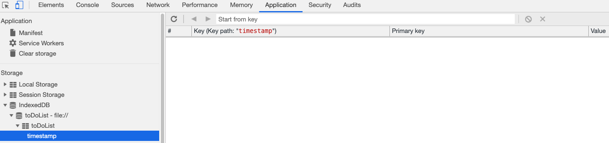
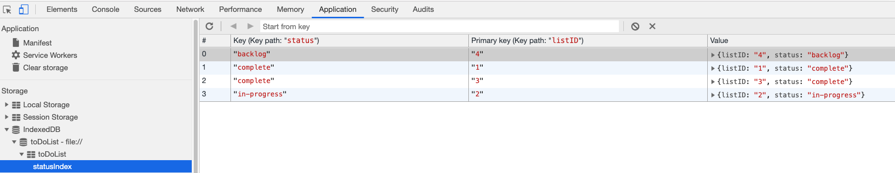
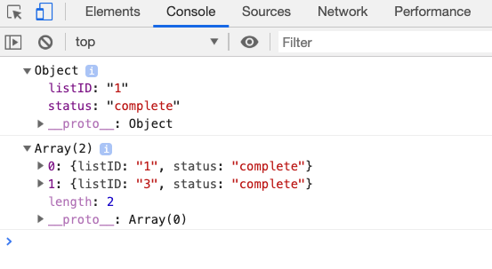
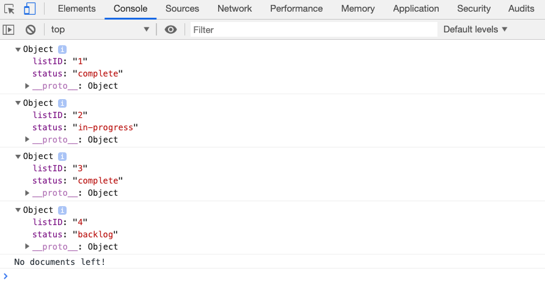

# 09.5 Full-Time Lesson Plan: IndexedDB

## Overview

This lesson continues The Indexed Database API, commonly referred to as IndexedDB. IndexedDB is a JavaScript API provided by web browsers for managing a NoSQL database of JSON objects. 

## Instructor Notes

* In this lesson, students will complete activities `20-Ins_Creating_Indexes` through `26-Stu-Mini-Project`.

* When moving on to new activities, make sure you refresh and or delete your database in IndexedDB. If you are not seeing changes to your database this will fix it.

* If students question why they are learning IndexedDB, let them know that the web is moving away from traditional cookies and into client side storage solutions such as IndexedDB. It gives them the ability to have offline mode for their applications which they will be learning more about in the following unit.

* Remind students to do a `git pull` of the class repo to have today's activities ready and open in VS Code. 

* If you are comfortable doing so, live-code the solutions to the activities. If not, just use the solutions provided and follow the prompts and talking points for review.

* Let students know that the Bonus at the end of each activity is not meant to be extra coding practice, but instead is a self-study on topics beyond the scope of this unit for those who want to further their knowledge.

## Learning Objectives

* Search for an item by keyPath with the `get` method.

* Create and search by index with the `getAll` method.

* Utilize Cursors to iterate through and update object store data with the `update` method.

## Time Tracker

| Start  | #   | Activity Name                                 | Duration |
|---     |---  |---                                            |---       |
| 10:00AM| 1   | Instructor Do: Welcome                        | 0:10     |
| 10:10AM| 2   | Instructor Demo: Creating Indexes             | 0:05     |
| 10:15AM| 3   | Student Do: Creating Indexes                  | 0:15     |
| 10:30AM| 4   | Instructor Review: Creating Indexes           | 0:10     |
| 10:40AM| 5   | Instructor Demo: Adding Getting Data          | 0:05     |
| 10:45AM| 6   | Student Do: Adding Getting Data               | 0:15     |
| 11:00AM| 7   | Instructor Review: Adding Getting Data        | 0:10     |
| 11:10AM| 8   | Instructor Demo: Updating Data with Cursors   | 0:05     |
| 11:15AM| 9   | Student Do: Updating Data with Cursors        | 0:15     |
| 11:30AM| 10  | Instructor Review: Updating Data with Cursors | 0:10     |
| 11:40AM| 11  | FLEX                                          | 0:20     |
| 12:00PM| 12  | BREAK                                         | 0:30     |
| 12:30PM| 13  | Instructor Demo: Mini Project                 | 0:05     |
| 12:35PM| 14  | Student Do: Mini Project                      | 0:60     |
| 1:35PM | 15  | Instructor Review: Mini Project               | 0:10     |
| 1:45PM | 16  | Introduce Homework                            | 0:05     |
| 1:50PM | 17  | FLEX                                          | 0:40     |
| 2:30PM | 18  | End                                           | 0:00     |

---

## Class Instruction

### 1. Instructor Do: Welcome (10 min)

* Welcome students to class.

* Ask the class the following question(s) and call on students for the corresponding answer(s):

  * ☝️ How do we store data client-side? 

  * 🙋 Cookies, local storage, session storage.

  * ☝️ What is a cookie?

  * 🙋 A cookie is a small piece of data sent from a website and stored on the user's computer by the user's web browser.

  * ☝️ What are some of the issues we encounter storing data client-side? 

  * 🙋 String value pairs, objects must be stringified and strings must be converted to JSON. Size limits.

  * ☝️ rom the name, what do we think IndexedDB is?

  * 🙋 The Indexed Database API (IndexedDB) is a JavaScript application programming interface provided by web browsers for managing a NoSQL database of JSON objects in the client.

* Answer any questions before proceeding to the next activity.

### 2. Instructor Demo: Creating Indexes (5 min) 

* Use the prompts and talking points below to demonstrate the following key point(s):

  * ✔ Object stores are schema-less and have no native search capability.

  * ✔ We create indexes on object store "columns" so we can query.

  * ✔ We use the `createIndex(indexName, keyPath)` method to create indexes, it takes two arguments.

  * ✔ The `indexName` is what you use to access the index when querying.

  * ✔ The `keyPath` is the actual name of the "column."

* In your browser's DevTools, be sure to have deleted the "todoList" database from the list of IndexedDB in the Application tab before starting this activity!

* Open `20-Ins_Creating_Indexes/index.html` in your IDE and review the code snippet.

  ```js
  const request = window.indexedDB.open("todoList", 1);
  request.onupgradeneeded = ({ target }) => {
    const db = target.result;
    const objectStore = db.createObjectStore("todoList");
    objectStore.createIndex("timestamp", "timestamp");
  };
  request.onsuccess = event => {
    console.log(request.result);
  };
  ```

* Open `20-Ins_Creating_Indexes/index.html` in your browser and open your Chrome Developer tools and navigate to `Application` then `IndexedDB`.

  

  * We navigate into the `22-Ins_Creating_Indexes` directory and open `index.html` from the command line. Inside the `IndexedDB` tab we see that we now have a new database connection called `todoList`.

  * When we click on the database tab, we can see that we now have an empty object store called `todoList`. Inside our `todoList` object store we now have a `timestamp` index that we can use to query on.

* Ask the class the following question(s): 

  * ☝️ What are indexes for?

  * 🙋 They are used to query on object store "columns" since they have no way to natively search.

* Answer any questions before proceeding to the next activity.

* In preparation for the activity, ask TAs to start directing students to the activity instructions found in `21-Stu_Creating_Indexes/README.md`.

### 3. Student Do: Creating Indexes (15 min) 

* Direct students to the activity instructions found in `21-Stu_Creating_Indexes/README.md`.

* Break your students into pairs that will work together on this activity.

  ```md
  # Creating Indexes

  In this activity, you will create an index on your object store that can be used to query data.

  ## Instructions

  * In your browser's DevTools, be sure to have deleted the "todoList" database from the list of IndexedDB in the Application tab before starting this activity!

  * Write code to request an IndexedDB database instance.

  * On success, log the result to your console.

  * Inside the `onupgradeneeded` method, create an object store for your database called `toDoList`. Next, create three indexes for your ToDoList called `icebox`, `inprogress` and `complete`.

  ## 💡 Hint(s)

  * Use the [createIndex](https://developer.mozilla.org/en-US/docs/Web/API/IDBObjectStore/createIndex) docs if you are stuck.
  ```

* While breaking everyone into groups, be sure to remind students and the rest of the instructional staff that questions on Slack or otherwise are welcome and will be handled. It's a good way for your team to prioritize students who need extra help.

### 4. Instructor Review: Creating Indexes (10 min) 

* Open `21-Stu_Creating_Indexes/Solved/index.html` in your IDE and explain the following point(s):

  * We simply call the `createIndex` method on our object store and create three new indexes, giving each of them an `indexName` and `keyPath`.

  ```js
  request.onupgradeneeded = ({ target }) => {
    const db = target.result;
    const objectStore = db.createObjectStore("todoList");
    objectStore.createIndex("icebox", "icebox");
    objectStore.createIndex("inprogress", "inprogress");
    objectStore.createIndex("complete", "complete");
  };
  ```

  * 🔑 Recall that the `indexName` is what you use to access the index and the `keyPath` is the actual name of the "column."

* Answer any questions before proceeding to the next demo.

* In your browser's DevTools, be sure to have deleted the "todoList" database from the list of IndexedDB in the Application tab before starting this activity!

### 5. Instructor Demo: Adding Getting Data (5 min) 

* Use the prompts and talking points below to demonstrate the following key point(s):

  * ✔ We add data to our object stores with the `add` method.

  * ✔ We can add a `keyPath` argument when we create our object stores that let's us query.

  * ✔ We use `get` object store method to query by `keyPath`.

  * ✔ We use the `getAll` object store method to query by indexes.

* Open `22-Ins_Adding_Getting_Data/index.html` in your IDE and review the following code.

  ```js
  request.onupgradeneeded = event => {
    const db = event.target.result;
    const todoListStore = db.createObjectStore("todoList", { keyPath: "listID" }); // can now query by listID
    todoListStore.createIndex("statusIndex", "status"); // can now query by statusIndex
  }

  todoListStore.add({ listID: "1", status: "complete" }); // adding data

  const getRequest = todoListStore.get("1"); // querying by keyPath
  const getRequestIdx = statusIndex.getAll("complete"); // querying by index

  ```

* Open `22-Ins_Adding_Getting_Data/index.html` in your browser and open your Chrome Developer tools and navigate to your console.

  

  * We navigate into the `22-Ins_Adding_Getting_Data` directory and open `index.html` from the command line. When we click on the database tab, we can see that we now have data in our `todoList` object store.

* Next open your developer tools console to show the data being returned from our `get` and `getAll` methods.

  

* Ask the class the following question(s): 

  * ☝️ What is a keyPath?

  * 🙋 A keyPath gives us a way to query our column's data.

  * ☝️ What is an index?

  * 🙋 An index is another way to more efficiently and specifically query for data.

* Answer any questions before proceeding to the next activity.

* In preparation for the activity, ask TAs to start directing students to the activity instructions found in `23-Stu_Adding_Getting_Data/README.md`.

### 6. Student Do: Adding Getting Data (15 min) 

* Direct students to the activity instructions found in `23-Stu_Adding_Getting_Data/README.md`.

* Break your students into pairs that will work together on this activity.

  ```md
  # Adding and Getting Data

  In this activity, you will create add and retrieve data from an objectStore using a keyPath and index.

  ## Instructions

  * In your browser's DevTools, be sure to have deleted the "todoList" database from the list of IndexedDB in the Application tab before starting this activity!

  * In the `onupgradeneeded` method:

    * Create a `toDoList` object store with a `listID` keyPath that can be used to query on.

    * Create an index for a "column" you'd like to query on. ie: due-date

  * In the `onsuccess` method:

    * Create variables for a new `transaction` on your database, `objectStore` and the `index` you created.

    * Add four new items to your object store with the `add` method.

    * Using the `get` method, return an item from your object store.

    * Using the `getAll` method, query by index and return all items.

  ## 💡 Hint(s)

  * Use the following docs if you are stuck.

    * [add](https://developer.mozilla.org/en-US/docs/Web/API/IDBObjectStore/add)

    * [get](https://developer.mozilla.org/en-US/docs/Web/API/IDBObjectStore/get)

    * [getAll](https://developer.mozilla.org/en-US/docs/Web/API/IDBObjectStore/getAll)
  ```

* While breaking everyone into groups, be sure to remind students and the rest of the instructional staff that questions on Slack or otherwise are welcome and will be handled. It's a good way for your team to prioritize students who need extra help.

### 7. Instructor Review: Adding Getting Data (10 min) 

* Use the prompts and talking points below to review the following key point(s):
  
  * ✔ We add data to our object stores with the `add` method.

  * ✔ We can add a `keyPath` argument when we create our object stores that let's us query.

  * ✔ We use `get` object store method to query by `keyPath`.

  * ✔ We use the `getAll` object store method to query by indexes.

* Open `23-Stu_Adding_Getting_Data/Solved/index.html` in your IDE and explain the following point(s):

  * We first create an object store and pass it the optional `keyPath` argument of `listID` that we can use to query with.
  
  * We then create an index on our `todoListStore` with `createIndex`, passing it an `index` of `statusIndex` and a `keyPath` of `status`.
  
  * We then simply use the `add` method to add records to our object store.

  * Next, we make a get request to our object store using the `get` method, which queries by `keyPath`.

  * Finally we make another get request with `getAll` and query by our `index`.

* Open `23-Stu_Adding_Getting_Data/index.html` in your IDE and review the following code.

  ```js
  request.onupgradeneeded = event => {
    const db = event.target.result;
    const todoListStore = db.createObjectStore("todoList", {keyPath: "listID"}); 
    todoListStore.createIndex("statusIndex", "status"); 
  }

  todoListStore.add({ listID: "1", status: "complete" }); 

  const getRequest = todoListStore.get("1"); 
  const getRequestIdx = statusIndex.getAll("complete"); 
  ```

  * 🔑 Querying by `index` is more efficient than by `keyPath`. When creating a schema, if you know the data you will be searching for most often, creating an `index` for that data is ideal.

* Ask the class the following question(s):

  * ☝️ When querying with the `getAll` method, what argument do you pass it?

  * 🙋 The value of the index you want returned.

* Answer any questions before proceeding to the next demo.

* In your browser's DevTools, be sure to have deleted the "todoList" database from the list of IndexedDB in the Application tab before starting this activity!

### 8. Instructor Demo: Updating Data with Cursors (5 min) 

* Use the prompts and talking points below to demonstrate the following key point(s):

  * ✔ We open a cursor request on our object store with `openCursor`.

  * ✔ On success we have a result that we can iterate through.

  * ✔ We use the `continue` key word to move through the records.

* Open `24-Ins_Updating_Data_With_Cursors/index.html` in your IDE and review the following code.

  ```js
  const getCursorRequest = todoListStore.openCursor();
    getCursorRequest.onsuccess = e => {
      const cursor = e.target.result;
      if (cursor) {
        console.log(cursor.value);
        cursor.continue();
      } else {
        console.log("No documents left!");
      }
    };
  ```

* Open `24-Ins_Updating_Data_With_Cursors/index.html` in your browser and open your Chrome Developer tools and navigate to your console.

  

  * We navigate into the `24-Ins_Updating_Data_With_Cursors` directory and open `index.html` from the command line. Next open your Chrome Developer tools and navigate into the console to see the data being returned.

* Ask the class the following question(s): 

  * ☝️ What is a cursor used for?

  * 🙋 It gives us a way to iterate through our object stores files.

* Answer any questions before proceeding to the next activity.

* In preparation for the activity, ask TAs to start directing students to the activity instructions found in `25-Stu_Updating_Data_With_Cursors/README.md`.

### 9. Student Do: Updating Data with Cursors (15 min) 

* Direct students to the activity instructions found in `25-Stu_Updating_Data_With_Cursors/README.md`.

* Break your students into pairs that will work together on this activity.

  ```md
  # Updating Data With Cursors

  In this activity, you will be updating records in your object store using a Cursor.

  ## Instructions

  * In your browser's DevTools, be sure to have deleted the "todoList" database from the list of IndexedDB in the Application tab before starting this activity!

  * Inside ` getCursorRequest.onsuccess`

    * Set the `result` to a variable named `cursor`.
    
    * Check the status of each cursor's value and if it's equal to "in-progress", set the status to "complete".

  ## 💡 Hint(s)

  * Use the following [cursor](https://developer.mozilla.org/en-US/docs/Web/API/IDBCursor) methods.

    * `cursor.value`

    * `cursor.update`

    * `cursor.continue`
  ```

* While breaking everyone into groups, be sure to remind students and the rest of the instructional staff that questions on Slack or otherwise are welcome and will be handled. It's a good way for your team to prioritize students who need extra help.

### 10. Instructor Review: Updating Data with Cursors (10 min) 

* Use the prompts and talking points below to review the following key point(s):

  * ✔ We open a cursor request on our object store with `openCursor`.

  * ✔ On success we have a result that we can iterate through.

  * ✔ We use the `continue` key word to move through the records.

* Open `25-Stu_Updating_Data_With_Cursors/Solved/index.html` in your IDE and explain the following point(s):

  * We first open a cursor on our object store with `openCursor()`.

  * Then in our `onsuccess` method we check to see if our cursor has any data in it.

  * If it does, we check the status of each cursor's value and if it's equal to "in-progress" we set the status to "complete" with the `update` method.

  * We then call `continue` to move to the next record, until there are none left to evaluate.

  ```js
  const getCursorRequest = todoListStore.openCursor();
    getCursorRequest.onsuccess = e => {
      const cursor = e.target.result;
        if (cursor) {
          if (cursor.value.status === "in-progress") {
            const todo = cursor.value;
            todo.status = "complete";
             cursor.update(todo);
          }
          cursor.continue();
        }
      };
  ```

* Ask the class the following question(s):

  * ☝️ What does the `continue` method do?

  * 🙋 Continues to the next record, exiting when there are none left.

* Answer any questions before proceeding.

### 11. FLEX (20 min)

* This time can be utilized for reviewing key topics learned so far in this unit..

* Ask students if they have any questions about IndexedDB or anything else covered so far in this unit.

* Answer any questions before proceeding.

### 12. BREAK (30 min)

### 13. Instructor Demo: Mini Project (5 min) 

* **Instructor Notes:** The mini project activity is intended to give the students a chance to practice with the IndexedDB API and introduce the idea of handling some offline behavior without introducing caching, service workers, or other concepts which will be covered in the following unit on PWAs.

* Change into `26-Stu-Mini-Project/Solved/public/db.js` in your terminal and run `npm install` followed by `node server.js` to launch your app at [http://localhost:3000/](http://localhost:3000/)

* Demo the functionality of the app and tell students they are going to build the IndexedDB storage functionality in the next activity. This feature will enable users to enter transactions when the device is not online and sync the transactions with the backend when network service is restored.

* Answer any questions before allowing students to start the mini project.

### 14. Student Do: Mini Project (60 min)

* Direct students to the activity instructions found in `26-Stu-Mini-Project/README.md`.

* Break your students into groups that will work together on this activity.

  ```md
  # Mini Project

  In this activity, you will implement IndexedDB so the budget tracker persists data even when the device is not online. When the device finally reconnects, any pending transactions will be synced with the backend api. Write all of your IndexedDB code in `public/db.js`.

  ## Instructions

  * Create a new db request for a `BudgetDB` database.

  * Inside `onupgradeneeded`, create an object store called `BudgetStore` and set `autoIncrement` to `true`.

  * Inside your `saveRecord()` function:

    * Create a transaction on the `BudgetStore` object with `readwrite` access.

    * Access your `BudgetStore`.

    * Add a record to your store with the `add` method.

  * Inside the `checkDatabase` function:

    * Open a transaction on your `BudgetStore` object.
    
    * Access your `BudgetStore` object store.

    * Get all records from store and set to a variable.

  * Inside `getAll.onsuccess`:

    * If successful, open a transaction on your `BudgetStore` object.

    * Access your `BudgetStore` object.

    * Clear all items in your store.

  ## 💡 Hint(s)

  * You can use the the comments in `public/db.js` as a guide.

  * If you do not see the key pairs populate in the IndexedDB, try refreshing the page. If it still doesn't work, try opening the browser in Incognito mode. 

  ## 🏆 Bonus

  * Create a button that resets all funds to zero in your indexedDB.
  ```

* While breaking everyone into groups, be sure to remind students and the rest of the instructional staff that questions on Slack or otherwise are welcome and will be handled. It's a good way for your team to prioritize students who need extra help.

### 15. Instructor Review: Mini Project (10 min)  

* Treat this review as a question and answer session to help students who might be stuck, since there are 10 minutes allotted.

* Open `26-Stu-Mini-Project/Solved/public/db.js` in your IDE and walk students review the solved code, letting the students ask questions about the key methods and functions they had to write.

  * `onupgradeneeded`

  * `saveRecord()`

  * `checkDatabase()`

  * `saveRecord()`

  * `onsuccess`

* Ask for volunteers to share or help if students are stuck.

* Answer any questions before proceeding to the next activity.

### 16. Instructor Demo: Introduce Homework (5 min)

* Navigate to `02-Homework/Main` and run `npm start` from the command line to demonstrate the following:

  * We are able to view, create, and track daily workouts.

  * We can log multiple exercises in a workout on a given day.

  * I can also track the name, type, weight, sets, reps, and duration of exercise.

* Ask the class the following questions (☝️) and call on students for the answers (🙋):

  * ☝️ What are we learning?

  * 🙋 We are creating a MongoDB database with a Mongoose schema. 

  * ☝️ How does this project build off or extend previously learned material?

  * 🙋 We are using Express.js and Node.js to build our full-stack application. MongoDB is our NoSQL database and Mongoose is our ODM (Object Document Mapper).

  * ☝️ How does this project relate to your career goals?

  * 🙋 NoSQL databases are becoming very popular these days with the wide use of JavaScript. Knowing how to use both SQL and NoSQL database will make you an even stronger full-stack developer.

* Ask TAs to direct students to the Homework Requirements found in `02-Homework/README.md`.

### 17. FLEX (40 min)

* This time can be utilized for reviewing key topics learned so far in this unit or getting started on the homework.

* Encourage students to get a head start on their homework. Or use this time to answer any questions students have over anything we covered this week.

* Answer any questions before ending the class.

### 18. END (0 min)

How did today’s lesson go? Your feedback is important. Please take 5 minutes to complete this [anonymous survey](https://forms.gle/RfcVyXiMmZQut6aJ6).

---
© 2021 Trilogy Education Services, LLC, a 2U, Inc. brand. Confidential and Proprietary. All Rights Reserved.
