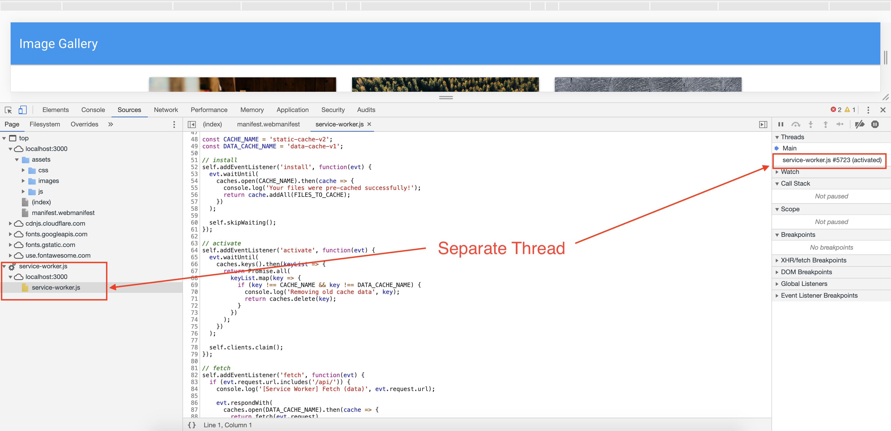
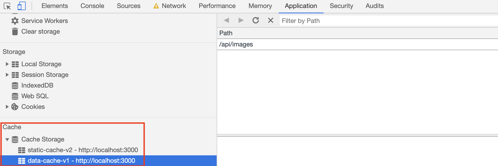
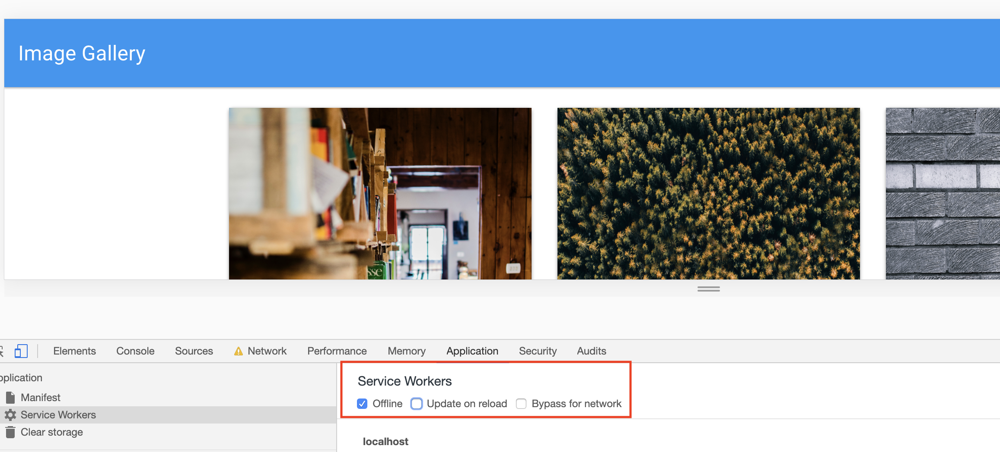
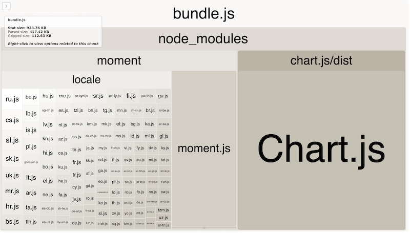
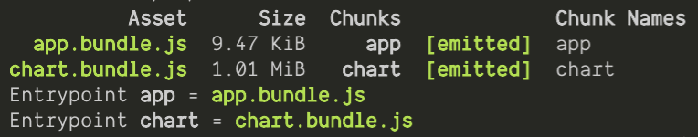
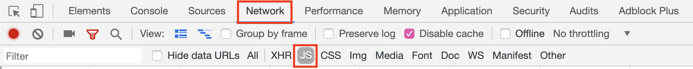

# 10.2 Full-Time Lesson Plan: PWAs and Webpack

## Overview

Today's class will continue our journey into web performance by learning more about progressive web apps. We will start with our basic Gallery App and step by step, implement a web app manifest as well as a service worker. This new functionality will provide us with a fully functioning progressive web app that delivers an offline experience to our users. We will also learn about Webpack. Webpack is a module bundler, with its main purpose being bundling JavaScript files for use in a browser. Webpack provides a lot of functionality that developers can take advantage of to make their programs more performant.

## Instructor Notes

* In this lesson, students will complete activities `08-Ins_Manifest` through `22-Stu-Chunking`.

* You may need to clear your storage periodically in order to see each iteration of activities. Do so in DevTools under `Application > Clear storage > Clear site data`.

* Some of today's activities use mongoDB to store data. It is recommended that you open a separate tab in your terminal and run `mongod`. Don't forget to kill the process at the end of class.

* It is recommended that you take some time to familiarize yourself with service workers before class begins. Specifically, look over the service worker lifecycle and caching and returning requests at https://developers.google.com/web/fundamentals/primers/service-workers/.

* Webpack can be a difficult tool to get your head around, so be as clear as possible in your explanations and be ready to answer plenty of student questions. It is recommended that you review the webpack [docs](https://webpack.js.org/concepts). You may want to read [Why Webpack](https://webpack.js.org/concepts/why-webpack) so that you are prepared to answer student questions like "Why are we learning this?".

* Remind students to do a `git pull` of the class repo to have today's activities ready and open in VS Code. 

* If you are comfortable doing so, live-code the solutions to the activities. If not, just use the solutions provided and follow the prompts and talking points for review.

* Let students know that the Bonus at the end of each activity is not meant to be extra coding practice, but instead is a self-study on topics beyond the scope of this unit for those who want to further their knowledge.

## Learning Objectives

By the end of class, students will be able to:

* Explain the benefits a progressive web app offers a user over a traditional app.

* Implement and explain the role of a web app manifest.

* Implement and explain the role of a service worker.

* Successfully cache and fetch files to deliver them in an offline experience.

* Install a PWA on both desktop and mobile devices

* Create a basic Webpack configuration file.

* Bundle their JavaScript code into a single file.

* Add Webpack plugins to their Webpack configs.

* Convert web applications to PWA using Webpack 

* Perform code splitting using webpack.

## Time Tracker

| Start  | #   | Activity Name                               | Duration |
|---     |---  |---                                          |---       |
| 10:00AM| 1   | Instructor Demo: Manifest                   | 0:05     |
| 10:05AM| 2   | Student Do: Manifest                        | 0:15     |
| 10:20AM| 3   | Instructor Review: Manifest                 | 0:10     |
| 10:30AM| 4   | Instructor Demo: Service Workers            | 0:05     |
| 10:35AM| 5   | Student Do: Service Workers                 | 0:15     |
| 10:50AM| 6   | Instructor Review: Service Workers          | 0:10     |
| 11:00AM| 7   | Instructor Demo: Caching Fetching Files     | 0:05     |
| 11:05AM| 8   | Student Do: Caching Fetching Files          | 0:15     |
| 11:20AM| 9   | Instructor Review: Caching Fetching Files   | 0:10     |
| 11:30AM| 10  | Instructor Demo: Trip Planner PWA           | 0:05     |
| 11:35AM| 11  | Student Do: Trip Planner PWA                | 0:25     |
| 12:00PM| 12  | BREAK                                       | 0:30     |
| 12:30PM| 13  | Instructor Review: Trip Planner PWA         | 0:10     |
| 12:40PM| 14  | Instructor Demo: Intro to Webpack           | 0:05     |
| 12:45PM| 15  | Student Do: Budget Tracker                  | 0:10     |
| 12:55PM| 16  | Instructor Review: Budget Tracker           | 0:05     |
| 1:00PM | 17  | Instructor Demo: Bundle Analyzer Plugin     | 0:05     |
| 1:05PM | 18  | Student Do: Gallery App with Webpack        | 0:10     |
| 1:15PM | 19  | Instructor Review: Gallery App with Webpack | 0:05     |
| 1:20PM | 20  | Instructor Demo: Pure Functions             | 0:10     |
| 1:30PM | 21  | Student Do: Pure Functions                  | 0:15     |
| 1:45PM | 22  | Instructor Review: Pure Functions           | 0:10     |
| 1:55PM | 23  | Instructor Demo: Chunking                   | 0:10     |
| 2:05PM | 24  | Student Do: Chunking                        | 0:15     |
| 2:20PM | 25  | Instructor Review: Chunking                 | 0:10     |
| 2:30PM | 26  | END                                         | 0:00     |

---

## Class Instruction

### 1. Instructor Demo: Manifest (5 min) 

* Welcome students to class.

* Use the prompts and talking points below to demonstrate the following key point(s):

  * ✔️ `manifest.webmanifest` is JSON file providing information for mobile and desktop installation
  
  * ✔️ Manifest properties are referred to as members
  
* Open [08-Ins_Manifest/manifest.webmanifest](../../../../01-Class-Content/19-PWA/01-Activities/08-Ins_Manifest/manifest.webmanifest) in your IDE and explain the following: 

  * 🔑 A web app manifest is a simple JSON file containing some metadata about a web application. 
  
 ```js
  {
    "short_name": "Demo",
    "name": "Web App Manifest Demo",
    "icons": [
      {
        "src": "/assets/images/icons-192.png",
        "sizes": "192x192",
        "type": "image/png"
      },
      {
        "src": "/assets/images/icons-512.png",
        "sizes": "512x512",
        "type": "image/png"
      }
    ],
    "start_url": "/",
    "background_color": "	#808080",
    "display": "standalone",
    "theme_color": "#808080"
  } 
  ```
  * 🔑 Each of the properties in our manifest file is referred to as a **member**.

* Ask the class the following question(s) and call on students for the corresponding answer(s):

  * ☝️ What do we think the difference is between `name` and `short_name`?

  * 🙋 `short_name` is used on the home screen and in the application menu
  
  * ☝️ What are "icons"?

  * 🙋 The `icons` array contains information about the thumbnail images used when installing the PWA on mobile or desktop

  * ☝️ What is the `start_url` member?

  * 🙋 Defines what page is opened when the app is first launched (start_url).
  
  * ☝️ What does the `display` member do?

  * 🙋 By using a web app manifest, our app can tell the browser you want your app to open in a standalone window

* Answer any questions before proceeding to the next activity.

* In preparation for the activity, ask TAs to start directing students to the activity instructions found in `09-Stu_Manifest/README.md`.

### 2. Student Do: Manifest (15 min) 

* Direct students to the activity instructions found in `09-Stu_Manifest/README.md`.

* Break your students into pairs that will work together on this activity.

  ```md
  # Web App Manifest

  In this activity, you will write your first progressive web application manifest.

  ## Instructions

  * Using the instructor demo as a guide, create a manifest for the Image Gallery app.

    * 🤔 Where do you create the `manifest.webmanifest` in the application architecture?

    * 🤔 How do you deploy a manifest? Hint: You will need to somehow link it with the web page. (See [Web App Manifest - Deploying a manifest](https://developer.mozilla.org/en-US/docs/Web/Manifest#Deploying_a_manifest_with_the_link_tag).)

  * When finished, run the commands:

    * `npm install`

    * `npm run seed`

    * `npm start`

  * Navigate to [localhost:3000](localhost:3000) and open `DevTools > Application > Manifest` to verify successful loading of the manifest.

  ## 💡 Hint(s)

  Read the [MDN Web App Manifest documentation](https://developer.mozilla.org/en-US/docs/Web/Manifest) 

  ## 🏆 Bonus

  * Add additional members to your manifest.
  ```

* While breaking everyone into groups, be sure to remind students and the rest of the instructional staff that questions on Slack or otherwise are welcome and will be handled. It's a good way for your team to prioritize students who need extra help.

### 3. Instructor Review: Manifest (10 min) 

* Use the prompts and talking points below to review the following key point(s):

  * The web app manifest tells the browser about your web application and how it should behave once installed. 

* Open [09-Stu_Manifest/Solved/public/manifest.webmanifest](../../../../01-Class-Content/19-PWA/01-Activities/09-Stu_Manifest/Solved/public/manifest.webmanifest) in your IDE and explain the following:

  * We give our PWA a name and short name. These can have different values, but for the sake of simplicity, we give them the same value.

  * There are numerous icons for our app, starting at the size of `72x72` through `512x512`.

  * We set both the theme color and the background color to be white.

  * We tell the app to run in standalone mode, which means the web app will look and feel like a standalone native app. The app runs in its own window, separate from the browser, and hides standard browser UI elements like the URL bar.

  * 📝 The other display modes we could specify are `fullscreen`, `minimal-ui`, and `browser`.

  ```json
    {
    "name": "Images App",
    "short_name": "Images App",
    "icons": [
      {
        "src": "assets/images/icons/icon-72x72.png",
        "sizes": "72x72",
        "type": "image/png"
      },
      ...
      {
        "src": "assets/images/icons/icon-512x512.png",
        "sizes": "512x512",
        "type": "image/png"
      }
    ],
    "theme_color": "#ffffff",
    "background_color": "#ffffff",
    "start_url": "/",
    "display": "standalone"
  }  
  ```

* Ask the class the following question(s) and call on students for the corresponding answer(s):

  * ☝️ Which file do we include the `manifest.webmanifest` in?

  * 🙋 `index.html` 

  * ☝️ What's next on our list of things to do?
  
  * 🙋 Add a service worker!

* Answer any questions before proceeding to the next activity.

### 4. Instructor Demo: Service Workers (5 min) 

* Use the prompts and talking points below to demonstrate the following key point(s):

  * ✔️ A service worker is a script that your browser runs in the background on a separate thread from your webpage.

  * ✔️ Certain functionality can _only_ be implemented from within a service worker, such as caching assets in order to make the application useable without an internet connection or notifying the browser that the application should be installable.

  * ✔️ **Cache API** Similar to localstorage and indexedDB in that this browser API is used for storing data. However Cache API can be used to store entire all front end assets such as images, javascript, HTML, CSS, etc. along with API responses.

  * ✔️ **Thread** A thread is an independent set of values for the processor that controls what executes in what order. Think of this as another JavaScript application running at the same time as our main application, with the ability to communicate and pass data between threads.

  * ✔️ Service workers have a lifecycle that consists of 3 main parts.

  * ✔️ **Installation**: The service worker creates a version-specific cache.

  * ✔️ **Waiting**: The updated service worker waits until the existing service worker is no longer controlling clients. This step is often skipped with a function, since service workers rarely exist past a new service workers installation.

  * ✔️ **Activation**: This event fires after the service worker has been installed and the previous one has been removed.

* Navigate to [10-Ins_Service_Workers](../../../../01-Class-Content/19-PWA/01-Activities/10-Ins_Service_Workers) and run the following commands in your terminal:

  ```
  npm install
  npm run seed
  node server.js
  ```

* In a separate tab, run `mongod`.

* Open your Chrome Dev Tools > Application and demonstrate that the service worker has been registered and installed

  * When our app launches, it registers and installs the service worker.

  * Using the Chrome Dev Tools, we can unregister the service worker.

  * Now, if we refresh the page, we can see that the service worker was installed and registered again.

* Ask the class the following question(s) and call on students for the corresponding answer(s):

  * ☝️ What are the 2 main steps in service worker lifecycle?

  * 🙋 Installation and activation. There is also a waiting step that is often skipped. 

* Answer any questions before proceeding to the next activity.

* In preparation for the activity, ask TAs to start directing students to the activity instructions found in `11-Stu_Service_Workers/README.md`.

### 5. Student Do: Service Workers (15 min) 

* Direct students to the activity instructions found in `11-Stu_Service_Workers/README.md`.

* Break your students into pairs that will work together on this activity.

  ```md
  # Registering A Service Worker

  In this activity you will be registering your first service worker.

  ## Instructions

  * Add the following script just above the `</body>` tag in `index.html`

  ```html
  <script>
    if ("serviceWorker" in navigator) {
      window.addEventListener("load", () => {
        navigator.serviceWorker.register("service-worker.js")
          .then(reg => {
            console.log("We found your service worker file!", reg);
          });
      });
    }
  </script>
  ```

  * Create a `service-worker.js` file in the `public` directory and add the following line of code.

  ```js
  console.log("Hi from your service-worker.js file!");
  ```

  * Refresh your Gallery App or launch it with `npm start` if it is not running.

  * Open your Chrome Dev Tools > Application and navigate to the Service Worker tab. Check to see if your service worker file was successfully found. You should see two messages, one from the `service-worker.js` file and one from the script tag that you put in your `index.html` file.

* While breaking everyone into groups, be sure to remind students and the rest of the instructional staff that questions on Slack or otherwise are welcome and will be handled. It's a good way for your team to prioritize students who need extra help.

### 6. Instructor Review: Service Workers (10 min) 

* Use the prompts and talking points below to review the following key point(s):

  * ✔️ We are adding an event listener to our window element, listening for the `load` event.

  * ✔️ We register our service worker using the `navigator` object.

  * ✔️ We console.log a message letting us know that the service worker registration was successful.

* Open [11-Stu_Service_Workers/Solved/public/index.html](../../../../01-Class-Content/19-PWA/01-Activities/11-Stu_Service_Workers/Solved/public/index.html) and explain the following points:

  * We tell the browser to register our service worker file.

  ```html
  <script>
    if ("serviceWorker" in navigator) {
      window.addEventListener("load", () => {
        navigator.serviceWorker.register("service-worker.js")
          .then(reg => {
            console.log("We found your service worker file!", reg);
          });
      });
    }
  </script>
  ```

* Ask the class the following question(s) and call on students for the corresponding answer(s):

  * ☝️ What step of the service worker lifecycle have we just completed? 

  * 🙋 The registration step. 

* Answer any questions before proceeding to the next activity.

### 7. Instructor Demo: Caching Fetching Files (5 min) 

* Use the prompts and talking points below to demonstrate the following key point(s):

  * ✔️ All files that need to be cached are stored as strings in an array.

  * ✔️ All files that need to be cached are precached in the `install` step.

  * ✔️ The `activate` step clears out the all outdated caches.

  * ✔️ The `fetch` listener intercepts all fetch requests and uses data from the cache to return a response.

* Open [12-Ins_Caching_Fetching_Files/](../../../../01-Class-Content/19-PWA/01-Activities/12-Ins_Caching_Fetching_Files/) in your IDE and run the following commands:

  * `npm install`

  * `npm start`

* Navigate to [localhost:3000](http://localhost:3000) in your browser and explain the following points:

  * If we inspect our Sources with DevTools, we can see that our service worker is running on a separate thread.

  

* Open [12-Ins_Caching_Fetching_Files/public/service-worker.js](../../../../01-Class-Content/19-PWA/01-Activities/12-Ins_Caching_Fetching_Files/public/service-worker.js) in your IDE and explain the following: 

  * Now that we have successfully registered our service worker, we'll step through the code that will install and activate it. This will give our service worker the ability to cache the files we tell it to and deliver them in an offline experience for our users.

  * Our `FILES_TO_CACHE` variable keeps track of each file that we want to store in our cache. 

  * This is an array of _files_ only, attempting to include entire folders won't work.

  📝 The `ALL_CAPS_SEPARATED_BY_UNDERSCORES` style is just standard convention for the global variables in our service worker. 

  ```js
  const FILES_TO_CACHE = [
    "/",
    "/index.html",
    "/assets/css/style.css",
    "/assets/js/loadPosts.js",
    "/assets/images/Angular-icon.png",
    "/assets/images/React-icon.png",
    "/assets/images/Vue.js-icon.png",
    "/manifest.webmanifest",
    ...
    ...
  ];

  // set cache variable names
  const CACHE_NAME = 'static-cache-v2';
  const DATA_CACHE_NAME = 'data-cache-v1';
  ```

  * Inside our install event listener callback we open our cache and call `addAll`, passing in `FILES_TO_CACHE`.

  ```js
  // install
  self.addEventListener('install', function(evt) {
    evt.waitUntil(
      caches.open(CACHE_NAME).then(cache => {
        console.log('Your files were pre-cached successfully!');
        return cache.addAll(FILES_TO_CACHE);
      })
    );

  // skipWaiting() ensures that any new versions of our service worker will take over the page and become activated immediately
    self.skipWaiting();
  });
  ```

  * Inside the activate event listener callback, we activate our service worker, cleaning up outdated caches.

  ```js
  // activate
  self.addEventListener('activate', function(evt) {
    evt.waitUntil(
      caches.keys().then(keyList => {
        return Promise.all(
          keyList.map(key => {
            if (key !== CACHE_NAME && key !== DATA_CACHE_NAME) {
              console.log('Removing old cache data', key);
              return caches.delete(key);
            }
          })
        );
      })
    );

  // Tells our new service worker to take over.
    self.clients.claim();
  });
  ```

  * Here we modify the service worker to handle requests to `/api` and store the responses in our cache, so we can easily access them later.

  ```js
  // fetch
  self.addEventListener('fetch', function(evt) {
    if (evt.request.url.includes('/api/')) {
      console.log('[Service Worker] Fetch (data)', evt.request.url);

      evt.respondWith(
        caches.open(DATA_CACHE_NAME).then(cache => {
          return fetch(evt.request)
            .then(response => {
              // If the response was good, clone it and store it in the cache.
              if (response.status === 200) {
                cache.put(evt.request.url, response.clone());
              }

              return response;
            })
  ```

  * If the network request fails, we try to get the response from our cache.

  ```js
    .catch(err => {
      return cache.match(evt.request);
    });
  ```

  * _**Note for instructor:** You will notice that the api requests are not cached on the first visit, when the service worker is installed for the first time. Solutions to deal with this case are most likely too complicated to introduce at this point in the class. Simply refresh the page to allow the service worker to cache the api request making the posts from the database available when the page is viewed offline._

  * If the request path does not include `/api`, then we will assume the requests is for a static file. The file is returned from the cache if a matching request is found and falls back to fetching the resource if nothing is cached.

  ```js
  evt.respondWith(
    caches.match(evt.request).then(function(response) {
      return response || fetch(evt.request);
    })
  );
  ```

* Open [12-Ins_Caching_Fetching_Files/public/assets/js/loadPosts.js](../../../../01-Class-Content/19-PWA/01-Activities/12-Ins_Caching_Fetching_Files/public/assets/js/loadPosts.js) in your IDE and explain the following: 

  * We are going to skip past the DOM element creation and focus on the handling of our "like" POST request. 

  * When a user likes a post, we increment it's `data-likes` attribute by 1.

  ```js
  function incrementLikes(event) {
    const statusEl = document.querySelector("#status")

    const id = event.currentTarget.getAttribute("id");
    const oldLikes = parseFloat(event.currentTarget.getAttribute("data-likes"));
    const likes = oldLikes + 1;

    event.currentTarget.setAttribute("data-likes", likes);

    statusEl.innerText = "";
  ```

  * `incrementLikesRequest` makes an API call, then sets a status DOM element at the top of the page to let the user know whether or not their save was successful. 

  ```js
  incrementLikesRequest(id, likes)
    .then(() => {
      statusEl.innerText = "Save successful!"
      updateLikesDisplay(id, likes, true)
    })
    .catch(() => {
      statusEl.innerText = "Sorry, your 'like' cannot be recorded while you are offline."
      updateLikesDisplay(id, likes, false)
    });
  ```

  * In `updateLikesDisplay` we indicate to the user whether or not their likes count is up to date by appending `(not saved)` to the like count for each post.

  ```js
  function updateLikesDisplay(id, likes, saved) {
    const likesCount = document.querySelector(`#likes-count-${id}`);
    likesCount.innerText = `Likes: ${likes}`;
    if(!saved) {
      likesCount.innerText += " (not saved)";
    }
  }
  ```

* There is quite a bit of code here so take the time to step through it, clarifying any questions as you go.

  * Our service worker is caching all of the files we tell it to so when a user doesn't have a connection, it can deliver them an offline browsing experience. If a user is offline, we must make sure that they can still use the application as much as possible, even if this means letting them know their data won't be saved until later.

* Ask the class the following question(s) and call on students for the corresponding answer(s):

  * ☝️ What kind of events do we have to listen for in our service worker file?

  * 🙋 Install and activate. We also listen for `fetch` if our application interacts with an API. 

* Answer any questions before proceeding to the next activity.

* In preparation for the activity, ask TAs to start directing students to the activity instructions found in `13-Stu_Caching_Fetching_Files/README.md`.

### 8. Student Do: Caching Fetching Files (15 min) 

* Direct students to the activity instructions found in `13-Stu_Caching_Fetching_Files/README.md`.

* Break your students into pairs that will work together on this activity.

  ```md
  # The Offline Experience

  In this activity you will be enabling functionality to allow your application to work offline.

  ## Instructions

  * Open a terminal and start `mongod` if it isn't already running.

  * Open another terminal and run the commands:

    * `npm install`

    * `npm run seed`

    * `npm start`

  * Add the following code to your `service-worker.js` file.

  * Copy/Type out the following code snippets when adding them to your application, it will help you solidify what you are doing!

  * As you go through each step, keep your Chrome Develop tools open to monitor your progress and debug if needed.

    1. Uncomment the code to set up cache files in `service-worker.js`.

    

    2. Add code to install and register your service worker.

    ```js
    // install
    self.addEventListener("install", function (evt) {
      // pre cache image data
      evt.waitUntil(
        caches.open(DATA_CACHE_NAME).then((cache) => cache.add("/api/images"))
        );
        
      // pre cache all static assets
      evt.waitUntil(
        caches.open(CACHE_NAME).then((cache) => cache.addAll(FILES_TO_CACHE))
      );

      // tell the browser to activate this service worker immediately once it
      // has finished installing
      self.skipWaiting();
    });
    ```

    3. If done successfully, you should see your static cache in your Application tab.

    

    4. Add code to activate the service worker and remove old data from the cache.

    ```js
    self.addEventListener("activate", function(evt) {
      evt.waitUntil(
        caches.keys().then(keyList => {
          return Promise.all(
            keyList.map(key => {
              if (key !== CACHE_NAME && key !== DATA_CACHE_NAME) {
                console.log("Removing old cache data", key);
                return caches.delete(key);
              }
            })
          );
        })
      );

      self.clients.claim();
    });
    ```

    5. Enable the service worker to intercept network requests.

    ```js
    self.addEventListener('fetch', function(evt) {
    // code to handle requests goes here
    });
    ```

    6. Serve static files from the cache. Proceed with a network request when the resource is not in the cache. This code allows the page to be accessible offline. (This code should be placed in the function handling the `fetch` event.)

    ```js
    evt.respondWith(
      caches.open(CACHE_NAME).then(cache => {
        return cache.match(evt.request).then(response => {
          return response || fetch(evt.request);
        });
      })
    );
    ```

    7. Type the remaining code to cache responses for requests for data. The function handling the `fetch` event should resemble the following:

    

    If done successfully you will see your data cache in your Application tab. At this point you should be able to put your application in offline mode for an offline experience.

    

    

* While breaking everyone into groups, be sure to remind students and the rest of the instructional staff that questions on Slack or otherwise are welcome and will be handled. It's a good way for your team to prioritize students who need extra help.

### 9. Instructor Review: Caching Fetching Files (10 min) 

* Open [13-Stu_Caching_Fetching_Files/Solved/public/service-worker.js](../../../../01-Class-Content/19-PWA/01-Activities/13-Stu_Caching_Fetching_Files/Solved/public/service-worker.js) in your IDE and explain the following: 

  * First we set up the files that we need to cache.

  ```js
  const FILES_TO_CACHE = [
    '/',
    '/index.html',
    '/favicon.ico',
    '/manifest.webmanifest',
    '/assets/css/style.css',
    '/assets/js/loadImages.js',
    '/assets/images/icons/icon-72x72.png',
    '/assets/images/icons/icon-96x96.png',
    '/assets/images/icons/icon-128x128.png',
    '/assets/images/icons/icon-144x144.png',
    '/assets/images/icons/icon-152x152.png',
    '/assets/images/icons/icon-192x192.png',
    '/assets/images/icons/icon-384x384.png',
    '/assets/images/icons/icon-512x512.png',
    '/assets/images/1.jpg',
    '/assets/images/2.jpg',
    '/assets/images/3.jpg',
    '/assets/images/4.jpg',
    '/assets/images/5.jpg',
    // ...
  ];

  const CACHE_NAME = 'static-cache-v2';
  const DATA_CACHE_NAME = 'data-cache-v1';
  ```

* Then, we install and register our service worker.

  ```js
  self.addEventListener('install', function(evt) {
    evt.waitUntil(
      caches.open(CACHE_NAME).then(cache => {
        console.log('Your files were pre-cached successfully!');
        return cache.addAll(FILES_TO_CACHE);
      })
    );

    self.skipWaiting();
  });
  ```

  * If done successfully, we should see our static cache in our Application tab.

  

  * Next we activate our service worker.

  ```js
  self.addEventListener('activate', function(evt) {
    evt.waitUntil(
      caches.keys().then(keyList => {
        return Promise.all(
          keyList.map(key => {
            if (key !== CACHE_NAME && key !== DATA_CACHE_NAME) {
              console.log('Removing old cache data', key);
              return caches.delete(key);
            }
          })
        );
      })
    );

    self.clients.claim();
  });
  ```

  * Lastly, we handle all fetching for any request with a url that includes `/api/`.

  * If the response is successful, we clone it and store it in our cache.

  * If the network request fails, we grab it from our cache.

  ```js
  self.addEventListener('fetch', function(evt) {
    if (evt.request.url.includes('/api/')) {
      evt.respondWith(
        caches.open(DATA_CACHE_NAME).then(cache => {
          return fetch(evt.request)
            .then(response => {
              if (response.status === 200) {
                cache.put(evt.request.url, response.clone());
              }

              return response;
            })
            .catch(err => {
              return cache.match(evt.request);
            });
        })
      );

      return;
    }

    evt.respondWith(
      caches.open(CACHE_NAME).then(cache => {
        return cache.match(evt.request).then(response => {
          return response || fetch(evt.request);
        });
      })
    );
  });
  ```

  * If done successfully we will see your data cache in your Application tab. At this point we should be able to put our application in offline mode for an offline experience.

  

  
  
* Ask the class the following question(s) and call on students for the corresponding answer(s):

  * ☝️ What does a service worker do?

  * 🙋 A service worker acts as an intermediate step in between an API call and the browser. It can cache files and help provide an offline experience.

  * ☝️ When using a service worker, can we send POST requests to an API while offline?

  * 🙋 No, POST/PUT requests must be handled separately. If we wish to "cache" the POST data, we can store it in IndexedDb.

  * ☝️ How many times does the install event run for each service worker? 

  * 🙋 Once.

  * ☝️ What does `self.skipWaiting()` do? 

  * 🙋 `self.skipWaiting()` forces the service worker to activate as soon as it's finished installing.

* Answer any questions before proceeding.

## 10. Instructor Demo: Trip Planner PWA (5 min) 

* Use the prompts and talking points below to demonstrate the following key point(s):

* Navigate to [14-Stu_Map-PWA](../../../../01-Class-Content/19-PWA/01-Activities/14-Stu_Map-PWA/Solved) and demonstrate the following functionality: 

  * Open up the Chrome Developer Tools and navigate to the `Service Worker` tab. Here, let's toggle the offline version and refresh the app.

  

  * Just like our other two apps, all of our resources have been cached and do not require a connection to access.

  * Also demonstrate the PWA install icon in the browser address bar with the PWA logo prompt.

* Answer any questions before proceeding to the next activity.

* In preparation for the activity, ask TAs to start directing students to the activity instructions found in `14-Stu_Map-PWA/README.md`.

### 11. Student Do: Trip Planner PWA (25 min)

* Direct students to the activity instructions found in `14-Stu_Map-PWA/README.md`.

* Break your students into pairs that will work together on this activity.

  ```md
  # Create a PWA

  For this activity you are going to convert the Trip Planner website into a PWA.

  This activity only requires a front-end since service workers and `manifest.webamanifest` file run on the web. Make sure to open the `index.html` file with [Live Server](https://marketplace.visualstudio.com/items?itemName=ritwickdey.LiveServer).

  ## Instructions

  * Refer back to the activities we previously worked through to help you accomplish the following steps.

    * Link the app manifest to the website - the `manifest.webamanifest` file has been created for you.

    * Install the service worker to cache static assets - the service worker has been registered for you.

    * Retrieve cached files for an offline experience.

    * Download the PWA.

  ## BONUS

  * Can we use the Cache Storage in the browser to store dynamic requests from the user, for example from a web form? If not, then what can we use?

  Use Google or another search engine to research the preceding topic. 
  ```

* While breaking everyone into groups, be sure to remind students and the rest of the instructional staff that questions on Slack or otherwise are welcome and will be handled. It's a good way for your team to prioritize students who need extra help.

### 12. BREAK (30 min)

### 12. Instructor Review: Trip Planner PWA (10 min) 

* Open [14-Stu_MAP-PWA/Solved/index.html](../../../../01-Class-Content/19-PWA/01-Activities/14-Stu_Map_PWA/Solved/index.html) in your IDE and explain the following: 

  * We add the link to the `webmanifest.manifest` file in the `<head>`.

  ```html
  <link rel="manifest" href="./manifest.webmanifest" />
  ```

* Open [14-Stu_Map-PWA/Solved/service-worker.js](../../../../01-Class-Content/19-PWA/01-Activities/14-Stu_Map-PWA/Solved/service-worker.js) in your IDE and explain the following: 

  * The files we need to cache are `index.html`, `style.css`, and the image files; `brandenburg.jpg`, `reichstag.jpg`, and `map.jpg`

  * Our cache will be named `static`.

  * When the install event is emitted, we will add all of our specified files to the `static` cache.

  ```js
  // install event handler
  self.addEventListener('install', (event) => {
    event.waitUntil(
      caches.open('static').then((cache) => {
        return cache.addAll([
          './',
          './index.html',
          './assets/css/style.css',
          './assets/images/brandenburg.jpg',
          './assets/images/reichstag.jpg',
          './assets/images/map.jpg'
        ]);
      })
    );
    console.log('Install');
    self.skipWaiting();
  });
  ```

  * 📝 The `fetch` call will retrieve the assets from the cache when the network call isn't possible.

  ```js
  // retrieve assets from cache
  self.addEventListener('fetch', event => {
    event.respondWith(
      caches.match(event.request).then( response => {
        return response || fetch(event.request);
      })
    );
  });
  ```

* Answer any questions before proceeding to the next activity.

## 14. Instructor Demo: Intro to Webpack (5 min) 

* Ask the class the following question(s) and call on students for the corresponding answer(s):

  * ☝️ In terms of performance, what are the skills we have learned so far?

  * 🙋 Compression, minification, lazy-loading, and caching.

  * ☝️ What if our application has dependencies? Do we minify those by-hand?

  * 🙋 No, that would be inefficient and take a long time.

  * ☝️ Today we're learning webpack. What do you think webpack does?

  * 🙋 Webpack is a module bundler. What this means is that Webpack takes our JavaScript and all of its dependencies and bundles it into a single file.

* There are two main phases to a module bundler.

  * Dependency Resolution

  * Packing

* Navigate to [15-Ins-Webpack-Intro/](../../../../01-Class-Content/19-PWA/01-Activities/15-Ins-Webpack-Intro/) from the command line and run:

  * `npm install webpack webpack-cli -D`

* Open `webpack.config.js` in your IDE and point out the following:

  * In order to use Webpack, we need to provide a configuration file that Webpack will use to build off of.

  * Entry is the main JavaScript file that our application uses.

  * Output is an object describing the bundle that Webpack will build. The path property is the folder that the file will be created in. In this configuration, we are telling Webpack that the output file should be in a folder named `dist` and the file itself should be named `bundle.js`.

  * In the dependency resolution phase, Webpack looks for an entry point. When the entry point is identified the main purpose of dependency resolution is to scan and gather all of the pieces of code and dependencies required to make the code function. The map of required code and dependencies is referred to as a _dependency graph_. Once this graph as been made, we continue to the packing phase.

  * Setting the mode property allows us to create custom configurations for different environments. In this configuration, we are specifying that this build should be used for development.

```js
const config = {
  entry: "./src/app.js",
  output: {
    path: __dirname + "/dist",
    filename: "bundle.js"
  },
  mode: "development"
};
module.exports = config;
```

* Open `package.json` in your IDE and point out the following:

  * 📝 Adding `-D` to the npm install command causes the packages to be saved as "devDependencies" in the `package.json`. While "dependencies" are dependencies that are used at runtime, "devDependencies" are meant to be packages that are only needed in development.

  * The JavaScript bundle that Webpack creates does **not** need Webpack to run.

  * We have added the script "build" so that when `npm run build` is ran, it executes `webpack --watch`. This command will watch over your entry point(s) for changes and build again if any files are changed.

```json
{
  "name": "webpack-demo",
  "version": "1.0.0",
  "description": "",
  "main": "app.js",
  "scripts": {
    "build": "webpack --watch",
    "test": "echo \"Error: no test specified\" && exit 1"
  },
  "keywords": [],
  "author": "",
  "license": "ISC",
  "devDependencies": {
    "webpack": "^4.31.0",
    "webpack-cli": "^3.3.2"
  }
}
```

* Run `webpack` from the command line and explain the following:

  * Running `webpack` created a new folder named `dist` with the new bundle inside a file named `bundle.js`.

  * Webpack takes the dependency graph that was created and then packs all of the code and dependencies necessary into an output file specified within the configuration file.

* Open the file `dist/app.js` in your IDE.

  * Show that the JavaScript is a minified bundle of `src/app.js` and any dependencies it has.

  * Use `Find` with your IDE to point out that the minified bundle contains `console.log` from `src/app.js`.

* Open `index.html` in your IDE.

  * Point out that we have to update the script tag so that it uses our new webpack build.

  ```html
  <script type="text/javascript" src="./dist/bundle.js"></script>
  ```

* Now open `index.html` in your browser and point out the following:

  * `Hello webpack` appears in the console, coming from the file `bundle.js`.

* Lastly run `npm run build` from the command line and explain the following:

  * The build script set up in `package.json` runs and watches for any changes in our files, similar to how `nodemon` watches for changes. In order to kill the process, type `Ctrl + C` in your terminal.

* Answer any questions before proceeding to the next activity.

* In preparation for the activity, ask TAs to start directing students to the activity instructions found in `16-Stu-Webpack-Intro/README.md`.

### 15. Student Do: Budget Tracker (10 min)

* Direct students to the activity instructions found in `16-Stu-Webpack-Intro/README.md`.

* Break your students into pairs that will work together on this activity.

  ```md
  # Budget Tracker

  In this activity we will create a bundle.js file with Webpack.

  ## Instructions

  * Run the following command: `npm install webpack webpack-cli -D`

  * Create a file called `webpack.config.js`.

  * Using the entry point of `src/app.js`, make Webpack output a bundle file in a folder called `dist/`.

  * In `index.html`, change the JavaScript file src to be your new bundle file.

  * Add the necessary scripts to `package.json`, then run Webpack with the `--watch` option.

  * Update this application to accomplish the following:

    * When the user types in a value to the price field and clicks submit, the remaining balance should be updated.

    * Using the `require` module and `module.exports`, move the code that calculates the new budget to a file named `calculations.js`.

    * Update the `reset` function so that when clicked, it sets the current balance back to its original balance and clears the list of expenses.

  ### Hints

  * Make sure that Webpack is working properly before attempting to make adjustments to the app.
  ```

* While breaking everyone into groups, be sure to remind students and the rest of the instructional staff that questions on Slack or otherwise are welcome and will be handled. It's a good way for your team to prioritize students who need extra help.

### 16. Instructor Review: Budget Tracker (5 min) 

* Open `16-Stu-Webpack-Intro/Solved/` in the browser and demonstrate the following functionality:

  * When we add multiple expenses, we see that our balance adjusts for each submission.

  * When we click the reset button, the expenses list gets cleared and the balance is reset to its original value.

* Open `16-Stu-Webpack-Intro/Solved/app.js` in your IDE and point out the following:

  * At the top of the file, we bring in `module.exports` from the calculations file.

  * Webpack allows us to use modules, including the `require` module just like we can in Node.js apps.

  * 📝 If we were not using Webpack, we wouldn't be able to use `require` in client-side JavaScript.

  ```js
  const calculations = require("./calculations");
  ```

  * Our subtract function needs to parse `balanceEl.innerText` from a String to a Number before perfoming the `-` operation.

```js
function submit() {
    const total = calculations.subtract(Number(balanceEl.innerText), priceEl.value);
    balanceEl.innerText = total;
    addToList(expenseEl.value, priceEl.value);
}

function reset() {
    const total = 2000;
    balanceEl.innerText = total;
    expensesListEl.innerHTML = '';
}
```

* Open `webpack.config.js` in your IDE and point out the following:

  * We use the same configuration as the previous demo.

* Open `package.json` in your IDE and point out the following:

  * We use the same configuration as the previous demo.

* Ask the class the following question(s) and call on students for the corresponding answer(s):

  * ☝️ Which JavaScript file do we link to index.html? 

  * 🙋 Our JavaScript bundle, `./dist/bundle.js`

* Answer any questions before proceeding to the next activity.

## 17. Instructor Demo: Bundle Analyzer Plugin (5 min) 

* Open [17-Ins-First-Plugin/package.json](../../../../01-Class-Content/19-PWA/01-Activities/17-Ins-First-Plugin/package.json) in your IDE and explain the following: 

  * We've added webpack-bundle-analyzer to our devDependencies and the chart.js library to our dependencies.

  * The `webpack-bundle-analyzer` is a plugin that will build an interactive visualization of all of the dependencies in our project.

* Open [17-Ins-First-Plugin/webpack.config.js](../../../../01-Class-Content/19-PWA/01-Activities/17-Ins-First-Plugin/webpack.config.js) in your IDE and point out the following:

  * Webpack plugins can be used to perform tasks that Webpack can't perform by default. Some of these tasks include asset management, additional bundle optimization, and adding PWA capabilities.

  * Plugins could be used multiple times in the same configuration file, so it is important that you create an instance of one by using the keyword `new`.

  * Emphasize that we've simply added a library so that we can analyze its impact on the total bundle size.

* Run `npm run build` from the command line, navigate to [http://127.0.0.1:8888](http://127.0.0.1:8888) in your browser if the tab does not automatically open and explain the following:



  * This plugin helps us analyze the different impacts that libraries have on the bundle size of our application.

  * When we mouse over the `bundle.js` section, then the `chart.js` section we can see that the chart.js library makes up a significant portion of our total bundle size.

  * ☝️ Why is `moment.js` included here, even though we didn't install it?

  * 🙋 Even though we didn't explicitly install `moment.js`, it is a dependency of `chart.js`, and adds to the total bundle size of our application.

* Answer any questions before proceeding to the next activity.

* In preparation for the activity, ask TAs to start directing students to the activity instructions found in `18-Stu-Webpack-Plugin/README.md`.

### 18. Student Do: Gallery App with Webpack (10 min) 

* Direct students to the activity instructions found in `18-Stu-Webpack-Plugin/README.md`.

* Break your students into pairs that will work together on this activity.

  ```md
  # PWAs with Webpack

  * In this activity we will adjust our Gallery app so that Webpack minifies and bundles our code.

  ## Instructions

  * Before you begin, make sure to install all of the necessary dependencies with `npm install`.

  * Run the following command: `npm install webpack-pwa-manifest -D`. (https://github.com/arthurbergmz/webpack-pwa-manifest)

  * In a separate tab in your terminal, start a mongodb server with `mongod`.

  * Run `npm start` to make sure that the application works as expected.

  * Using the entry point of `public/assets/js/app.js`, make Webpack output a bundle file in a folder called `/public/dist/`.

  * Update `webpack.config.js` to use the `WebpackPwaManifest` plugin. This will generate a `manifest.json` file to replace the one we manually created. Use the values from `manifest.webmanifest` in activity `13-Stu_Caching_Fetching_Files` to provide the configuration values passed to `WebpackPwaManifest`. Use the plugin to create icons following the example in the [webpack-pwa-manifest documentation](https://github.com/arthurbergmz/webpack-pwa-manifest).

  * Add the script `"prestart": "npm run webpack"` to the scripts in `package.json` so that Webpack will build every time the application is started.

  * In `index.html`, change the JavaScript file src to be your new bundle file and the link to the manifest to be the one generated by the `WebpackPwaManifest` plugin.

  * In `service-worker.js`, update the `FILES_TO_CACHE` array with files generated from Webpack.

  * Change the mode to `"production"` in `webpack.config.js` so that the generated bundle will be minified.

  ### Bonus

  * Install the bundle analyzer plugin and identify which modules contribute the most to the total bundle size.

  ### Hints

  * Try clearing application storage and disabling cache after making changes to your application. If it appears to be working, use Chrome DevTools to toggle `offline mode` and ensure that the application uses the service worker.

  * You may find it easier to override the default behavior of `webpack-pwa-manifest` by setting the `fingerprints` and `inject` options to `false`, since you are manually providing the links to `manifest.json` and the names of the icon images to cache. 
  ```

* While breaking everyone into groups, be sure to remind students and the rest of the instructional staff that questions on Slack or otherwise are welcome and will be handled. It's a good way for your team to prioritize students who need extra help.

### 19. Instructor Review: Gallery App with Webpack (5 min) 

* Open [18-Stu-Webpack-Plugin](../../../../01-Class-Content/19-PWA/01-Activities/18-Stu-Webpack-Plugin/Solved) in your terminal.

* Run the following commands to start the application:

```bash
node seeders/seed.js
npm install
npm start
```

* Navigate to [http://localhost:3000](http://localhost:3000) in your browser and point out the following: 

  * If we inspect our Service Worker with DevTools, we see that `dist/bundle.js` is cached.

  * Additionally, "Service Worker registered successfully" was logged to the console.

  * The plugin, `WebpackPwaManifest`, generates a manifest.json file to be included in our build directory. While most of the properties are the same as a regular manifest.json, this plugin also automatically resizes all of our icons to the appropriate sizes and allows for the use of ES6 features and JavaScript comments. Setting `figerprints` and `inject` to `false` makes the names of the output files predictable so that we can manually add code to `service-worker.js` to cache the generated manifest and image files. _Point out that there are webpack plugins available that can generate our html using the "fingerprinted" names generated by webpack._

  ```js
  plugins: [
    new WebpackPwaManifest({
      filename: "manifest.json",
      inject: false,
      fingerprints: false,
      name: "Images App",
      short_name: "Images App",
      theme_color: "#ffffff",
      background_color: "#ffffff",
      start_url: "/",
      display: "standalone",
      icons: [
        {
          src: path.resolve(
            __dirname,
            "public/assets/images/icons/icon-512x512.png"
          ),
          size: [72, 96, 128, 144, 152, 192, 384, 512]
        }
      ]
    })
  ]
  ```

* Open `package.json` in your IDE and point out the following:

  * Our plugin must be installed as a devDependency. 

  * We've also added the script "prestart", which is a built in npm script that will automatically run before each time `npm start` is run.

* Answer any questions before proceeding to the next activity.

## 20. Instructor Demo: Pure Functions (10 min) 

* The next demo is going to use a couple of ES6 features that aren't supported in all browsers.

* Ask the class the following question(s) and call on students for the corresponding answer(s):

  * ☝️ What tool do you think we will need to use to allow us to use ES6 in all browsers?

  * 🙋 Babel. This is true, but in order to use Babel with our Webpack build we will need to utilize a Babel feature known as a **loader**.

  * Normally, Webpack only knows how to process regular JavaScript. Loaders allow Webpack to compile and bundle non-JavaScript resources like CSS, HTML, TypeScript, and more. Specifically, the Babel loader goes through all of our JavaScript files and transpiles ES6 into ES5.

* Open `16-Ins-Pure-Functions/webpack.config.js` in your IDE and point out the following:

  * We've created a new object called module and within it define an array of rules. 

  * `test` is a regular expression that describes the files that you want to match.

  * Since Babel loader is pretty slow, it is especially important that you define an `exclude` property that contains a regular expression that matches all files in your `node_modules` folder.

  * The `use` property is where we define which loader we are going to use, along with any presets or configurations to pass to the loader. Here, we are telling Webpack to use the babel-loader for all JavaScript files that are not in `node_modules`, and to use a preset called `@babel/preset-env`.

  ```js
  module: {
      rules: [{
          test: /\.m?js$/,
          exclude: /(node_modules)/,
          use: {
              loader: 'babel-loader',
              options: {
                  presets: ['@babel/preset-env']
              }
          }
      }]
  }
  ```

  * Now that we've added our loader, we need to install Babel itself, the loader, and any presets that we want to use. 

* Run `npm install @babel/core babel-loader @babel/preset-env -D` from the command line.

* Open up `src/app.js` and point out the reorganization of the files. 

* We have added the `Chart.js` library so that we can see a bar chart of our expenses. 

  * Remember, Webpack allows us to import other npm modules into our application. 
  
  * We've separated the files into files like `elements.js` and `expenses.js` to help further modularize our code. There is no definitively "right" way to split up your code. The main goal when refactoring code to be split between files is to create functions that are reusable and relatively "pure", when possible.

* Ask the class the following question(s) and call on students for the corresponding answer(s):

  * ☝️ What does it mean for a function to be pure?

  * 🙋 Pure functions are straightforward with singular purposes. They do not have any "side effects" within them. **Side effects** are bits of code that interact with the outside world like database calls or changes to the DOM.
  
  * 🙋 In pure functions, whenever data needs to be modified, it is not mutated. Instead, we create a new variable that describes the new mutation. Pure functions have the advantage of being easily testable and reusable. It is considered best practice to use pure functions whenever possible.
  
  * ☝️ What does it mean for a function to be impure?

  * 🙋 Impure functions tend to have multiple purposes. The might contain database or network calls. Even though it is preferred to keep your functions simple, impure functions are often unavoidable. 

* Open `src/calculations.js` in your IDE and point out the following:

  * The `subtract` function is a pure function. It creates a new variable for the result, instead of modifying the input and contains no side effects.

  ```js
  export function subtract(a, b) {
    const result = a - b
    return result;
  }
  ```

* Open `src/app.js` in your IDE and point out the following:

  * The `submit` function is an impure function. It modifies existing values and has multiple side effects.

  ```js
  function submit() {
    const total = subtract(Number(balanceEl.innerText), priceEl.value);
    balanceEl.innerText = total;
    addToList(expenseEl.value, priceEl.value);
    updateChart(expensesChart, expenseEl.value, priceEl.value);
  }
  ```
  
* Run `npm install` in your terminal and open `index.html` file in your browser and demonstrate the following functionality:

  * The submit button adds new expenses to the list.

  * The chart is updated with the new expenses.

* Answer any questions before proceeding to the next activity.

* In preparation for the activity, ask TAs to start directing students to the activity instructions found in `20-Stu-PWA-refactor/README.md`.

### 21. Student Do: Pure Functions (15 min) 

* Direct students to the activity instructions found in `20-Stu-PWA-refactor/README.md`.

* Break your students into pairs that will work together on this activity.

  ```md
  # PWA Refactor

  In this activity we will adjust our Gallery app so that Webpack minifies and bundles our code.

  ## Instructions

  * Run `npm install`.

  * Run `npm install -D babel-loader @babel/core @babel/preset-env`.

  * Using `19-Ins-Pure-Functions/webpack.config.js` as a reference, update `Unsolved/webpack.config.js` to use babel-loader.

  * Using the ES6 import/export syntax, separate functions out into separate JavaScript files to make your application more modular.

  * While there are many ways that you can separate your JavaScript files, it is recommended that you create somethings similar to the following file structure:

    * `app.js` Loads images and calls the `createCards` function.

    * `cardCreation.js` Responsible for all functions related to the creation of cards.

    * `domMethods.js` Responsible for all functions related to manipulating the DOM.

    * `rating.js` Handles the creation of the ratings form and the update method.

  * Adjust the files in the `FILES_TO_CACHE` array within `public/service-worker.js` so that the Webpack bundle is cached instead.

  * Run `npm start` and make sure that the application still works as expected.

  ### Hints

  * Try testing out functionality of the application on [localhost](<http://localhost:3000>) every time you make changes. This will help you identify the code that does not work as expected.

  * You can use the [Babel Loader Docs](https://github.com/babel/babel-loader) as an additional reference.
  ```

* While breaking everyone into groups, be sure to remind students and the rest of the instructional staff that questions on Slack or otherwise are welcome and will be handled. It's a good way for your team to prioritize students who need extra help.

### 22. Instructor Review: Pure Functions (10 min) 

* Open [20-Stu-PWA-refactor/Solved/webpack.config.js](../../../../01-Class-Content/19-PWA/01-Activities/20-Stu-PWA-refactor/Solved/webpack.config.js) in your IDE and explain the following:

  * The configuration object is updated to use `babel-loader` to transpile only files ending in ".js".

  * Code in "node_modules" is not transpiled by the `babel-loader` so that our code will run on a wider range of browsers and browser versions. It allows us to write code that uses more modern syntax and still have the code work on browsers that do not support some features.

  ```js
  module: {
    rules: [
      {
        test: /\.js$/, // files must end in ".js" to be transpiled
        exclude: /node_modules/, // don't transpile code from "node_modules"
        use: {
          loader: "babel-loader",
          options: {
            presets: ["@babel/preset-env"]
          }
        }
      }
    ]
  }
  ```

* Next, open [Solved/public/assets/js/](../../../../01-Class-Content/19-PWA/01-Activities/20-Stu-PWA-refactor/Solved/public/assets/js/) and demonstrate how the code was split up into separate modules.

  * Remind students that there is no definitively "right" way to split up your code. The main goal when refactoring code to split between files is to create functions that are reusable and relatively "pure", when possible.

  * Open the terminal, cd to `.../20-Stu-PWA-refactor/Solved`, and run `npm run build` to run Webpack. (Run `npm install` first if you haven't done so already.)

  * Show students how Webpack created `bundle.js` which includes the code from all the modules from `public/assets/js`.

* Answer any questions before proceeding to the next activity.

## 23. Instructor Demo: Chunking (10 min) 

* Tell the class that just like the lazy loading they worked with using Images, JavaScript can also be loaded as needed.

* Ask the class the following question(s) and call on students for the corresponding answer(s):

  * ☝️ What is lazy loading?

  * 🙋 Lazy loading allows us to load resources on an as-needed basis, instead of on page load.

  * ☝️ If there is JavaScript specific to a part of the page a user is using, when do you think it should be downloaded?

  * 🙋 We should only download the JavaScript specific to a part of the page when the user navigates to that page.

  * ☝️ Could deferring the downloading save us time on page load?

  * 🙋 Absolutely. Longer bundle sizes result in longer load times.

* Open `21-Ins-Chunking/webpack.config.js` in your IDE and point out the following:

  * We have added a second entry point to our bundle. This entry point is `chart`.

  * `chart` points to `./src/expenseChart.js`.

  * `filename: "[name].bundle.js"` dynamically names our bundle after the name of the entry point. For instance, the entry point `chart` will create a bundle named `chart.bundle.js`.

  * By creating multiple entry points, we can defer the loading of a particular bundle until the code required is needed.

* Open `chart.html` and point out the following:

  * We've added a `<script>` tag to our html that loads our `chart.js` JavaScript bundle.

  ```html
  <script type="text/javascript" src="./dist/chart.bundle.js"></script>
  ```

* Open `21-Ins-Chunking` in your IDE and run the following commands from your command line:

  * `npm install`

  * `npm run build`

* Open the `index.html` in your browser and point out the following:

  * If we inspect out Network in DevTools, we can see that the chart.js has not been loaded yet.

  * Only once we click the `chart` link in the navbar of the page does the `chart.js` bundle load.

* Ask the class the following question(s) and call on students for the corresponding answer(s):

  * ☝️ What are the possible setbacks of this method?

  * 🙋 If both of our bundles require some of the same dependencies, those will be included and both bundles and thus we will end up with duplicated code between bundles. 

* Answer any questions before proceeding to the next activity.

* In preparation for the activity, ask TAs to start directing students to the activity instructions found in `22-Stu-Chunking/README.md`.

### 24. Student Do: Chunking (15 min) 

* Direct students to the activity instructions found in `22-Stu-Chunking/README.md`.

* Break your students into pairs that will work together on this activity.

  ```md
  # Chunking

  In this activity, we will practice using multiple entry points to split up our JavaScript code.

  ## Instructions

  * Run `npm install`.

  * In `webpack.config.js`, add entry points for JavaScript files for the three pages, home, detail, and favorites.

  * Update `service-worker.js` file so that it caches the new bundles.

  * Make sure to update each html file so that it also uses the appropriate bundle.

  * Note that the gallery application has been upgraded with the ability to save your favorite images to IndexedDb. 

  * Once again, there are many ways that you can separate your JavaScript files. It is recommended that you create somethings similar to the following file structure to avoid chunking unused code:

    * `api.js` Loads images from the api.

    * `cardCreation.js` Responsible for all functions related to the creation of cards.

    * `domMethods.js` Responsible for all functions related to manipulating the DOM.

    * `detail.js` Responsible for the Detail page of the application.

    * `favorites.js` Responsible for the Favorites page of the application.

    * `home.js` Responsible for the Home page of the application.

    * `indexedDb.js` Contains a helper method to interact with IndexedDb.

    * `rating.js` Handles the creation of the ratings form and the update method.

  * Run `npm start` and make sure that the application still works as expected.

  * Navigate to each page and make sure that the bundle files are all being cached by the service worker.

  ### Hints

  * Try testing out functionality of the application at [http://localhost:3000](http://localhost:3000) every time you make changes. This will help you identify the code that does not work as expected.

  * If extracting functionality from a JavaScript file causes any of the pages to stop working, do **not** continue until you understand why it's not working as expected.

  * Ask the instructor or a TA for help if you get stuck or are unsure why a function isn't working.
  ```

* While breaking everyone into groups, be sure to remind students and the rest of the instructional staff that questions on Slack or otherwise are welcome and will be handled. It's a good way for your team to prioritize students who need extra help.

### 25. Instructor Review: Chunking (10 min) 

* Open [22-Stu-Chunking/Solved/webpack.config.js](../../../../01-Class-Content/19-PWA/01-Activities/22-Stu-Chunking/Solved/webpack.config.js) in your IDE and explain the following:

  * There are now three entry points designated.

  ```js
  entry: {
    app: './public/assets/js/home.js',
    detail: './public/assets/js/detail.js',
    favorites: './public/assets/js/favorites.js'
  }
  ```

  * We also used the `[name].bundle.js` syntax in our output to dynamically name our bundle after the entry point it was built from.

  ```js
  output: {
    path: __dirname + '/public/dist',
    filename: '[name].bundle.js'
  }
  ```

* Now run the following commands from the command line:

  * `npm install`

  * `npm start`

  * In the console, we have 3 `bundle.js` files and the bundle naming aligns with the entry points provided in the `webpack.config.js`



* Run the following command from the command line: `npm run webpack`

* In your browser, navigate to [localhost](<https://localhost:3000>) and explain the following:

  * If we open up our `Network` tab and toggle JS, we can click a picture's name and see that `detail.bundle.js` is loaded when we view the details of an image.



* In your browser, click on the link to the favorites page and point out the following:

  *  `favorites.bundle.js` loads.

  * Lazy loading is a great way to defer loading of resources that are not necessary, but there are possible problems it can raise.

  * Most notably, if multiple entry points have some of the same dependencies, those dependencies will be duplicated across bundles.

* Answer any questions before ending the class.

### 26. END (0 min)

How did today’s lesson go? Your feedback is important. Please take 5 minutes to complete this [anonymous survey](https://forms.gle/RfcVyXiMmZQut6aJ6).

---
© 2021 Trilogy Education Services, LLC, a 2U, Inc. brand. Confidential and Proprietary. All Rights Reserved.
