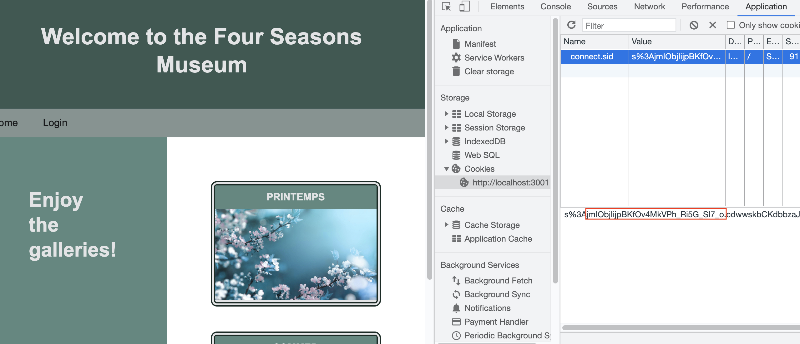

# 14.2 Part-Time Lesson Plan: Model-View-Controller (MVC)

## Overview 

In today's class, students will continue to practice using Handlebars.js, including using partials and custom helpers. Students will also incorporate sessions and cookies using the Sequelize store. Lastly, students will create their own custom middleware for user authentication. 

## Instructor Notes

* In this lesson, students will complete activities `11-Ins_Partials` through `20-Stu_Middleware`.

* Be sure to prepare and read over the activities before your class begins. Try to anticipate any questions students may have.

* You will be using MySQL for today's activities. Be sure to have your MySQL server up and running. Demonstrate creating the `museum_db` database live in class during the first "Instructor Demo" of this class.

* Be sure to modify the `.env.EXAMPLE` file to include your MySQL user/password information before demonstrating each activity.

* Students will need to create the `museum_db` database and seed it during their first activity. They will need to run `npm install`, modify the `.env.EXAMPLE` file, and run `npm start` before **every** activity.

* Remind students to do a `git pull` of the class repo to have today's activities ready and open in VS Code. 

* If you are comfortable doing so, live-code the solutions to the activities. If not, just use the solutions provided and follow the prompts and talking points for review.

* Let students know that the Bonus at the end of each activity is not meant to be extra coding practice, but instead is a self-study on topics beyond the scope of this unit for those who want to further their knowledge.

## Learning Objectives

By the end of class, students will be able to:

* Implement Handlebars.js partials to reuse a Handlebars.js template.

* Utilize custom helper functions to format data in a Handlebars.js template.

* Create and read a session on a server using `express-sessions`. 

* Explain how cookies and sessions work together.

* Implement middleware function in Express.js for user authentication. 

## Time Tracker
| Start  | #   | Activity Name                       | Duration |
|---     |---  |---                                  |---       |
| 6:30PM | 1   | Instructor Do: Stoke Curiosity      | 0:10     |
| 6:40PM | 2   | Instructor Demo: Partials           | 0:05     |
| 6:45PM | 3   | Student Do: Partials                | 0:15     |
| 7:00PM | 4   | Instructor Review: Partials         | 0:10     |
| 7:10PM | 5   | Instructor Demo: Custom Helpers     | 0:05     |
| 7:15PM | 6   | Student Do: Custom Helpers          | 0:15     |
| 7:30PM | 7   | Instructor Review: Custom Helpers   | 0:10     |
| 7:40PM | 8   | Instructor Demo: Sessions           | 0:05     |
| 7:45PM | 9   | Student Do: Sessions                | 0:15     |
| 8:00PM | 10  | BREAK                               | 0:15     |
| 8:15PM | 11  | Instructor Review: Sessions         | 0:10     |
| 8:25PM | 12  | Instructor Demo: Cookies            | 0:05     |
| 8:30PM | 13  | Student Do: Cookies                 | 0:15     |
| 8:45PM | 14  | Instructor Review: Cookies          | 0:10     |
| 8:55PM | 15  | Instructor Demo: Middleware         | 0:05     |
| 9:00PM | 16  | Student Do: Middleware              | 0:15     |
| 9:15PM | 17  | Instructor Review: Middleware       | 0:15     |
| 9:30PM | 18  | END                                 | 0:00     |

---

## Class Instruction

### 1. Instructor Do: Stoke Curiosity (10 min)

* Welcome students to class.

* One of the topics for today is cookies. Using the prompts below, have a discussion about how sessions and cookies work hand-in-hand.

* Ask the class the following questions (☝️) and call on students for the answers (🙋):

  * Today we are going to talk about cookies! Not the cookies that we eat, but the HTTP cookies that are saved whenever we visit a website. 

  * You've probably seen these messages whenever you visit a website:

  > This website stores cookies on your computer. These cookies are used to collect information about how you interact with our website and allow us to remember you. 
  We use this information in order to improve and customize your browsing experience and for analytics and metrics about our visitors both on this website and other media. 
  To find out more about the cookies we use, see our Privacy Policy.
  If you decline, your information won’t be tracked when you visit this website. A single cookie will be used in your browser to remember your preference not to be tracked.

  * ☝️ What do you think this means? What is your understanding of cookies?

  * 🙋 Cookies are used to remember the website visitor. A cookie is a small text file. It is stored on your computer.

  * ☝️ Can you think of examples of when cookies would be useful?

  * 🙋 The most common example is a shopping cart. When we visit an online store and select some items to add to your shopping cart, the cookie will remember those items.  When you are ready to checkout, the items will still be in your shopping cart.

  * ☝️ It looks like cookies are very useful and even crucial to a good user experience when visiting websites. So why do websites ask for your permission to store cookies?

  * 🙋 Companies need to get your explicit consent to collect your data because most cookies identify you through your device. Cookies are pieces of information saved about you when you’re online, and they track you as you browse. So it can be a privacy issue. There are many security considerations to keep in mind when implementing cookies, but arguably the most important is that there are vulnerabilities that allow cookies to be accessed by third parties. This why we do **not** store sensitive information, like passwords, in cookies.

  * ☝️ We also learned to use localStorage to store data. How are cookies different from localStorage?

  * 🙋 Cookies can be read by the client but are mainly for reading server-side, whereas local storage can only be read by the client-side. Basically, cookies allow the server to deliver a page tailored to the user. Local storage allows a much larger amount of data to be stored on the user's computer and reduces the amount of traffic between the client and server. When trying to decide which one to use, think about who needs this data, is it the client or the server?

  * ☝️ How will we use cookies in our applications today?

  * 🙋 We will use cookies to remember our logged in status so we can navigate from page to page and have access to all the content.

* Answer any questions before proceeding to the next activity. 

### 2. Instructor Demo: Partials (5 min) 

* Remind students to start their MySQL Server.

* Go over how to create the `museum_db` database, run `npm install`, and modify the `.env.EXAMPLE` file to include their MySQL user/password information with the class.

* Demonstrate how to seed the database by running `npm run seed` in your command line.

* Navigate to `11-Ins_Partials` and run `npm start` from the command line. 

* Open <http://localhost:3001/> in your browser and demonstrate the following:

  * Today all of our activities will use this museum application. 

  * We see four galleries named after the four seasons in different languages.

  * 🔑 When we click a gallery, we see the paintings (photos) that belong in that gallery.

  * 🔑 When we click on a painting, we see it in a larger format with the title and artist name.

* Open `11-Ins_Partials/views/homepage.handlebars` in your IDE and explain the following:

  * 🔑 Here is the homepage. Instead of rendering the four galleries here, we use a partial `gallery-details` instead.

  * We are using the built-in helper method `{{#each}}` to iterate through the galleries. Then for each gallery we are rendering the `gallery-details` partial.

  ```handlebars
  {{#each galleries as |gallery|}}
  {{> gallery-details}}
  {{/each}}
  ```

* Open `11-Ins_Partials/views/partials/gallery-details.handlebars` in your IDE and explain the following:

  * 🔑 We create a new folder in the `views` directory called `partials` and put our partials there.

  * In the `gallery-details` partial, we see a card that links to the specific gallery using its `id`.

  ```handlebars
  <section class="card">
    <a href="/gallery/{{id}}">
    ...
    </a>
  </section>
  ```

  * The card consists of a header with the name of the gallery and the first painting of the gallery. Notice how we are accessing the first painting of the gallery, as well as its filename and description.

  ```handlebars
  <header>{{name}}</header>
  
  ```

  * ☝️ How are the Handlebars.js templates getting all this data about the galleries and their paintings?

  * 🙋 They're getting it from the Controllers!

* Open `11-Ins_Partials/controllers/home-routes.js` in your IDE and explain the following:

  * If we take a look at the routes, we see we are getting all of the galleries as well as the paintings in each gallery.

  ```js
  const dbGalleryData = await Gallery.findAll({
    include: [
      {
        model: Painting,
        attributes: ['filename', 'description'],
      },
    ],
  });
  ```

  * Then we map through the data and serialize it.

  ```js
  const galleries = dbGalleryData.map((gallery) =>
    gallery.get({ plain: true })
  );
  ```

  * When we render the `homepage` template, we pass in the `galleries` data for the templates to use.

  ```js
  res.render('homepage', {
    galleries,
  });
  ```

* In preparation for the activity, ask TAs to start directing students to the activity instructions found in `12-Stu_Partials/README.md`.

* Ask the class the following questions (☝️) and call on students for the answers (🙋):

  * ☝️ How else could we use partials in our museum application?

  * 🙋 We will use partials to reuse a template that renders details about the painting.

* Answer any questions before proceeding to the next activity.

### 3. Student Do: Partials (15 min) 

* Direct students to the activity instructions found in `12-Stu_Partials/README.md`.

* Break your students into pairs that will work together on this activity.

* Remind students to set up their `museum_db` database and seed it before starting on the activity. 

* Students should also modify the `.env.EXAMPLE` file to include their MySQL user/password information and run `npm install` before **every activity**. 

```md
# 🏗️ Use Handlebars.js partials to reuse a template

Work with a partner to implement the following user story:

* As a developer, I want to be able to render details of a painting by reusing the same Handlebars.js template.

## Acceptance Criteria

* It's done when the details for the paintings that are associated with the gallery are rendered using a Handlebars.js partial in the [gallery.handlebars](./Unsolved/views/gallery.handlebars) file.

* It's done when the `painting-details.handlebars` partial renders a card that links to that painting's page.

* It's done when the card includes a header with the painting's title.

* It's done when the card includes a body with the painting and the artist's name.

## Assets

The following image demonstrates how the painting's details should be rendered onto the page:


---

## 💡 Hints

* How do we set up the database?

* What command do we use to seed the database?

* What is the syntax for Handlebars.js partials?

## 🏆 Bonus

If you have completed this activity, work through the following challenge with your partner to further your knowledge:

* What are some other ways we can use Handlebars.js partials? How else can partials be useful?

Use [Google](https://www.google.com) or another search engine to research this.
```

* While breaking everyone into groups, be sure to remind students and the rest of the instructional staff that questions on Slack or otherwise are welcome and will be handled. It's a good way for your team to prioritize students who need extra help.

### 4. Instructor Review: Partials (10 min) 

* Ask the class the following questions (☝️) and call on students for the answers (🙋):

  * ☝️ How comfortable do you feel with Handlebars.js partials? (Poll via Fist to Five, Slack, or Zoom)

* Assure students that we will cover the solution to help solidify their understanding. If questions remain, remind them to use office hours to get extra help!

* Use the prompts and talking points (🔑) below to review the following key points:

  * ✔️ `painting-details` partial

  * ✔️ Link to painting's page

  * ✔️ Painting's title

  * ✔️ Painting's image and artist name

* Open `12-Stu_Partials/Solved/views/gallery.handlebars` in your IDE and explain the following: 

  * This is the gallery page that displays the paintings that belong to this gallery. There are 2-3 paintings for each gallery so we use the built-in helper function `{{#each}}` to iterate through each painting.

  ```handlebars
  {{#each gallery.paintings as |painting|}}

  {{/each}}
  ```

  * 🔑 The details for each painting will be rendered by using the partial `painting-details`. 

  ```handlebars
  {{> painting-details}}
  ```

* Open `12-Stu_Partials/Solved/views/partials/painting-details.handlebars` in your IDE and explain the following: 

  * We are given a card for each painting. We need to include a link to the painting's page, the title, the image, and the artist name.

  * 🔑 We use the entire contents of the card as a link to the painting's page, so we encapsulate everything in a `<a>` tag. We are using the `id` of the painting with the `{{ }}` handlebars syntax.

  ```handlebars
  <a href="/painting/{{id}}">

  </a>
  ```

  * 🔑 We create the card header by using the `<header>` tag with the painting's `title` as a Handlebars.js expression.

  ```handlebars
  <header>{{title}}</header>
  ```

  * 🔑 In the body of the card, we render the actual image of the painting. We use the painting's `filename` in the `` tag and the painting's `description` as the alt text.

  ```handlebars
  
  ```

  * 🔑 Also in the card body, we include the artist's name.

  ```handlebars
  <p>By: {{artist}}</p>
  ```

* Ask the class the following questions (☝️) and call on students for the answers (🙋):

  * ☝️ If we want to specify what data gets sent over to the partials to be rendered, where can we do that?

  * 🙋 That will be handled in our Controllers! As part of the MVC framework, the templates (View) only focus on the rendering of content. The routes (Controller) are responsible for getting the data from the database (Model) and handle all the logic behind which data is needed to be rendered.

  * ☝️ What can we do if we don't completely understand this?

  * 🙋 We can refer to supplemental material, read the [Handlebars.js Docs on Partials](https://handlebarsjs.com/guide/partials.html#basic-partials), and stick around for office hours to ask for help.

* Answer any questions before proceeding to the next activity.

### 5. Instructor Demo: Custom Helpers (5 min) 

* Navigate to `13-Ins_Custom-Helpers` and run `npm install` and `npm start` in your command line to demonstrate the following:

  * 🔑 When we navigate to <localhost:3001/> in our browser and click on one of the galleries, we see the "Opening Hour" and "Closing Hour".

  * 🔑 But the "Opening Hour" is formatted as the original timestamp from the database, whereas the "Closing Hour" has been formatted to a clean `H:M:S` format.

* Open `13-Ins_Custom-Helpers/views/gallery.handlebars` in your IDE and explain the following:

  * We see how the Opening Hour uses the gallery's `starting_date` as is.

  ```handlebars
  <h4>Opening Hour: {{gallery.starting_date}}</h4>
  ```

  * 🔑 But we see how Closing Hour uses a custom helper function called `format_time` to display only the time of `gallery.ending_date` in a specific format.

  ```handlebars
  <h4>Closing Hour: {{format_time gallery.ending_date}}</h4>
  ```

* Open `13-Ins_Custom-Helpers/utils/helpers.js` in your IDE and explain the following:

  * 🔑 To create our own custom helper functions, we create a folder called `utils` and a new file named `helpers.js`.

  * 🔑 For our `format_time` custom helper, we will take in a `date` timestamp and use the `toLocaleTimeString()` method to format the time as `H:MM:SS AM/PM`.

  ```js
  module.exports = {
    format_time: (date) => {
      return date.toLocaleTimeString();
    },
  };
  ```

* Open `13-Ins_Custom-Helpers/server.js` in your IDE and explain the following:

  * In order to use custom helper methods, we need to import them into our `server.js` file.

  ```js
  const helpers = require('./utils/helpers');
  ``` 

  * We instruct Handlebars.js to incorporate the custom helper methods when rendering the templates.

  ```js
  const hbs = exphbs.create({ helpers });
  ```

* In preparation for the next activity, ask TAs to start directing students to the activity instructions found in `14-Stu_Custom-Helpers/README.md`.

* Ask the class the following questions (☝️) and call on students for the answers (🙋):

  * ☝️ How would we use custom helpers to format the painting's end date in our museum application?

  * 🙋 We will need to create a helper function and use JavaScript Date methods that allow us to get the month, date, and year of a timestamp.

* Answer any questions before proceeding to the next activity.

### 6. Student Do: Custom Helpers (15 min) 

* Direct students to the activity instructions found in `14-Stu_Custom-Helpers/README.md`.

* Break your students into pairs that will work together on this activity.

```md
# 🐛 Date is not formatted correctly

Work with a partner to resolve the following issue(s):

* Museum visitors should be able to see the end date of each painting on the painting page.

## Expected Behavior

When a museum visitor visits the painting page, it should clearly and accurately show the date of when the exhibition will end:

* The end date is calculated by adding five years to the painting's `exhibition_date`.

* The end date should be formatted as `M/D/YYYY`.

## Actual Behavior

When a museum visitor visits the exhibition page, it shows the painting's `exhibition_date` in the original long timestamp format.

## Assets

The following image demonstrates the correct formatting of the end date for each painting:


---

## 💡 Hints

* Which JavaScript Date methods allow you to return the month, date, and year of a specified date?

* How do you correctly render the month, since it is returned as a zero-based value?

## 🏆 Bonus

If you have completed this activity, work through the following challenge with your partner to further your knowledge:

* What other data can be formatted by custom helpers?

Use [Google](https://www.google.com) or another search engine to research this.
```

* While breaking everyone into groups, be sure to remind students and the rest of the instructional staff that questions on Slack or otherwise are welcome and will be handled. It's a good way for your team to prioritize students who need extra help.

### 7. Instructor Review: Custom Helpers (10 min) 

* Ask the class the following questions (☝️) and call on students for the answers (🙋):

  * ☝️ How comfortable do you feel with custom helpers? (Poll via Fist to Five, Slack, or Zoom)

* Assure students that we will cover the solution to help solidify their understanding. If questions remain, remind them to use office hours to get extra help!

* Use the prompts and talking points (🔑) below to review the following key points:

  * ✔️ `.getMonth()`

  * ✔️ `.getFullYear()`

  * ✔️ `format_date()` custom helper

* Open `14-Stu_Custom-Helpers/Solved/utils/helpers.js` in your IDE and explain the following: 

  * Under the `format_time` helper function, we create another custom helper named `format_date` that takes in a date.

  ```js
  format_date: (date) =>  {

  }
  ```

  * 🔑 In order to format the date, we use template literals! First we need to get the month, but notice how `.getMonth()` will return the month as a zero-based value. For example, January will return `0`. In order to format it correctly, we need to add one to value returned.

  ```js
  return `${new Date(date).getMonth() +1}
  ```

  * Then we add the `/` slash and the date value.

  ```js
  /${new Date(date).getDate()}
  ```

  * 🔑 Lastly, we add the `/` slash and get the year, but we need to add five years to it in order to calculate the end date.

  ```js
  /${new Date(date).getFullYear() + 5}`;
  ```

* Open `14-Stu_Custom-Helpers/Solved/views/painting.handlebars` in your IDE and explain the following: 

  * 🔑 On our `painting.handlebars` template, we need to include the helper function `format_date` along with the `painting.exhibition_date` in order for the end date to be rendered correctly.

  ```handlebars
  <p>Exhibition open until: {{ format_date painting.exhibition_date}}</p>
  ```

* Run `npm start` and navigate to <http://localhost:3001/> in your browser to demonstrate the following:

  * When we click on a gallery and then a painting, we see that the exhibition end date is formatted correctly.

* Ask the class the following questions (☝️) and call on students for the answers (🙋):

  * ☝️ How are custom helper functions helpful when using Handlebars.js?

  * 🙋 In order to keep the templates logic-free and only concerned with rendering data, we can separate this kind of logic and place them in helper functions instead.

  * ☝️ What can we do if we don't completely understand this?

  * 🙋 We can refer to supplemental material, read the [Express Handlebars Docs on Helpers](https://www.npmjs.com/package/express-handlebars#helpers), and stick around for office hours to ask for help.

* Answer any questions before proceeding to the next activity.

### 8. Instructor Demo: Sessions (5 min) 

* Navigate to `15-Ins_Sessions` in your command line and run `npm install` to demonstrate the following:

  * Sessions allow our Express.js server to keep track of which user is making a request, and store useful data about them in memory.

  * 🔑 In order to incorporate sessions into our application, we need to install `express-session`.

  * The `express-session` library allows us to leverage sessions in our Express.js routes.

* Open `15-Ins_Sessions/server.js` in your IDE and demonstrate the following:

  * 🔑 We need to import `express-session` into our application.

  ```js
  const session = require('express-session');
  ```

  * 🔑 We set up an Express.js session with the following options: `secret`, `resave`, and `saveUninitialized`. The `secret` option is required and can be either a string for a single secret or an array of multiple secrets. This is used to sign the session ID cookie. Technically this should be stored in a `.env` file as a real secret.

  * The `resave` option forces the session to be saved back to the session store. In most cases, we will want to use `false`.

  * The `saveUninitialized` option forces a session that is "uninitialized" to be saved to the store. A session is uninitialized when it is new but not modified. Choosing `false` is useful for implementing login sessions. 

  ```js
  const sess = {
    secret: 'Super secret secret',
    resave: false,
    saveUninitialized: false,
  };
  ```

* Open `15-Ins_Sessions/controllers/home-routes.js` in your IDE and explain the following:

  * We are going to set up a session variable to count how many times we visit the homepage, and **only** the homepage. We can visit the gallery and painting pages, but that will not get counted.

  * 🔑 In the `/` route, which is our homepage, we set up a session variable called `countVisit`. If that session variable already exists, we increment it by one. But if this is the first time visiting the homepage, meaning there isn't a session variable yet, then we create it and set it to `1`.

  ```js
  if (req.session.countVisit) {
    req.session.countVisit++;
  } else {
    req.session.countVisit = 1;
  }
  ```

  * Then we will render the `homepage` template and send over the `galleries` data and the `countVisit` session variable.

  ```js
  res.render('homepage', {
    galleries,
    countVisit: req.session.countVisit,
  });
  ```

  * We want to make sure the session is created before we send the response back, so we're wrapping the variables in a callback. The `req.session.save()` method will initiate the creation of the session and then run the callback function once complete. 

  ```js
  req.session.save(() => {
    if (req.session.countVisit) {
      req.session.countVisit++;
    } else {
      req.session.countVisit = 1;
    }

    res.render('homepage', {
      galleries,
      countVisit: req.session.countVisit,
    });
  });
  ```

* Run `npm start` and open <http://localhost:3001/> in your browser and demonstrate the following:

  * When we first visit the homepage, it says "Number of times you've visited this homepage: 1".

  * If we click on a gallery, it says "Number of times you've visited the homepage: 1" because we are not counting anything else but how many times we visit the main homepage.

  * If we go back to the homepage, now it will say "Number of times you've visited this homepage: 2".

  * If we refresh the homepage, the number will increment.

  * If we restart our server, the count is reset! That's because our session is lost once the connection to the server is lost or restarted.

  * This was a simple demo of how to create session variables. In most cases, session variables will be used to check logged-in statuses. 

* In preparation for the activity, ask TAs to start directing students to the activity instructions found in `16-Stu_Sessions/README.me`.

* Ask the class the following questions (☝️) and call on students for the answers (🙋):

  * ☝️ How could we use sessions to allow or restrict access to content?

  * 🙋 Using sessions to check if a user is logged in or not, we will allow the user to access the gallery's paintings. Otherwise we will redirect the user to the login page.

* Answer any questions before proceeding to the next activity.

### 9. Student Do: Sessions (15 min) 

* Direct students to the activity instructions found in `16-Stu_Sessions/README.me`.

* Break your students into pairs that will work together on this activity.

```md
# 🏗️ Add sessions to the login route

Work with a partner to implement the following user story:

* As a museum director, I want to allow visitors to view the gallery's paintings only after logging in.

* As a museum visitor, I want to be able to visit multiple pages while maintaining my logged in status.

## Acceptance Criteria

* It's done when I am able to view the gallery's paintings only after I am logged in. Otherwise I am directed to login.

* It's done when I am able to view the individual painting page only after I am logged in. Otherwise I am directed to login.

* It's done when I can navigate from the gallery page to a painting's detail page without losing my logged in status.

## Assets

The following image demonstrates what the museum visitor sees if they try to access the gallery page without logging in:


---

## 💡 Hints

* You will need to create a user to test out the routes. Feel free to create your own user, or use these credentials to sign up: 

  * `username`: "Sam", `email`: "sam@email.com", `password`: "password1234"

* If the session variables are set up when the user is created or logged in, which file would hold that info?

* How can the templates know if the user is logged in or not?

* What built-in helper method will help us render specific content depending on whether the user is logged in or not?

## 🏆 Bonus

If you have completed this activity, work through the following challenge with your partner to further your knowledge:

* What is the lifecycle of a session?

Use [Google](https://www.google.com) or another search engine to research this.
```

* While breaking everyone into groups, be sure to remind students and the rest of the instructional staff that questions on Slack or otherwise are welcome and will be handled. It's a good way for your team to prioritize students who need extra help.

### 10. BREAK (15 min)

### 11. Instructor Review: Sessions (10 min) 

* Ask the class the following questions (☝️) and call on students for the answers (🙋):

  * ☝️ How comfortable do you feel with sessions? (Poll via Fist to Five, Slack, or Zoom)

* Assure students that we will cover the solution to help solidify their understanding. If questions remain, remind them to use office hours to get extra help!

* Use the prompts and talking points (🔑) below to review the following key points:

  * ✔️ `loggedIn` session variable

  * ✔️ `{{#if loggedIn}}`

  * ✔️ `{{else}}`

* Open `16-Stu_Sessions/Solved/controllers/api/user-routes.js` in your IDE and explain the following: 

  * We have been provided with `user-routes` to handle creating a new user, logging in, and logging out functionality.

  * 🔑 When a new user is created, we want them to be logged in right away. So we set up a session variable `loggedIn` and set it to `true` as soon a user is created.

  ```js
  req.session.save(() => {
    req.session.loggedIn = true;
    res.status(200).json(dbUserData);
  });
  ```

  * 🔑 For the `/login` route, after we find the user in our database using their email address and check their password against the hashed password, we set up the session.

  ```js
  req.session.save(() => {
    req.session.loggedIn = true;
    res
      .status(200)
      .json({ user: dbUserData, message: 'You are now logged in!' });
  });
  ```

  * This isn't something you had to code, but notice how we destroy the session once the user logs out.

  ```js
  router.post('/logout', (req, res) => {
    if (req.session.loggedIn) {
      req.session.destroy(() => {
        res.status(204).end();
      });
    } else {
      res.status(404).end();
    }
  });
  ```

* Open `16-Stu_Sessions/Solved/views/gallery.handlebars` in your IDE and explain the following: 

  * 🔑 We want to prevent unauthorized access to our paintings in the gallery page. So on the `gallery.handlebars` template, we use the built-in helper method `{{#if}}` to determine if the session variable `loggedIn` is set to `true`. Only then can they access the `painting-details`.

  ```handlebars
  {{#if loggedIn}}
    <section class="flex-row justify-center">
      {{#each gallery.paintings as |painting|}}
      {{> painting-details}}
      {{/each}}
    </section>
  </section>
  ```

  * 🔑 Else, if the session variable `loggedIn` does not exist or is set to `false`, then we provide a link for them to log in.

  ```handlebars
  {{else}}
  <a href="/login">You must login first to view the paintings</a>
  {{/if}}
  ```

* Open `16-Stu_Sessions/Solved/views/painting.handlebars` in your IDE and explain the following: 

  * We need to do the same thing to the `painting.handlebars` template to restrict access.

  * Here we wrap the entire contents of the template in the `{{#if}}` helper method.

  ```handlebars
  {{#if loggedIn}}
  <section class="painting">
    ...
  </section>
  {{else}}
  <a href="/login">You must login first to view this painting</a>
  {{/if}}
  ```

* Run `npm start` and navigate to <http://localhost:3001/> in your browser to demonstrate the following:

  * If we try to access the paintings without logging in, we are directed to log in first. 

  * Let's create a user using the provided credentials: `username`: "Sam", `email`: "sam@email.com", `password`: "password1234"

  * After we are logged in, we can access everything on the museum website.

* Ask the class the following questions (☝️) and call on students for the answers (🙋):

  * ☝️ Did you notice where else we used the `loggedIn` session variable to change the view?

  * 🙋 On the `main.handlebars` template, once the user logged in, the link to login was replaced by a button to logout in the navbar!

  * ☝️ What can we do if we don't completely understand this?

  * 🙋 We can refer to supplemental material, read the [npm Docs on express-session](https://www.npmjs.com/package/express-session), and stick around for office hours to ask for help.

* Answer any questions before proceeding to the next activity.

### 12. Instructor Demo: Cookies (5 min) 

* Navigate to `17-Ins_Cookies` and run `npm install` and `npm start` from your command line.

* Open <http://localhost:3001/> in your browser to demonstrate the following:

  * 🔑 Let's create a new user for this application, if you haven't already done so: `email`: "sam@email.com", `password`: "password1234".

  * 🔑 Now let's try closing the browser, then opening a new tab or window and navigating to <http://localhost:3001/> without logging out first.

  * We are still logged in!! This is possible through HTTP cookies. Cookies allow us to store information about the session on the user's client. We store a reference to the cookie in our database.

  * 🔑 Let's open the Application tab in Chrome DevTools to inspect the cookie. If we select the `Cookies` dropdown on the left-hand menu, we can see the `value` of the cookie.

  

  * Let's also check our database. We initialize the MySQL command line prompt by running `mysql -u root -p` and then entering our MySQL password. Then we run `use museum_db` to change into the `museum_db` database and run `SELECT sid FROM Session;` to view the `sid` of the cookie.

    ```sql
    mysql> SELECT sid FROM Session;
    +----------------------------------+
    | sid                              |
    +----------------------------------+
    | jmIObjIijpBKfOv4MkVPh_Ri5G_SI7_o |
    +----------------------------------+
    1 row in set (0.00 sec)
    ```

  * Lastly, if our server is still running, we can also see it printed in our terminal as we move from route to route.

  ```sh
  Executing (default): SELECT `sid`, `expires`, `data`, `createdAt`, `updatedAt` FROM `Session` AS `Session` WHERE `Session`.`sid` = 'jmIObjIijpBKfOv4MkVPh_Ri5G_SI7_o';
  ```

* In preparation for the activity, ask TAs to start directing students to the activity instructions found in `18-Stu_Cookies/README.md`.

* Ask the class the following questions (☝️) and call on students for the answers (🙋):

  * ☝️ How can we use cookies in our museum application?

  * 🙋 We will need to set up sessions with cookies and the Sequelize store.

* Answer any questions before proceeding to the next activity.

### 13. Student Do: Cookies (15 min)

* Direct students to the activity instructions found in `18-Stu_Cookies/README.md`.

* Break your students into pairs that will work together on this activity.

```md
# 📐 Add Comments to Implementation of the Sequelize Store and cookies

Work with a partner to add comments describing the functionality of the code found in [Unsolved/server.js](./Unsolved/server.js).

## 📝 Notes

Refer to the documentation: 

[Connect Session Store using Sequelize](https://www.npmjs.com/package/connect-session-sequelize)

---

## 🏆 Bonus

If you have completed this activity, work through the following challenge with your partner to further your knowledge:

* What is the difference between sessions and cookies?

Use [Google](https://www.google.com) or another search engine to research this.
```

* While breaking everyone into groups, be sure to remind students and the rest of the instructional staff that questions on Slack or otherwise are welcome and will be handled. It's a good way for your team to prioritize students who need extra help.

### 14. Instructor Review: Cookies (10 min) 

* Ask the class the following questions (☝️) and call on students for the answers (🙋):

  * ☝️ How comfortable do you feel with cookies? (Poll via Fist to Five, Slack, or Zoom)

* Assure students that we will cover the solution to help solidify their understanding. If questions remain, remind them to use office hours to get extra help!

* Use the prompts and talking points (🔑) below to review the following key points:

  * ✔️ `connect-session-sequelize`

  * ✔️ `cookie: {}`

  * ✔️ `SequelizeStore()`

* Open `18-Stu_Cookies/Solved/server.js` in your IDE and explain the following: 

  * 🔑 In order to set up cookies, we first need to initialize Sequelize with the session store. In order to do that, we need to install and import `connect-session-sequelize`. The `connect-session-sequelize` library automatically stores the sessions created by `express-session` into our database!

  ```js
  const SequelizeStore = require('connect-session-sequelize')(session.Store);
  ```

  * 🔑 Then we set up an Express.js session like before but this time we connect to our Sequelize database. We include the `secret`, `resave`, and `saveUninitialized` options as before. All we need to do to tell our session to use cookies is to set `cookie` to be `{}`. If we wanted to set additional options on the cookie, like a maximum age, we would add the options to that object. 

  ```js
  cookie: {}
  ```

  * 🔑 Lastly, we set `store` to a new Sequelize store and we connect it to our database.

  ```js
  store: new SequelizeStore({
    db: sequelize,
  }),
  ```

* Ask the class the following questions (☝️) and call on students for the answers (🙋):

  * ☝️ In what ways are cookies useful?

  * 🙋 Cookies are very useful for customer logins, persistent shopping carts, and product recommendations. 

  * ☝️ What can we do if we don't completely understand this?

  * 🙋 We can refer to supplemental material, read the [Express.js session cookie documentation](https://github.com/expressjs/session#cookie), and stick around for office hours to ask for help.

* Answer any questions before proceeding to the next activity.

### 15. Instructor Demo: Middleware (5 min) 

* Open `19-Ins_Middleware/controllers/home-routes.js` in your IDE and explain the following:

  * 🔑 Conditional access is when we only allow users who are authorized to see certain content. We did something similar in our Sessions activity when we checked if the user was logged in before allowing them to see the paintings. But we checked that in the templates.

  * 🔑 In line with the separation of concerns principle and the MVC framework, the correct way to accomplish this is directly in the routes. If we look at the route for a gallery, we use the same logic where if they are not logged in (meaning the `loggedIn` session variable does not exist), then the user is redirected to the login page.

  ```js
  router.get('/gallery/:id', async (req, res) => {
    if (!req.session.loggedIn) {
      res.redirect('/login');
    } 
  ```

  * 🔑 Else, we allow them to view the gallery's paintings.

  ```js
  else {
    try {
      const dbGalleryData = await Gallery.findByPk(req.params.id, {
        include: [
          {
            model: Painting,
            attributes: [
              'id',
              'title',
              'artist',
              'exhibition_date',
              'filename',
              'description',
            ],
          },
        ],
      });
      const gallery = dbGalleryData.get({ plain: true });
      res.render('gallery', { gallery });
    }
  ```

  * The same logic is used for the painting page. This is more appropriate than doing it in the templates (since we want to keep that kind of logic out of our Views), but there is an even better solution to this!

  * We can create our own custom middleware to check if the user is authenticated before allowing them to access the route. That's what the next activity is all about!

* In preparation for the activity, ask TAs to start directing students to the activity instructions found in `20-Stu_Middleware/README.md`.

* Ask the class the following questions (☝️) and call on students for the answers (🙋):

  * ☝️ How would we use custom middleware for our museum application?

  * 🙋 We will need to create our own custom middleware to check for user authentication. 

* Answer any questions before proceeding to the next activity.

### 16. Student Do: Middleware (15 min) 

* Direct students to the activity instructions found in `20-Stu_Middleware/README.md`.

* Break your students into pairs that will work together on this activity.

```md
# 📖 Implement middleware function for user authentication

Work with a partner to implement the following user story:

* As a developer, I want to write my own middleware to check for user authentication.

## Acceptance Criteria

* It's done when the middleware checks if the user is logged in.

* It's done when the middleware allows access to the gallery and painting pages if the user is logged in.

* It's done when the middleware directs an unauthorized user to the login page if they are not logged in yet.

## 📝 Notes

Refer to the documentation: 

[Express.js Docs on Using Middleware](https://expressjs.com/en/guide/using-middleware.html)

---

## 💡 Hints

* How can you keep the current logic being used in the routes to check if a user is logged in or not and rewrite it as a middleware function?

* Where can we write the code for the custom middleware so it is separate but accessible from the routes? (Where did we put the custom helper functions?)

## 🏆 Bonus

If you have completed this activity, work through the following challenge with your partner to further your knowledge:

* What other middleware do developers use with Express.js?

Use [Google](https://www.google.com) or another search engine to research this.
```

* While breaking everyone into groups, be sure to remind students and the rest of the instructional staff that questions on Slack or otherwise are welcome and will be handled. It's a good way for your team to prioritize students who need extra help.

### 17. Instructor Review: Middleware (15 min)

* Ask the class the following questions (☝️) and call on students for the answers (🙋):

  * ☝️ How comfortable do you feel with custom middleware? (Poll via Fist to Five, Slack, or Zoom)

* Assure students that we will cover the solution to help solidify their understanding. If questions remain, remind them to use office hours to get extra help!

* Use the prompts and talking points (🔑) below to review the following key points:

  * ✔️ `withAuth` middleware

* Open `20-Stu_Middleware/Solved/utils/auth.js` in your IDE and explain the following: 

  * According to the docs, middleware functions are functions that have access to the request object `req`, the response object `res`, and the next middleware function `next`. If the current middleware function does not end the request-response cycle, it must call `next()` to pass control to the next middleware function. Otherwise, the request will be left hanging.

  * To create our custom middleware, we put it in the same folder as our custom helper functions: the `/utils` folder. We create a new file called `auth.js` to hold our custom middleware.

  * 🔑 So, to create this custom middleware, `withAuth`, we take the exact same logic that was in our routes and put it in our function.

    ```js
    const withAuth = (req, res, next) => {
      // This is directly from the `/gallery/:id` and `/painting/:id` routes
      if (!req.session.loggedIn) {
        res.redirect('/login');
      } else {
        // We call next() if the user is authenticated
        next();
      }
    };

    module.exports = withAuth;
    ```

* Open `20-Stu_Middleware/Solved/controllers/home-routes.js` in your IDE and explain the following: 

  * Now we need to refactor the routes to use the middleware functions.

  * First, we need to import the custom middleware at the top of the file.

  ```js
  const withAuth = require('../utils/auth');
  ```

  * 🔑 Then we replace the logic that is in the `/gallery/:id` and `/painting/:id` routes with the middleware.

  ```js
  router.get('/gallery/:id', withAuth, async (req, res) => { 

  }

  router.get('/painting/:id', withAuth, async (req, res) => {

  }
  ```

  * Notice how clean our code looks and it functions perfectly!

* Ask the class the following questions (☝️) and call on students for the answers (🙋):

  * ☝️ How are custom middleware useful when building applications?

  * 🙋 Writing custom middleware helps us handle common functionality in our applications. For example, it keeps us from repeating the same code at the beginning of a route handler.

  * ☝️ What can we do if we don't completely understand this?

  * 🙋 We can refer to supplemental material, read the [Express.js Docs on Using Middleware](https://expressjs.com/en/guide/using-middleware.html), and stick around for office hours to ask for help.

* Answer any questions before ending the class.

### 18. END (0 min)

How did today’s lesson go? Your feedback is important. Please take 5 minutes to complete this [anonymous survey](https://forms.gle/RfcVyXiMmZQut6aJ6).

---
© 2020 Trilogy Education Services, LLC, a 2U, Inc. brand. Confidential and Proprietary. All Rights Reserved.