# 19.1 Lesson Plan - An ES6travaganza (6:30 PM) <!--links--> &nbsp; [⬅️](../../18-Week/03-Day/03-Day-LessonPlan.md) &nbsp; [➡️](../02-Day/02-Day-LessonPlan.md)

## Overview

* This week, we will be introducing students to React. For them to be able to understand it, however, they need a basic primer in ES6.

* Thus, in this class we will be introducing students to a few ES6 concepts prevalent in React (and general modern JS) development.

* Today's class is fast-paced. This class is not meant to be an extensive introduction to all concepts ES6, but instead a basic introduction to some of the more commonly-used concepts. Students are expected to continue their study of these and other ES6 concepts outside of class.

* Regarding timing: You can expand/reduce activity times according to student interest and familiarity.

* Have your TAs reference [01-Day-TimeTracker](https://drive.google.com/a/trilogyed.com/file/d/1rcPKcPeV7pRwl_pszChm7FhectWPLbXX/view?usp=sharing) to help keep track of time during class.


`Summary: Complete activities 1-13 in Unit 19`

### Before class

* If you have time, we always recommend personalizing the activities with names/relevant examples for your class! For example, switch up the names in the activities to be students in your class.

* Free to plan to cut out activities that would be less beneficial for your class. For example, if you've already discussed arrow function or `const` and `let`, feel free to skip those activities to spend more time on other topics.

- - -

### Class Objectives

* Students will understand and utilize ES6 arrow functions

* Students will understand and utilize const/let and block Scope

* Students will understand ES2015 modules

* Students will understand classes, constructors, and class methods

* Students will understand truthy/falsy values and and short circuit evaluation

* Students will understand and utilize ternary expressions

* Students will understand and utilize the `forEach`, `map`, and `filter` array methods

* Students will understand ES6 object destructuring

- - -

### 1. Preview:  (5 min)

* This week we will finally be learning React. When working with React, it’s common to utilize newer ES6 JavaScript features we haven’t covered yet. Today we’ll go through some of the most commonly used ES6 features, as well as some JavaScript fundamentals students may not have mastered yet. This will not be a deep dive but an introduction to what they will need to know to be successful in React development, and writing more modern JS code!

* Facebook created React.js. Explain that lots of big companies such as AirBnB, Netflix, Atlassian, Khan Academy, and Walmart build with React. Get students excited about today.

* Transition: We’ll cover a lot of ground in this lesson, but it’s okay if students walk away without a totally solid understanding of every concept, they’ll get to continue practicing everything discussed over the next few lessons. For the most part, it'll be beneficial for students to have some exposure to these concepts before seeming them alongside JSX &mdash; which may be confusing all on its own.

### 2. Instructor Do: Arrow Function Demo (10 min) (HIGH)

* In this demonstration you will give students and overview of arrow functions, including syntax differences, when to use them, and when to avoid them.

* Explain to the class that ES6 introduces a newer shorter syntax for writing functions. Consider the following example found in [01-syntax.js](../../../../01-Class-Content/19-react/01-Activities/01-Ins_ArrowFunction/01-syntax.js).

  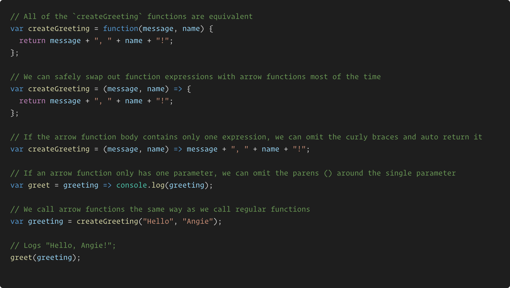

  * Point out how we can swap out a function expression for the shorter arrow function syntax.

  * Bring everyone's attention to how we can optionally shorten this syntax even further by removing the curly braces if the function has only one expression inside of its body. Explain that when we do this the single expression is returned automatically.

  * Finally point out that if an arrow function takes a single parameter, we can optionally omit the parentheses around that parameter.

  * Take a few moments to answer any questions about the arrow function syntax before moving on to some behavioral differences between arrow functions and regular functions.

* Now walk through the first part of the code in [02-context.js](../../../../01-Class-Content/19-react/01-Activities/01-Ins_ArrowFunction/02-context.js).

  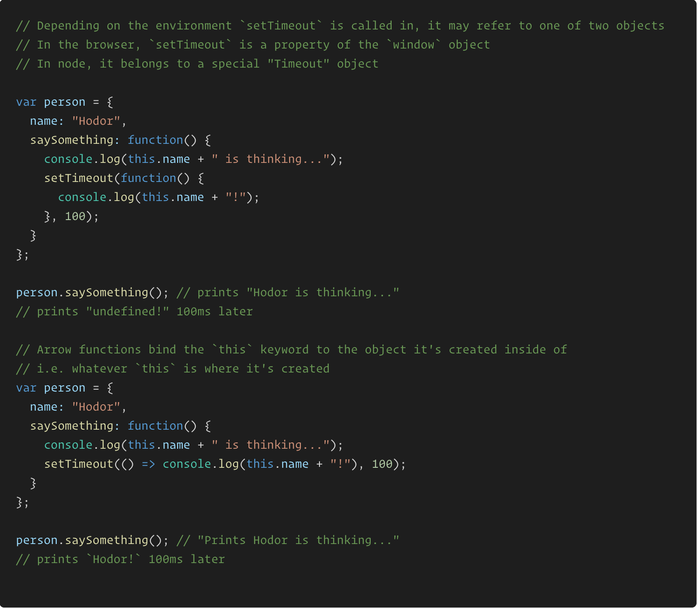

  * Students may still not feel completely comfortable with the `this` keyword in JavaScript yet, inform them that many experienced developers still aren't as it's a tricky topic.

  * When run in the browser `this` inside of the `setTimeout` method refers to the `window`, when run inside of node, it refers to a newly created `Timeout` object. In both cases, `setTimeout` changes `this` to no longer be the `person` object.

  * Explain that we could resolve this issue by using `.bind(this)` as we've done before, but ES6 introduces arrow functions, a shorter more concise syntax for doing just this.

  * Point out how this code works as intended. Explain that this is because an arrow function automatically binds to the context or object it's created inside of, even if it is not a direct property of that object. The arrow function is created when `saySomething` is run, inside of `person` right before the `setTimeout` is run.

* Explain that this may seem great, but we can experience unexpected results if we were to write an object's method as an arrow function. Demonstrate [03-arrow-property-methods.js](../../../../01-Class-Content/19-react/01-Activities/01-Ins_ArrowFunction/03-property-methods.js).

  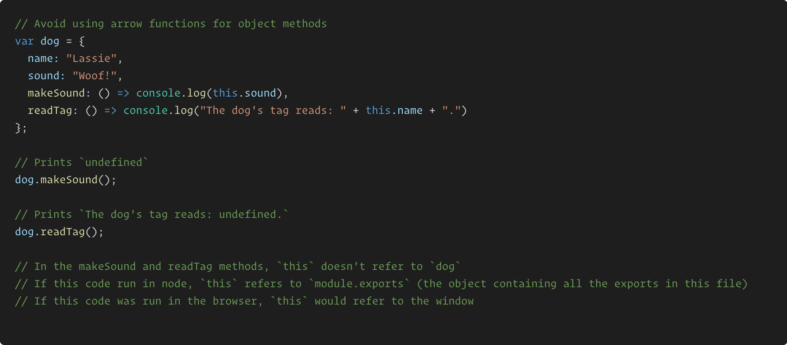

  * Explain that when working with objects, we typically want to avoid using arrow functions for its methods. In these cases, the arrow function will bind to the context it's created inside of (probably the `window` or `module.exports` object).

  * We can replace regular functions with arrow functions _most_ of the time, but they aren't meant to replace regular functions altogether for reasons like this. Additionally (native, non-transpiled) arrow functions can't be used as constructor functions and also don't have access to Function prototype methods such as `bind`, `call`, and `apply`.

  * Students will become more comfortable with when to use and not use arrow functions as they practice using them. For now, they should understand that they can use them most of the time, but they should avoid using them as object methods.

* At a minimum, arrow functions give us slightly shorter syntax for writing functions.

* Take a moment to answer any lingering questions.

### 3. Students Do: Arrow Function Practice (8 min)

* In this activity students will convert a file with pre-written code over to use arrow functions where suitable.

* Students won't need to fully understand how all the code in this activity works, just the rules we've established about when arrow functions should and shouldn't be used.

* **Activity & Instructions**: [02-Stu_ArrowFunctionPractice](../../../../01-Class-Content/19-react/01-Activities/02-Stu_ArrowFunctionPractice)

* Instructional staff should be circulating the room checking in on students progress and making themselves available for assistance.

### 4. Instructor Do: Review Arrow Function Practice (8 min)

* Open [Solved/index.js](../../../../01-Class-Content/19-react/01-Activities/02-Stu_ArrowFunctionPractice/Solved/index.js) in your editor and run the code. Point out that even though we've converted a few of the examples over to use arrow functions, the code works exactly the same as it did before.

  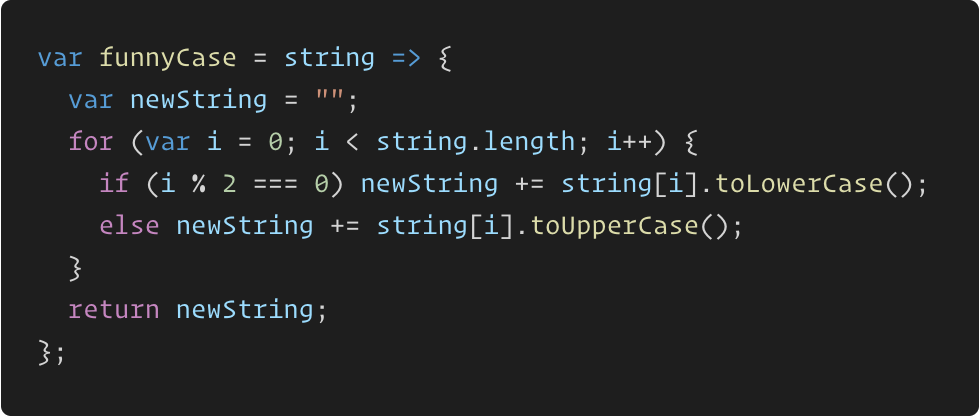

  * Point out again how we can omit the parentheses around the arrow function parameters if there is only one. This **does not** work if the arrow function has multiple or no parameters. This is optional, assure students that they don't need to do this, but may see code written this way.

  

  * Point out again how we can also omit an arrow function's curly braces if the arrow function body only contains one expression. The single expression is automatically returned from the function when we use this shorter syntax. Students may see code written in this way, but this is also optional, if students prefer, they may continue to use curly braces and the `return` keyword.

* Finally point out the `netflixQueue` object. Ask the class: Why didn't we convert the functions here to arrow functions?

  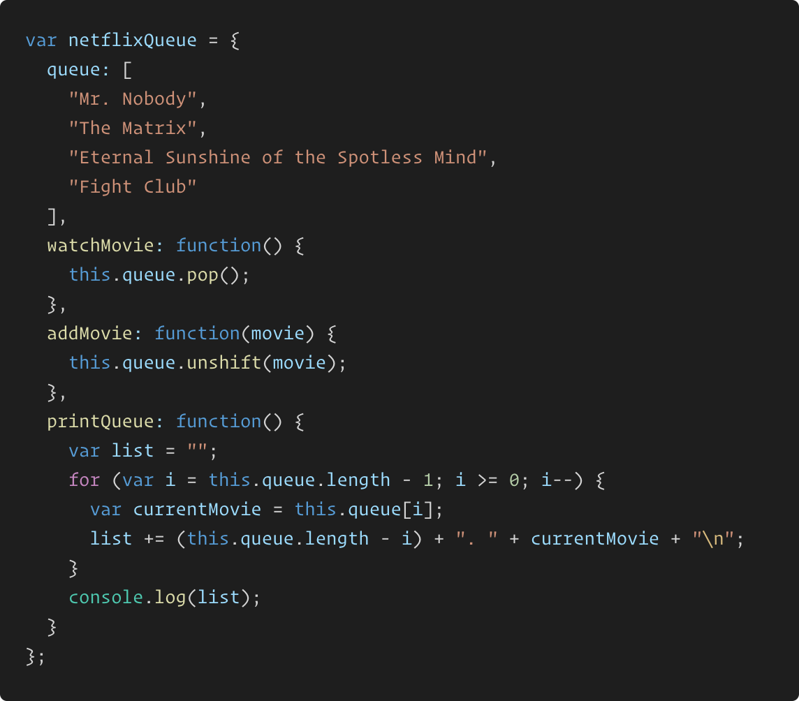

  * Whenever we're working with objects, we usually don't want to write its methods as as arrow functions since `this` inside of the arrow function will refer to whatever object the one we're defining is inside of (usually the `window` in the browser or `module.exports` in node).

* Inform the class that the key takeaways for now are:

  * In most cases, we can replace regular functions with arrow functions.

  * Arrow functions shouldn’t be object methods.

### 5. Instructor Do: Let and Block Scope (8 min) (CRITICAL)

* In this example we will demonstrate the new `let` keyword and how block scoping works.

* Explain to the class that by now they should be familiar with function scope. Have a volunteer offer up their explanation for what this means.

* With function scope, variables defined inside of a function body are only available inside of that function, as well as functions defined inside of that function.

* Explain that ES6 offers us a new way to define variables using `let`. Unlike `var`, `let` is block scoped.

* Inform the class that a "block" is created whenever we have a pair of curly braces. This includes loops and conditional statements as well as function bodies. Since `let` is block scoped, any variables we define using `let` inside of a block are only available inside of that block.

* This can help us avoid a few silly mistakes in our code. Point out the first example in [index.js](../../../../01-Class-Content/19-react/01-Activities/03-Ins_LetAndBlockScope/index.js).

  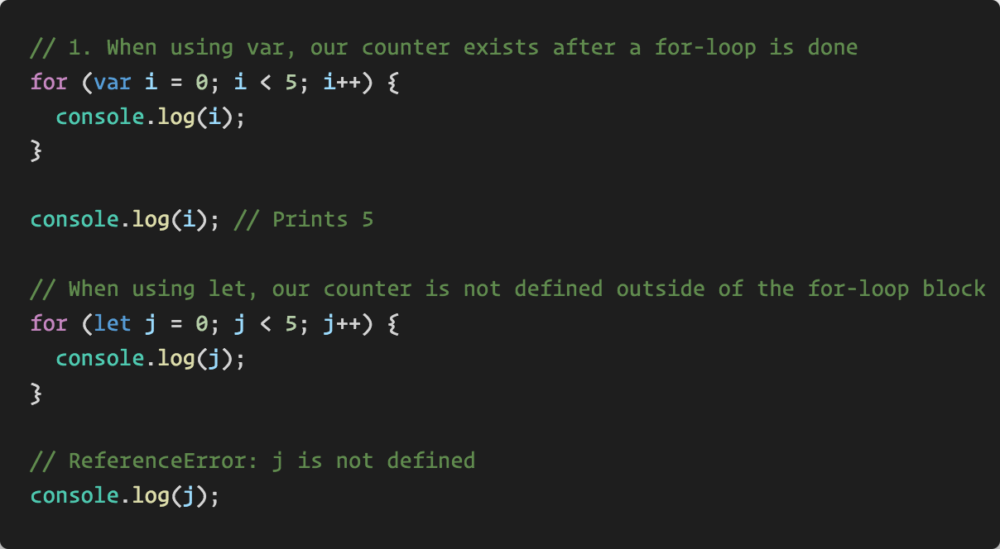

  * Point out how our for-loop counter continues to exist after the for-loop has ended. We don’t need it anymore. This could potentially cause issues if we wanted to refer to a different variable with the same name as the counter later.

  * Even though the `let` declaration is not technically inside of the curly braces, it's considered to be part of the block anyway in this case.

  * Point out how the counter no longer exists after the loop is done when we use `let`.

  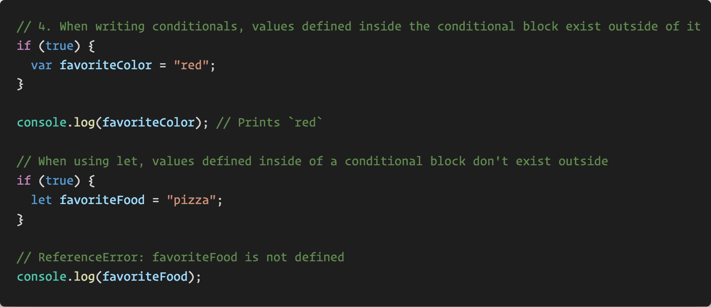

  * Point out how when using `let`, any values defined inside of a conditional block no longer exist outside of the conditional.

* If you need to use a variable both inside and outside of  a block, you’d define it outside of the block. Example:

  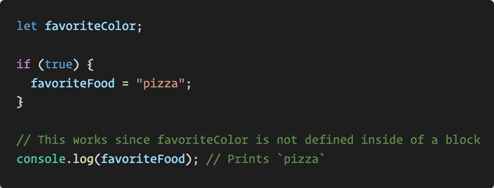

  * This helps express intent because it tells others more information about where or how we’ll be using the value.

* Inform the class that going forward, we will no longer be using `var`. Unlike arrow functions and regular functions, we can completely replace `var` with `let`.

* Take a moment to answer any questions, but avoid getting too off track! We'll go over `const` next!

### 6. Instructor Do: Constant Reference (8 min)

* In this demonstration we will cover the new `const` keyword for defining variables and when it should be used.

* Explain to the class that while we can replace all the `var`s in all of our code with `let`, we also have one more new option for declaring variables: `const`.

* Ask the class: Can anyone tell me what they think `const` is used for in JavaScript?

  * Odds are, if any students have been exposed to another programming language, someone will answer that `const` is like `let`, except that it's for variables which can't be changed. This is _mostly_ true.

* Explain that `const` has the same rules as `let` for block scoping. There is, however, one one key difference between `const` and `let`: a variable declared with `const` cannot be _reassigned_.

* Inform the class that using `const` can help prevent us from accidentally reassigning values we don't mean to, and also helps express intent, helping us document important values in our code for other developers, or for our future selves when we forget how the code works.

* Open [index.js](../../../../01-Class-Content/19-react/01-Activities/04-Ins_ConstantReference/index.js) and go through each example.

  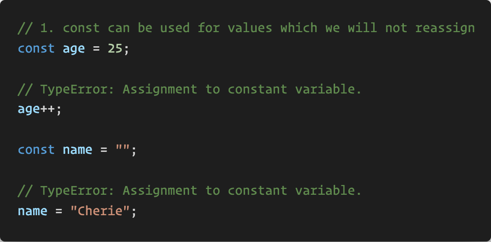

  * Point out that whenever we try to reassign a variable declared with `const`, we get an error in the console. Whenever we're working with primitive types such as strings or numbers, even modifying the value e.g. `age++`, is considered to be reassigning it. This is because primitive types such as numbers and strings are "passed by value", i.e. a new value is created and referred to in memory anytime we modify variable containing a primitive type.

  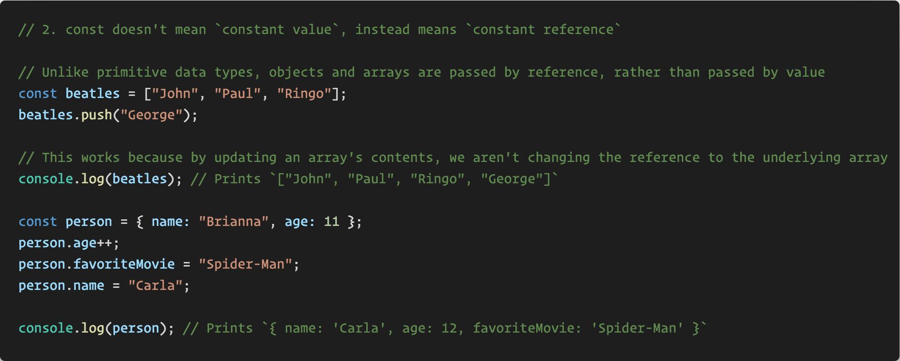

  * Point out how in the second example, we can update the array and object as long as we aren't reassigning them completely, i.e. using the `=` operator to assign the variables a new values.

  * Explain that `const` in JavaScript doesn't mean "constant value", but rather "constant reference". Because arrays and objects are non-primitive values, they are "passed by reference", i.e. modifying an array or object doesn't create a new object or array in memory. This is why we can push to the array or update the object's properties.

  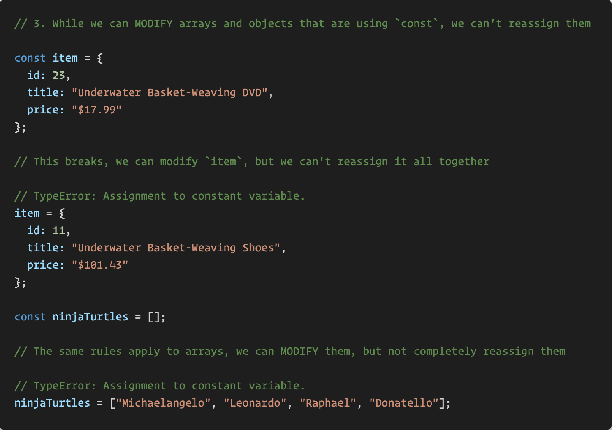

  * To check for understanding, ask the class: `Why isn't this last example allowed?`

    * While we can modify arrays and objects declared with `const`, we still can't reassign them completely.

* Key takeaways for this demonstration:

  * Both `const` and `let` are block scoped.

  * Use `let` whenever a value will need to be reassigned.

  * Use `const` whenever a value won't need to be reassigned.

### 7. Students Do: Convert Const Let Arrow (15 min) (CRITICAL)

* In this activity students will convert a prebuilt Crystal Guessing Game to use the new ES6 syntax covered so far.

* Stress that students don't need to completely understand all of the code in the activity. They just need to remember what we just overed about `const`, `let`, and arrow functions.

* **Activity & Instructions**: [05-Stu_ConvertConstLetArrow](../../../../01-Class-Content/19-react/01-Activities/05-Stu_ConvertConstLetArrow/Unsolved)

### 8. Instructor Do: Review Convert Const/Let & Arrow (8 min)

* Open [index.js](../../../../01-Class-Content/19-react/01-Activities/05-Stu_ConvertConstLetArrow/Solved/index.js) in your code editor and walk through the code with the class.

* For every `let`, ask the class: "Why it isn't a `const` instead?"

  * Because the value is reassigned somewhere.

* For every `function` keyword: ask the class, "Why isn't an arrow function isn't used instead?"

  * In this activity, constructor functions and functions that are object methods using the `this` keyword are kept as regular functions.

  * For object methods, arrow functions will prevent `this` from binding to the object.

  * Arrow function's can't be used as constructor functions.

* Run the application in the browser and demonstrate that it works the same as it did before.

* Answer any remaining questions about the solution.

### 9. Instructor Do: Truthy/Falsey and Ternary Expressions (14 min) (CRITICAL)

* In this example we will briefly go over short circuit evaluation as well as ternary expressions. While not new to JavaScript, these are heavily used in React and may require some explanation.

* Go over the code in [index.js](../../../../01-Class-Content/19-react/01-Activities/06-Ins_TruthyFalsey/index.js) one at a time and have students guess or explain what each value will log and why. Try to make this part fun! Students are learning about to learn about concept in JavaScript that escapes many professional developers.

  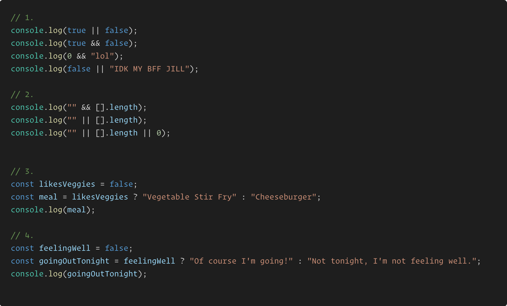

* Be sure to explain how some values can be cast to `true` or `false` depending on what they are, hence the terms truthy and falsey values.

* An easy way to explain this would be to have students ask themselves if a value _exists_. i.e. `0`, `null`, `undefined`, `""`, are all empty/nonexistent values.

* If you'd like, show the class how a value can be explicitly converted to a boolean using the Boolean constructor. Example:

  ```js
  const falsey = 0;
  console.log(Boolean(falsey)); // prints false
  ```

* Explain the flow our code takes as we use the `||` or `&&` operator, and have students guess how this works as you go through the examples.

  * When using `||` operator, the if the value to the left of the operator is evaluated as truthy, that value is returned and the value on the right is thrown away. If the value on the left of the operator is evaluated as falsey, the value on the right is evaluated and returned whether it's truthy or not.

  * When using the `&&` operator, if the value on the left is evaluated as falsey it is returned and the value on the right is thrown away. If the value on the left is evaluated as truthy, the value on the right is evaluated and returned, whether it's truthy or not.

  * Point out how this works the same here as it does in if/else statements. A final value is returned by the expression and used to decide if the conditional should run or not.

* Explain to students the concept of _Ternary Expressions_.

  * Ternary expressions perform a function similar to if/else statements, with much less code.

  * Ternary expressions are written in the format of `condition ? evalAndReturnIfConditionIsTruthy : evalAndReturnIfConditionIsFalsey`

    

    * Point out how ternary expressions can be used to assign a value to a variable or execute some basic logic based on a simple condition.

    * Explain that these don't replace if/else statements, but for simple conditionals it might be more elegant to use a ternary expression.

* Take a moment to answer any remaining questions, students will get to practice hands-on in the next activity.

### 10. Student Do: Truthy and Falsey (7 min) (HIGH)

* In this activity students will refactor if/else statements to make use of short-circuit evaluation and ternary expressions. Once complete, the activity code should work the same way.

* **Activity & Instructions**: [Truthy Falsey](../../../../01-Class-Content/19-react/01-Activities/07-Stu_TruthyFalsey/Unsolved)

* Instructional staff should be circulating the room during this activity, checking student progress and making themselves available for assistance.

### 11. Instructor Do: Review Truthy and Falsey (8 min)

* Open [index.js](../../../../01-Class-Content/19-react/01-Activities/07-Stu_TruthyFalsey/Solved/index.js) in your code editor and walk through the code with the class.

* Optionally, if the class had an easy time with this activity, consider showing them the default parameter syntax introduced with ES6:

  ```js
  const logSomething = something => {
    something = something || "something";
    console.log(something); // prints "something"
  };

  // Can be written as...

  const logSomething = (something = "something") => {
    console.log(something); // prints "something"
  };
  ```

* Be sure to answer any questions students have and provide some encouragement to the class on covering all these features already going into break.

* Great! We have learned a nice little foundation of ES6 syntax and updated some old code to utilize these new features! We also dug into Truthy/Falsy values, Ternary Operators and Short Circuit Evaluation. While some of these are things you have encountered briefly before, getting some more exposure and explanation is always helpful. Let's take a break and get back into it with some new Array methods!

- - -

### 12. Break (15 min)

- - -

### 13. Instructor Do: Functional Loops (14 min) (CRITICAL)

* In this demonstration students will be introduced to new Array methods `forEach`, `filter`, and `map`.

* Explain that `filter` and `map` are used heavily in React when rendering elements from array data. Students have probably seen `forEach` already, but it's a good stepping stone for understanding `filter` and `map`.

* Go through each example in [index.js](../../../../01-Class-Content/19-react/01-Activities/08-Ins_FunctionalLoops/index.js) one at a time to demonstrate the utility of `forEach`, `filter`, and `map`.

  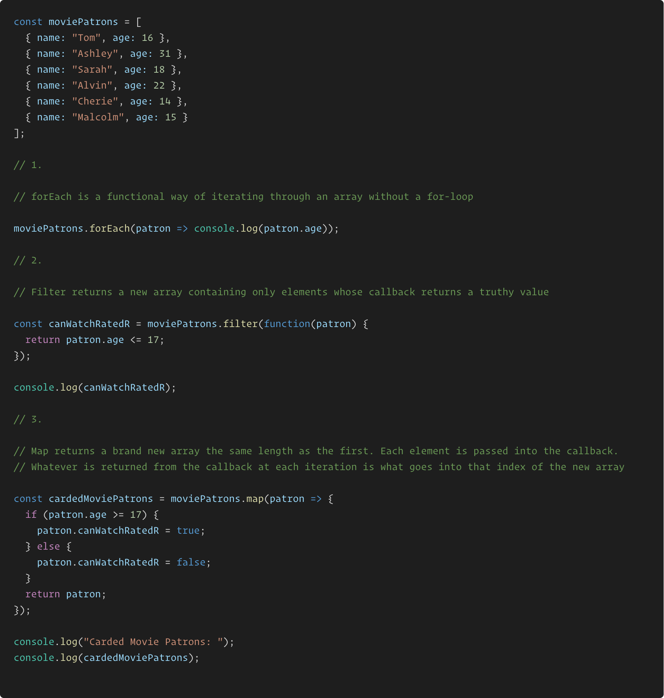

  * Explain how each of these array methods:

    * Works on an array

    * Runs a callback function once for each element in the array

    * Passes the each element into the callback as an argument

  * Then work on explaining the differences between each of these methods:

    * `forEach` is the simplest. It runs the callback for each element in the array

    * `fitler` is similar to `forEach`, but it returns a brand new array using elements in the original array. If an element's callback function returns a truthy value, it is added to the newly returned array, otherwise it is _filtered_ out and doesn't get added to the new array.

    * `map` is similar in that it also returns a brand new array using elements in the original array. Unlike `filter`, the new array created with `map` is always the same length as the original array. Whatever is returned by the callback on each iteration is what goes into the new array. We can use this to create a new array of modified elements, or elements computed from values in the original array.

* Run each example one at a time and demonstrate the logged output for students.

* If helpful, demonstrate how each piece of functionality can be achieved (with more code) using for-loops.

### 14. Students Do: Functional Loops (14 min) (CRITICAL)

* In this activity students will use the `map` and `filter` methods to solve problems they previously would have used for-loops for.

* Consider live-coding each problem piece by piece over the duration of the activity.

* **Activity & Instructions**: [Functional Loops Unsolved](../../../../01-Class-Content/19-react/01-Activities/09-Stu_FunctionalLoops)

### 15. Instructor Do: Review Functional Loops (10 min)

* Once time's up, open the [activity solution](../../../../01-Class-Content/19-react/01-Activities/09-Stu_FunctionalLoops/Solved) and go over the code.

* Start by demonstrating the `map` example.

  

  * Remind the class that the callback is run once for each element in the array. Whatever it returns is what goes into the corresponding index of the new array.

  * If the arrow function syntax is still confusing, refactor the solutions to use regular functions instead.

* Then move on to the `filter` example.

  

  * Point out that we don't need to pass an anonymous function into the `map` and `filter` methods &mdash; we can write a named function and use that instead, as is the case for `isPrime`.

  * Remind the class that if the function returns something truthy, that array element is copied to the new array, otherwise it is skipped.

    * The first example should contain an array of only prime numbers, the second should only contain numbers larger than `5`.

  * Once again, refactor the solution to regular functions if arrow functions are still a point of confusion.

* Check for understanding by asking questions such as:

  * "When's a time in real life when you need to _filter_ through something?"

    * When looking for a word in the dictionary, you're _filtering_ out all the words that don't contain the same letters as the one you're looking for.

    * When shopping for pants, you're _filtering_ out all the ones on the rack that aren't your size.

    * When you're looking for your friend in a crowd, you're _filtering_ out everyone that doesn't look like them.

  * "When's a time in real life when you need to _map_ over something?"

    * When you're _mapping_ through your todolist and marking off all the things you've completed for the day.

    * When you're _mapping_ through your laundry pile, categorizing your clothes so you can put them into the correct drawers.

* Explain that just like how we need to map and filter over things in real life, we often need to in code as well.

* Take a moment to answer any remaining questions before the next demonstration.

### 16. Instructor Do: ES6 Classes (10 min)

* In this example, students will be introduced to ES6 classes.

* Explain that many programming languages have the concept of classes. A class can be used as a blueprint for creating new objects or "instances".

* Up until recently, we used constructor functions in JavaScript to achieve the same effect. Constructor functions often confuse developers as they aren't as clear or as familiar as the class syntax. In order to use constructor functions effectively, developers need to have some understanding of the language's implementation details, e.g. the `prototype` chain, `Object.create`.

* Explain that fundamentally, classes in ES6 are just a new syntax for JavaScript constructor functions that make it easier to define blueprints for objects.

  * Demonstrate the `Vehicle` class in [Vehicle.js](../../../../01-Class-Content/19-react/01-Activities/10-Ins_Classes/Vehicle.js).

  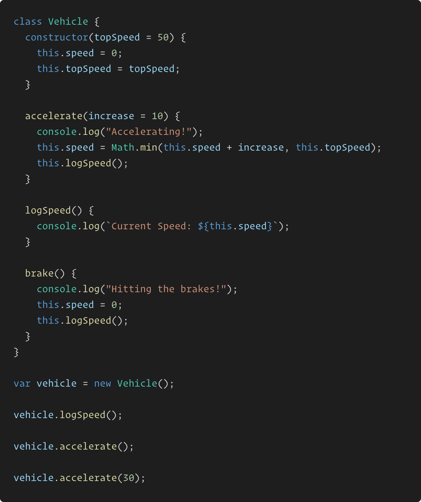

  * Explain that the `constructor` method is used for receiving arguments as well as setting instance properties.

  * Below the `constructor` method are all the methods that should be defined on every object created with the Vehicle class.

  * Run the code and demonstrate how the `vehicle` object was created and has the properties and methods defined on the class.

  * Compare the `Vehicle` class to the commented out `Vehicle` constructor function. Answer any questions before moving on.

* Open the [Car.js](../../../../01-Class-Content/19-react/01-Activities/10-Ins_Classes/Vehicle.js) file and explain that this class `extends` or "inherits" from the `Vehicle` class. In other words, `Car` has all the attributes and behaviors as `Vehicle`, plus a little extra.

  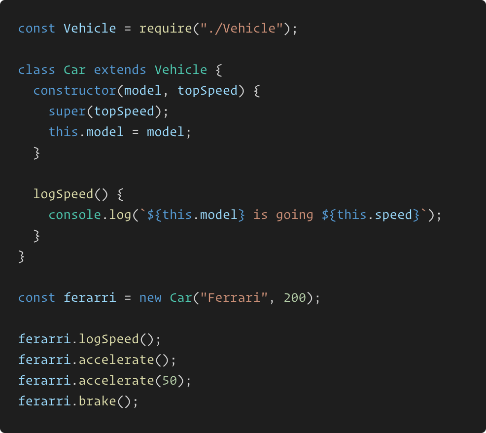

  * Explain that in this relationship, `Vehicle` is known as the "super-class". We could also define a `Bicycle` class that extends from `Vehicle` class if we wanted to share some functionality between them.

  * Inside of the `constructor` method for the `Car` class, `super` refers to the `constructor` method of the super-class: the `constructor` method inside of `Vehicle`.

  * Point out how we didn't have to define an `accelerate` method on `Car` to use it. It was already defined in `Vehicle`.

  * Explain how the string template literals work in the `logSpeed` method.

    * We snuck this ES6 feature in here, but it's simple enough. When writing strings with backticks, we can insert values using `${}` without using the concatenation operator.

    * This also allows us to write multi-line strings without escaping or concatenating multiple strings.

    * Like many ES6 features, this is optional, students can still use regular string concatenation if they want to, but they should understand what this new syntax does.

  * Lastly take a quick moment to demonstrate how the ES5 version works.

* Answer any remaining questions, but explain to the class that they'll be okay walking away with a high-level understanding for now. Once we start working with React, we'll have even further simplified class syntax.

### 17. Student Do: Constructor to Class (10 min)

* In this activity students will convert a constructor function to an ES6 class.

* Encourage students to look back at the previous Vehicle example if they get stuck.

* **Activity & Instructions**: [11-Stu_ConstructorToClass](../../../../01-Class-Content/19-react/01-Activities/11-Stu_ConstructorToClass)

### 18. Instructor Do: Review Constructor to Class (8 min)

* Once time's up, go over [the solution](../../../../01-Class-Content/19-react/01-Activities/11-Stu_ConstructorToClass/Solved) as a class.

* Answer any questions before wrapping up for the day.

### 19. END (0 min)

* If time permits, feel free to run through the bonus activities. These aren't crucial right now, so it's okay to encourage students to go through them on their own time.

* Mention that there are a few ES6 features we didn't go into today: Spread operator/rest parameters, generators, the `fetch` API, and more.

* Explain that some of these we'll cover over the next few weeks, but it'd take too much time to go through them all in class. Encourage everyone to spend some time outside of class investigating!

### 20. BONUS Instructor Do: Object Destructuring (10 min)

* In this example, students will be introduced to the ES6 object destructuring syntax.

* Explain that object destructuring is a way for us to pull properties off of an object an onto separate variables for easier access. We can achieve this without ES6, but now we have a newer shorthand for doing so.

* Go through each example inside of [index.js](../../../../01-Class-Content/19-react/01-Activities/12-Ins_ObjDestructuring/index.js).

  * Highlight how we can destructure multiple object properties at once, saving us a few lines of code.

  * Demonstrate how this is also possible with function parameters. This allows us to have named function parameters i.e. if we passed multiple values into a function one at a time, we'd need them to be passed in the specific order intended. Now we can simply expect an object and pull the properties off without worrying about the order they're passed in or write extra code to destructure them the old way.

* If you're ahead of schedule and you feel as though it wouldn't overwhelm the class, feel free to demonstrate how arrays can also be destructured. Example:

  ```js
  const strangeKids = ["Will", "Mike", "Dustin", "Luke", "Eleven", "Max"];
  const [kid1, kid2] = strangeKids;
  console.log(kid1); // prints "Will"
  console.log(kid2); // prints "Mike"
  ```

  * This isn't important to cover at all now, so use your best judgement.

### 21. BONUS Instructor Do: ES2015 Modules (10 min)

* In this example, students will be given a brief introduction to ES2015 modules.

* Explain that ES6 also introduces a new module system for sharing data between files known as ES2015 modules.

* What we've been using so far, `require/module.exports` is part of what's known as commonJS modules.

* Explain that the ES2015 module system is closer to how modularization is handled in many other programming languages, and gives us a greater degree of control over what is shared and imported between files. ES2015 are also tree-shakeable -- i.e. any unused imports can be excluded from the final application, saving space and helping the application run faster.

* Open the [commonJS](../../../../01-Class-Content/19-react/01-Activities/13-Ins_ES2015Modules/commonJS) folder and go through each file one at a time, demonstrating the path each module takes, how we export/import one or multiple values.

* Then open the [es2015](../../../../01-Class-Content/19-react/01-Activities/13-Ins_ES2015Modules/es2015) folder. Explain that ES2015 modules don't work yet in node, so we'll need to run the code using Babel, a JavaScript compiler.

* Run `npm install` followed by `npm start` to run the `C.js` file.

* Go through each file in [es2015](../../../../01-Class-Content/19-react/01-Activities/13-Ins_ES2015Modules/es2015) and explain that the result of both approaches is the same here.

### Lesson Plan Feedback

How did today's class go?

[Went Well](http://www.surveygizmo.com/s3/4325914/FS-Curriculum-Feedback?format=pt&sentiment=positive&lesson=19.01)

[Went Poorly](http://www.surveygizmo.com/s3/4325914/FS-Curriculum-Feedback?format=pt&sentiment=negative&lesson=19.01)
