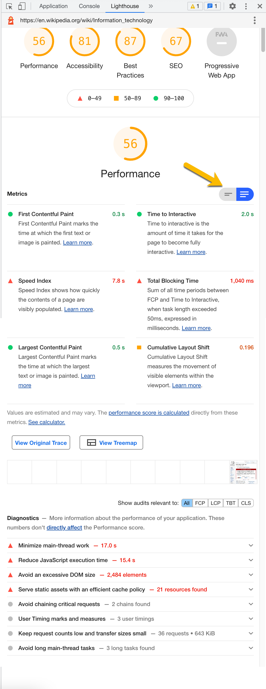

# 19.1 Part-Time Lesson Plan: Webpack Bundles and Their Impact on Performance

## Overview 

In this class, you will introduce the concept of bundling an application with webpack, its impact on webpage performance, and then demonstrate how to configure webpack to incorporate more performance improvements, lazy loading, and how webpack can improve the development processes.

## Instructor Notes

* In this lesson, students will complete activities `01-Ins_Lighthouse` through `10-Stu_Webpack-Plugin` in `19-PWA`.

* If you haven't used webpack much in the past, take a look at the `webpack.config` and the `scripts` in the `package.json` files. This should prime you for the lecture.

* If students question why they are learning webpack, let them know that since the web is moving towards more advanced front end applications, a compiler is needed to process the code into a more performant format that can take advantage of modules, modern JavaScript, and bundles.

* Remind students to do a `git pull` of the class repo to have today's activities ready and open in VS Code. 

* If you are comfortable doing so, live-code the solutions to the activities. If not, just use the solutions provided and follow the prompts and talking points for review.

* Let students know that the Bonus at the end of each activity is not meant to be extra coding practice, but instead is a self-study on topics beyond the scope of this unit for those who want to further their knowledge.

## Learning Objectives

By the end of class, students will be able to:

* Identify the main purpose of a bundler like webpack.

* Set up the project to use webpack in development mode.

* Create a bundle and use it to handle interactions with a webpage.

* Extend webpack's functionality for better performance, improved development processes, and automated bundle insertion.

* Identify the metrics in a Lighthouse audit that affect page load.

## Slide Deck

* @TODO [Unit 19 Slide Deck]()

## Time Tracker

| Start  | #   | Activity Name                       | Duration |
|---     |---  |---                                  |---       |
| 6:30PM | 1   | Instructor Do: Stoke Curiosity      | 0:10     |
| 6:40PM | 2   | Instructor Demo: Lighthouse         | 0:05     |
| 6:45PM | 3   | Student Do: Lighthouse              | 0:15     |
| 7:00PM | 4   | Instructor Review: Lighthouse       | 0:10     |
| 7:10PM | 5   | Instructor Demo: Webpack Intro      | 0:05     |
| 7:15PM | 3   | Student Do: Webpack Intro           | 0:15     |
| 7:30PM | 4   | Instructor Review: Webpack Intro    | 0:10     |
| 7:40PM | 8   | Instructor Demo: Webpack Bundle     | 0:05     |
| 7:45PM | 9   | Student Do: Webpack Bundle          | 0:15     |
| 8:00PM | 10  | BREAK                               | 0:15     |
| 8:15PM | 11  | Instructor Review: Webpack Bundle   | 0:10     |
| 8:25PM | 12  | Instructor Demo: Webpack Loader     | 0:05     |
| 8:30PM | 13  | Student Do: Webpack Loader          | 0:15     |
| 8:45PM | 14  | Instructor Review: Webpack Loader   | 0:10     |
| 8:55PM | 15  | Instructor Demo: Webpack Plugin     | 0:05     |
| 9:00PM | 16  | Student Do: Webpack Plugin          | 0:15     |
| 9:15PM | 17  | Instructor Review: Webpack Plugin   | 0:15     |
| 9:30PM | 18  | END                                 | 0:00     |

> **Important**: If this lesson occurs on a Saturday, make sure to adjust the activities to accommodate for the extra hour of class time. Feel free to take your time as you go through the activities; for example, you can add 5 minutes to the `Student Do` and `Instructor Review` sections as you see fit. Remember to take a 40-minute break at noon!

---

## Class Instruction

### 1. Instructor Do: Stoke Curiosity (10 min)

* Welcome students to class.

* Open the [slide deck]() and follow these prompts on their corresponding slides:

  * **Webpage Performance**: This unit explains why webpage performance is important and how to create performant modern web applications using a bundler.
  
  * **@TODO TITLE OF SLIDE**: @TODO ADD TALKING POINTS

  * **@TODO TITLE OF SLIDE**: @TODO ELABORATE ON SLIDE CONTENT
  
  * **Mini-Project**: The mini-project for this unit will be a contact directory app that uses service workers, IndexedDB, webpack, and has PWA functionality. We will also deploy the app to Heroku.

* Navigate to `28-Stu_Mini-Project/Main` in your command line and demonstrate the following:

  * We are going to build a contact directory that can work offline.

  * Run `npm install` from the command line to install the dependencies.

  * Run `npm start` from the command line to start the Express.js server.

  * Open the browser at http://localhost:3000/

  * Create a two fake people to populate the contact cards.

  * In DevTools/Network tab set the Throttling option to Offline. Then refresh the page to see the contact cards persist on the webpage.

  * Install the PWA to display the app as a PWA.

* Ask the class the following questions (☝️) and call on students for the answers (🙋):

  * ☝️ What are we learning?

  * 🙋 Webpack, bundlers, Workbox, service workers, IndexedDB, PWAs, offline functionality, etc.

  * ☝️ How does this project build off or extend previously learned material?

  * 🙋 We will be using CRUD operations to persist and delete data. We will set up an Express.js server to display the user interface. We will use the client-server model with HTTP requests and responses. 

  * ☝️ How does this project relate to your career goals?

  * 🙋 Not only do apps need to look impressive, they must also have low latency and load quickly. In the real world connectivity can be unstable, so provisions must be made to preserve the app's functionality to retain users. 

* Answer any questions before proceeding to the next activity.

### 2. Instructor Demo: Lighthouse (5 min) 

* Open [the Wikipedia page related to information technology](https://en.wikipedia.org/wiki/Information_technology) in your browser.

* Open the DevTools/Lighthouse tab.

* Generate a report with all the categories checked, and explain the following:

  * To get started, we'll focus on the main driver for high bounce rates - slow page loads.

  * Briefly show some of the categories Lighthouse will audit for you. Scroll down to the **Performance** section and note the overall score is rated very bad.

  * 🔑 Select the slide button to display the longer descriptions of the performance metrics. 

     

  * Examine First Contentful Paint, Time to Interactive, Total Blocking Time, and Speed Index.

  *  Follow the link in the Time To Interactive metric to [Learn more](https://web.dev/interactive/?utm_source=lighthouse&utm_medium=devtools) to obtain more details on the metric and the corrective measures to improve this metric.

* Ask the class the following questions (☝️) and call on students for the answers (🙋):

  * ☝️ How do we generate an audit report?

  * 🙋 Open the Lighthouse tab in DevTools, select the categories, then select the "Generate report" button.

* Answer any questions before proceeding to the next activity.

* In preparation for the activity, ask TAs to start directing students to the activity instructions found in `02-Stu_Lighthouse/README.md`.

### 3. Student Do: Lighthouse (15 min) 

* Direct students to the activity instructions found in `02-Stu_Lighthouse/README.md`.

* Break your students into pairs that will work together on this activity.

  ```md
  # 📐 Analyze the Lighthouse Audit

  Work with a partner to identify which key metrics need improvement using a Lighthouse audit. 

  ## 📝 Notes

  1. Navigate to [weather.com](https://weather.com/).

  2. Generate a Lighthouse report on performance.
  
  3. Select the proper categories that would return an audit based on performance.

  4. Find which metrics must be modified to improve the loading time of the website.

  5. Add comments to the markdown file in the [audit.md] for the metrics that are most problematic for performance. Also describe the process of how to improve the metrics.(./Unsolved/audit.md)

  Refer to the documentation:   

  * [Google Docs on Lighthouse Audits](https://developers.google.com/web/tools/lighthouse)

  ---

  ## 🏆 Bonus

  If you have completed this activity, work through the following challenge with your partner to further your knowledge:

  * What other ways can you run a Lighthouse audit besides from the browser?

  Use [Google](https://www.google.com) or another search engine to research this.

  ---
  © 2021 Trilogy Education Services, LLC, a 2U, Inc. brand. Confidential and Proprietary. All Rights Reserved.
  ```

* While breaking everyone into groups, be sure to remind students and the rest of the instructional staff that questions on Slack or otherwise are welcome and will be handled. It's a good way for your team to prioritize students who need extra help.

### 4. Instructor Review: Lighthouse (10 min) 

* Ask the class the following questions (☝️) and call on students for the answers (🙋):

  * ☝️ How comfortable do you feel with Lighthouse? (Poll via Fist to Five, Slack, or Zoom)

* Assure students that we will cover the solution to help solidify their understanding. If questions remain, remind them to use office hours to get extra help!

* Use the prompts and talking points (🔑) below to review the following key points:

  * ✔️ First Contentful Paint

  * ✔️ Time to Interactive

* Open the [Lighthouse audit report for weather.com](./Images/weather-report.png) and note that the metrics can vary based on internet speed and server load.

  * 🔑 Time to interactive is very slow

    ```
    @TODO ADD CODE SNIPPET, TABBED TWICE (4 SPACES)
    ```

  * 🔑 @TODO DON'T FORGET TO USE THE KEY EMOJI ON KEY POINTS, BUT ONLY KEY POINTS, NOT _EVERY_ POINT

* Ask the class the following questions (☝️) and call on students for the answers (🙋):

  * ☝️ @TODO { DO WE END OUR REVIEWS WITH A QUESTION? }

  * 🙋 @TODO { YES, WE DO! }

  * ☝️ What can we do if we don't completely understand this?

  * 🙋 @TODO We can refer to supplemental material, read the [{ DOCS }]({ URL }), and stick around for office hours to ask for help.

* Answer any questions before proceeding to the next activity.

### 5. Instructor Demo: { ACTIVITY NAME } (5 min) 

@TODO USE THE FOLLOWING FOR BROWSER AND/OR COMMAND LINE DEMOS, RESPECTIVELY. REMOVE IF UNUSED

* Open `@TODO/folder/file` in your browser and demonstrate the following:

* Run `@TODO/folder/file { AND ARGS, IF ANY }` from the command line and demonstrate the following: 

  * 🔑 @TODO { WHEN WE DO THIS, IT DOES THAT. }

  * 🔑 @TODO { WE ALSO SEE THESE THINGS. }

* Ask the class the following questions (☝️) and call on students for the answers (🙋):

  * ☝️ How would we build this?

  * 🙋 @TODO { YES, HOW? }

* Answer any questions before proceeding to the next activity.

* In preparation for the activity, ask TAs to start directing students to the activity instructions found in `@TODO/folder/file`.

### 6. Student Do: { ACTIVITY NAME } (15 min) 

* Direct students to the activity instructions found in `@TODO/folder/file`.

* Break your students into pairs that will work together on this activity.

  ```md
  @TODO ADD ACTIVITY INSTRUCTIONS, TABBED ONCE OR TWICE (DEPENDING ON CODE SNIPPETS IN ACTIVITY INSTRUCTIONS)
  ```

* While breaking everyone into groups, be sure to remind students and the rest of the instructional staff that questions on Slack or otherwise are welcome and will be handled. It's a good way for your team to prioritize students who need extra help.

### 7. Instructor Review: { ACTIVITY NAME } (10 min) 

* Ask the class the following questions (☝️) and call on students for the answers (🙋):

  * ☝️ How comfortable do you feel with @TODO { TOPIC }? (Poll via Fist to Five, Slack, or Zoom)

* Assure students that we will cover the solution to help solidify their understanding. If questions remain, remind them to use office hours to get extra help!

* Use the prompts and talking points (🔑) below to review the following key points:

  * ✔️ @TODO { THIS }

  * ✔️ @TODO { THAT }

  * ✔️ @TODO { THE OTHER }

* Open `@TODO/folder/file` in your IDE and explain the following: 

  * @TODO { WE DO THIS AND THE RESULT IS THAT }

    ```
    @TODO ADD CODE SNIPPET, TABBED TWICE (4 SPACES)
    ```

  * 🔑 @TODO DON'T FORGET TO USE THE KEY EMOJI ON KEY POINTS, BUT ONLY KEY POINTS, NOT _EVERY_ POINT

* Ask the class the following questions (☝️) and call on students for the answers (🙋):

  * ☝️ @TODO { DO WE END OUR REVIEWS WITH A QUESTION? }

  * 🙋 @TODO { YES, WE DO! }

  * ☝️ What can we do if we don't completely understand this?

  * 🙋 @TODO We can refer to supplemental material, read the [{ DOCS }]({ URL }), and stick around for office hours to ask for help.

* Answer any questions before proceeding to the next activity.

### 8. Instructor Demo: { ACTIVITY NAME } (5 min) 

@TODO USE THE FOLLOWING FOR BROWSER AND/OR COMMAND LINE DEMOS, RESPECTIVELY. REMOVE IF UNUSED

* Open `@TODO/folder/file` in your browser and demonstrate the following:

* Run `@TODO/folder/file { AND ARGS, IF ANY }` from the command line and demonstrate the following: 

  * 🔑 @TODO { WHEN WE DO THIS, IT DOES THAT. }

  * 🔑 @TODO { WE ALSO SEE THESE THINGS. }

* Ask the class the following questions (☝️) and call on students for the answers (🙋):

  * ☝️ How would we build this?

  * 🙋 @TODO { YES, HOW? } 

* Answer any questions before proceeding to the next activity.

* In preparation for the activity, ask TAs to start directing students to the activity instructions found in `@TODO/folder/file`.

### 9. Student Do: { ACTIVITY NAME } (15 min) 

* Direct students to the activity instructions found in `@TODO/folder/file`.

* Break your students into pairs that will work together on this activity.

  ```md
  @TODO ADD ACTIVITY INSTRUCTIONS, TABBED ONCE OR TWICE (DEPENDING ON CODE SNIPPETS IN ACTIVITY INSTRUCTIONS)
  ```

* While breaking everyone into groups, be sure to remind students and the rest of the instructional staff that questions on Slack or otherwise are welcome and will be handled. It's a good way for your team to prioritize students who need extra help.

### 10. BREAK (15 min)

### 11. Instructor Review: { ACTIVITY NAME } (10 min) 

* Ask the class the following questions (☝️) and call on students for the answers (🙋):

  * ☝️ How comfortable do you feel with @TODO { TOPIC }? (Poll via Fist to Five, Slack, or Zoom)

* Assure students that we will cover the solution to help solidify their understanding. If questions remain, remind them to use office hours to get extra help!

* Use the prompts and talking points (🔑) below to review the following key points:

  * ✔️ @TODO { THIS }

  * ✔️ @TODO { THAT }

  * ✔️ @TODO { THE OTHER }

* Open `@TODO/folder/file` in your IDE and explain the following: 

  * @TODO { WE DO THIS AND THE RESULT IS THAT }

    ```
    @TODO ADD CODE SNIPPET, TABBED TWICE (4 SPACES)
    ```

  * 🔑 @TODO DON'T FORGET TO USE THE KEY EMOJI ON KEY POINTS, BUT ONLY KEY POINTS, NOT _EVERY_ POINT

* Ask the class the following questions (☝️) and call on students for the answers (🙋):

  * ☝️ @TODO { DO WE END OUR REVIEWS WITH A QUESTION? }

  * 🙋 @TODO { YES, WE DO! }

  * ☝️ What can we do if we don't completely understand this?

  * 🙋 @TODO We can refer to supplemental material, read the [{ DOCS }]({ URL }), and stick around for office hours to ask for help.

* Answer any questions before proceeding to the next activity.

### 12. Instructor Demo: { ACTIVITY NAME } (5 min) 

@TODO USE THE FOLLOWING FOR BROWSER AND/OR COMMAND LINE DEMOS, RESPECTIVELY. REMOVE IF UNUSED

* Open `@TODO/folder/file` in your browser and demonstrate the following:

* Run `@TODO/folder/file { AND ARGS, IF ANY }` from the command line and demonstrate the following: 

  * 🔑 @TODO { WHEN WE DO THIS, IT DOES THAT. }

  * 🔑 @TODO { WE ALSO SEE THESE THINGS. }

* Ask the class the following questions (☝️) and call on students for the answers (🙋):

  * ☝️ How would we build this?

  * 🙋 @TODO { YES, HOW? } 

* Answer any questions before proceeding to the next activity.

* In preparation for the activity, ask TAs to start directing students to the activity instructions found in `@TODO/folder/file`.

### 13. Student Do: { ACTIVITY NAME } (15 min)

* Direct students to the activity instructions found in `@TODO/folder/file`.

* Break your students into pairs that will work together on this activity.

  ```md
  @TODO ADD ACTIVITY INSTRUCTIONS, TABBED ONCE OR TWICE (DEPENDING ON CODE SNIPPETS IN ACTIVITY INSTRUCTIONS)
  ```

* While breaking everyone into groups, be sure to remind students and the rest of the instructional staff that questions on Slack or otherwise are welcome and will be handled. It's a good way for your team to prioritize students who need extra help.

### 14. Instructor Review: { ACTIVITY NAME } (10 min) 

* Ask the class the following questions (☝️) and call on students for the answers (🙋):

  * ☝️ How comfortable do you feel with @TODO { TOPIC }? (Poll via Fist to Five, Slack, or Zoom)

* Assure students that we will cover the solution to help solidify their understanding. If questions remain, remind them to use office hours to get extra help!

* Use the prompts and talking points (🔑) below to review the following key points:

  * ✔️ @TODO { THIS }

  * ✔️ @TODO { THAT }

  * ✔️ @TODO { THE OTHER }

* Open `@TODO/folder/file` in your IDE and explain the following: 

  * @TODO { WE DO THIS AND THE RESULT IS THAT }

    ```
    @TODO ADD CODE SNIPPET, TABBED TWICE (4 SPACES)
    ```

  * 🔑 @TODO DON'T FORGET TO USE THE KEY EMOJI ON KEY POINTS, BUT ONLY KEY POINTS, NOT _EVERY_ POINT

* Ask the class the following questions (☝️) and call on students for the answers (🙋):

  * ☝️ @TODO { DO WE END OUR REVIEWS WITH A QUESTION? }

  * 🙋 @TODO { YES, WE DO! }

  * ☝️ What can we do if we don't completely understand this?

  * 🙋 @TODO We can refer to supplemental material, read the [{ DOCS }]({ URL }), and stick around for office hours to ask for help.

* Answer any questions before proceeding to the next activity.

### 15. Instructor Demo: { ACTIVITY NAME } (5 min) 

@TODO USE THE FOLLOWING FOR BROWSER AND/OR COMMAND LINE DEMOS, RESPECTIVELY. REMOVE IF UNUSED

* Open `@TODO/folder/file` in your browser and demonstrate the following:

* Run `@TODO/folder/file { AND ARGS, IF ANY }` from the command line and demonstrate the following: 

  * 🔑 @TODO { WHEN WE DO THIS, IT DOES THAT. }

  * 🔑 @TODO { WE ALSO SEE THESE THINGS. }

* Ask the class the following questions (☝️) and call on students for the answers (🙋):

  * ☝️ How would we build this?

  * 🙋 @TODO { YES, HOW? } 

* Answer any questions before proceeding to the next activity.

* In preparation for the activity, ask TAs to start directing students to the activity instructions found in `@TODO/folder/file`.

### 16. Student Do: { ACTIVITY NAME } (15 min) 

* Direct students to the activity instructions found in `@TODO/folder/file`.

* Break your students into pairs that will work together on this activity.

  ```md
  @TODO ADD ACTIVITY INSTRUCTIONS, TABBED ONCE OR TWICE (DEPENDING ON CODE SNIPPETS IN ACTIVITY INSTRUCTIONS)
  ```

* While breaking everyone into groups, be sure to remind students and the rest of the instructional staff that questions on Slack or otherwise are welcome and will be handled. It's a good way for your team to prioritize students who need extra help.

### 17. Instructor Review: { ACTIVITY NAME } (15 min)

* Ask the class the following questions (☝️) and call on students for the answers (🙋):

  * ☝️ How comfortable do you feel with @TODO { TOPIC }? (Poll via Fist to Five, Slack, or Zoom)

* Assure students that we will cover the solution to help solidify their understanding. If questions remain, remind them to use office hours to get extra help!

* Use the prompts and talking points (🔑) below to review the following key points:

  * ✔️ @TODO { THIS }

  * ✔️ @TODO { THAT }

  * ✔️ @TODO { THE OTHER }

* Open `@TODO/folder/file` in your IDE and explain the following: 

  * @TODO { WE DO THIS AND THE RESULT IS THAT }

    ```
    @TODO ADD CODE SNIPPET, TABBED TWICE (4 SPACES)
    ```

  * 🔑 @TODO DON'T FORGET TO USE THE KEY EMOJI ON KEY POINTS, BUT ONLY KEY POINTS, NOT _EVERY_ POINT

* Ask the class the following questions (☝️) and call on students for the answers (🙋):

  * ☝️ @TODO { DO WE END OUR REVIEWS WITH A QUESTION? }

  * 🙋 @TODO { YES, WE DO! }

  * ☝️ What can we do if we don't completely understand this?

  * 🙋 @TODO We can refer to supplemental material, read the [{ DOCS }]({ URL }), and stick around for office hours to ask for help.

* Answer any questions before ending the class.

### 18. END (0 min)

How did today’s lesson go? Your feedback is important. Please take 5 minutes to complete this [anonymous survey](https://forms.gle/RfcVyXiMmZQut6aJ6).

---
@TODO © YEAR Trilogy Education Services, LLC, a 2U, Inc. brand. Confidential and Proprietary. All Rights Reserved.
