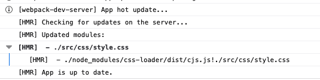
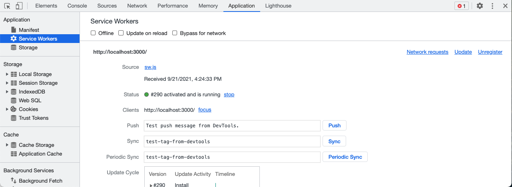

# 19.2 Part-Time Lesson Plan: Introduction to Workbox, Caching and Service Workers

## Overview

IN this class, students will learn how to use the workbox library to cache and serve static assets. Students will also become familiar with the different methods workbox provides to create a service worker. Additionally, students will some of the caching strategies that workbox provides out of the box.

## Instructor Notes

* In this lesson, students will complete activities `11-Ins_WebPack-HMR` through `20-Stu_Client-Server`.

* This unit features activities that will require students to save and refresh the browser in order to see changes. The very nature of progressive web apps means that by design, students will likely run into issues with cached assets interfering while debugging and testing. **Important**: If you are having issues with cached assets, please use a private or incognito window to view the application.

  * For Chrome users, you can open an incognito window by clicking the three dots in the top right corner of the browser. From there, click the "New Incognito Window" button. You can also use the hot keys on a Mac to open an incognito window, by pressing Command + Shift + N. For Windows users you can use the hot keys by pressing Control + Shift + N.

  * For Firefox users, you can open a private tab by clicking the three dots in the top right corner of the browser. From there, click the "New Private Tab" button. You can also use hot keys on a Mac to open a private tab, by pressing Command + Shift + T. For Windows users you can can do the same by pressing Control + Shift + T.

* In addition to using a private window, students can troubleshoot the caching issues further by completely unregistering the service worker. This will allow the browser to cache the assets again. Details on how to do this will vary between browsers, but generally you can find the option to do this in the browser's developer tools.

* Remind students to do a `git pull` of the class repo to have today's activities ready and open in VS Code.

* If you are comfortable doing so, live-code the solutions to the activities. If not, just use the solutions provided and follow the prompts and talking points for review.

* Let students know that the Bonus at the end of each activity is not meant to be extra coding practice, but instead is a self-study on topics beyond the scope of this unit for those who want to further their knowledge.

## Learning Objectives

By the end of class, students will be able to:

* Implement service workers to a web application.

* Leverage caching strategies to optimize performance.

* Execute a full-stack application with a server and client-side development server

## Time Tracker

| Start  | #   | Activity Name                                     | Duration |
| ------ | --- | ------------------------------------------------- | -------- |
| 6:30PM | 1   | Instructor Do: Stoke Curiosity                    | 0:10     |
| 6:40PM | 2   | Instructor Demo: Hot Module Replacement           | 0:05     |
| 6:45PM | 3   | Student Do: Hot Module Replacement                | 0:15     |
| 7:00PM | 4   | Instructor Review: Hot Module Replacement         | 0:10     |
| 7:10PM | 5   | Instructor Demo: WorkBox Service Workers          | 0:05     |
| 7:15PM | 6   | Student Do: WorkBox Service Workers               | 0:15     |
| 7:30PM | 7   | Instructor Review: WorkBox Service Workers        | 0:10     |
| 7:40PM | 8   | Instructor Demo: Cache CSS and JavaScript Files   | 0:05     |
| 7:45PM | 9   | Student Do: Cache CSS and JavaScript Files        | 0:15     |
| 8:00PM | 10  | BREAK                                             | 0:15     |
| 8:15PM | 11  | Instructor Review: Cache CSS and JavaScript Files | 0:10     |
| 8:25PM | 12  | Instructor Demo: Caching Images                   | 0:05     |
| 8:30PM | 13  | Student Do: Caching Images                        | 0:15     |
| 8:45PM | 14  | Instructor Review: Caching Images                 | 0:10     |
| 8:55PM | 15  | Instructor Demo: Client Server Model              | 0:05     |
| 9:00PM | 16  | Student Do: Client Server Model                   | 0:15     |
| 9:15PM | 17  | Instructor Review: Client Server Model            | 0:15     |
| 9:30PM | 18  | END                                               | 0:00     |

> **Important**: If this lesson occurs on a Saturday, make sure to adjust the activities to accommodate for the extra hour of class time. Feel free to take your time as you go through the activities; for example, you can add 5 minutes to the `Student Do` and `Instructor Review` sections as you see fit. Remember to take a 40-minute break at noon!

---

## Class Instruction

### 1. Instructor Do: Stoke Curiosity (10 min)

* Welcome students to class.

* Progressive web apps and service workers first appeared in the browser in 2015. The concept however was first discussed by Steve Jobs in 2007 just 18 days before the shipping the first iPhone. At the time, Steve Jobs had envisioned a way to create web applications that look and behave like native apps. The idea was to leverage the browser's native APIs to create a web application that would be able to run on any device. We now know that history played out differently with the advent of the app store, but the concept remains relevant today.

  * You can take a look at this moment in history by watching the following video: ["One Last Thing" by Steve Jobs at Worldwide Developer Conference 07'](https://youtu.be/ZlE7dzoD6GA)

* It wasn't until 2015 that Google took that concept and gave it some life. The first progressive web app (PWA) specification was introduced at the Chrome Dev summit in 2015. Shortly after, developers started to use the specification to create web applications. Some of the most notable examples of progressive web apps are Twitter, Uber, and Google Maps. All touting reduced data consumption of about 70% or more.

* Fast forward to today, creating a progressive web app is a lot easier than it was back then, and is usually a lot more cost effective than developing a mobile application. Google has created an amazing set of tools called Workbox designed to help developers create a service workers with minimal effort.

* In this unit, you learn about service workers and how to use them to cache assets, improve performance, and serve static assets. We will take a look at one that was made from scratch using vanilla Javascript, and another that was built on top of Workbox.

* First we will cover the project setup needed to replace modules on the fly, how to generate a service worker using Workbox, and finally how to implement caching strategies that make your app faster, and if configured correctly, to work offline.

### 2. Instructor Demo: Hot Module Replacement (5 min)

* Navigate to `11-Ins_WebPack-HMR` in your terminal and run `npm i && npm run dev`. This will install the dependencies and run the development server.

  * 🔑 When we run this application, we notice that there is a build process happening on the fly, but unlike other start scripts, this time we are not actually outputting the files to the `dist` directory

  * 🔑 Instead, the files are built and sent directly to the browser. The hot module replacement (HMR) will take care of appending a hash to the file name, and the browser will automatically refresh the page when the file changes. For example, this is an example of the file name that will be sent to the browser:

    ```bash
    index.be865f63154ff82e7d29.hot-update.js
    ```

* Open `webpack.config.js` in your IDE to demonstrate the following:

  * In this file, you can see that we have set up our webpack config to use hot module replacement by adding a `devServer` options object with a attribute of `hot` set to `only`. This will only reload the module without reloading the entire page.

  * 🔑 In development, not having to refresh the page is a benefit so that we can see the change in the browser immediately and also keep an eye on the HMR logs that are generated by webpack.

  * It is important to note that when using webpack, you don't need to install the Hot Module Replacement plugin. You can simply add the `hot` option to the `devServer` object in your webpack config.
  
  * 🔑  Under the hood, webpack calls on another developer dependency called `webpack-dev-server` when it parses the `devServer` object in the `webpack.config.js` file. You can see this package listed in the `devDependencies` section of the `package.json` file.

* Open the `src/css/style.css` file in your IDE to demonstrate the following:

  * Update the font or font weight of the `h1` element and save the file.

  * 🔑  Notice that when we update some of the content of a CSS file, we don't need to refresh the page to see the updates reflected in the browser.

* Ask the class the following questions (☝️) and call on students for the answers (🙋):

  * ☝️ How would we build this?

  * 🙋 We would first make sure that `webpack-dev-server` and then add a devServer object to our webpack config.

* Answer any questions before proceeding to the next activity.

* In preparation for the activity, ask TAs to start directing students to the activity instructions found in `12-Stu_WebPack-HMR/README.md`.

### 3. Student Do: Hot Module Replacement (15 min)

* Direct students to the activity instructions found in `12-Stu_WebPack-HMR/README.md`.

* Break your students into pairs that will work together on this activity.

  ```md
  # 📖 Add WebPack Development Server to a Project With Hot Module Replacement (HMR)

  Work with a partner to implement the following user story:

  * As a developer, I want to add a webpack-dev-server to my project so that I can use hot module replacement (HMR) to update the page without a full page refresh.

  * As a developer, I want to learn how to configure webpack-dev-server so that it can test my project in a way that allows my work to continue without much downtime.

  ## Acceptance Criteria

  * It's done when I installed `webpack-dev-server` as a `devDependency`.

  * It's done when I have a `webpack.config.js` file in my project that includes the `devServer` property.

  * It's done when I have added a `hot` property to the `devServer` object in `webpack.config.js` and set it's value to `only`.

  * It's done when I have opened `Unsolved/src/index.js` and made the following changes:

    * Import the css file from the css folder.

    * Added logic to accept hot module replacement (HMR), as this is an opt-in feature.

  * It's done when I have modified or added some content to the `style.css` file. For example, try changing the `h1` font weight in the `style.css` file and save it. The changes should be reflected in the browser.

  ## 📝 Notes

  Refer to the documentation:

  * [Webpack Docs on webpack-dev-server](https://webpack.js.org/configuration/dev-server/)

  ## 💡 Hints

  * What other options are available for the `devServer` property?

  ## 🏆 Bonus

  If you have completed this activity, work through the following challenge with your partner to further your knowledge:

  * What is another way we can run `webpack-dev-server` without needing to add it to our `package.json` file?

  Use [Google](https://www.google.com) or another search engine to research this.
  ```

* While breaking everyone into groups, be sure to remind students and the rest of the instructional staff that questions on Slack or otherwise are welcome and will be handled. It's a good way for your team to prioritize students who need extra help.

### 4. Instructor Review: Hot Module Replacement (10 min)

* Ask the class the following questions (☝️) and call on students for the answers (🙋):

  * ☝️ How comfortable do you feel with hot module replacement and how it can help us in development? (Poll via Fist to Five, Slack, or Zoom)

* Assure students that we will cover the solution to help solidify their understanding. If questions remain, remind them to use office hours to get extra help!

* Use the prompts and talking points (🔑) below to review the following key points:

  * ✔️ `webpack-dev-server`

  * ✔️ `hot: 'only'`

  * ✔️ `module.hot.accept()`

* Open `Solved/package.json` in your IDE and explain the following:

  * 🔑 Notice that we have added a `devDependencies` object to our `package.json` file. This object contains all of the dependencies that we need to run our development server.

  * 🔑 When creating a project, the `webpack-dev-server` package is best installed as a `devDependency`. The reason for this that it is only used in development and not in production.

  * Keeping your dependencies list to a minimum is a good way to keep your project size down. While this isn't as important for these simple demos, it is good practice and something you should consider when creating your own projects.

  * 🔑 In our scripts, we also added a `dev` command to run `webpack-dev-server --open`. This command will run the `webpack-dev-server` and open the project in the browser. Optionally, if you don't like this behavior, you can use `--no-open` to prevent the browser from opening.

    ```json
    "scripts": {
      "dev": "webpack-dev-server --open",
      "build": "webpack"
    },
    ```

* Open `Solved/webpack.config.js` in your IDE to demonstrate the following:

  * Now that we have our script to start the server, and we installed the `webpack-dev-server` package, we need to add a `devServer` object to our `webpack.config.js` file.

  * The `devServer` object contains all of the configuration options for our development server, which gets invoked by the `dev` command.

  * We added a `hot` property to the `devServer` object in `webpack.config.js` and set it's value to `only`.
  
  * 🔑  The hot attribute is a webpack-dev-server feature that allows us to use HMR. Additionally, we set this value to `only` so that we can use HMR without a full page refresh, as shown in the finished `webpack.config.js` snippet:

    ```js
    module.exports = {
      // Truncated webpack.config.js
      devServer: {
        hot: true,
        static: './dist',
      },
    }
    ```

* Open `Solved/src/index.js` in your IDE to demonstrate the following:

  * 🔑  Even though we have set up HMR, it is by default an opt-in feature. In order to take of it, we need to update the `index.js` file to accept hot modules.

  * This code is added at the bottom of the `index.js` file, but it can be added anywhere in the file. We first check to see if module.hot is defined. If it is, we accept hot modules by calling `module.hot.accept()` method, as shown in the following `index.js` snippet:

    ```js
    if (module.hot) {
      module.hot.accept((err) => {
        if (err) {
          console.error('Cannot apply HMR update.', err);
        }
      });
    }
    ```

  * You don't need to accept hot modules in every file, as changes will bubble up to a file that does accept hot modules. For example, if you make a change to `style.css` and save it, the changes will be reflected in the browser because `style.css` is imported in `index.js`. The same is true for JavaScript files.

* Navigate to `12-Stu_WebPack-HMR/Solved` in your terminal and run `npm i && npm run dev` and demonstrate the following:

  * With the development server running, we can now make changes to our `style.css` file and see the changes reflected in the browser.

  * In `Solved/src/css/style.css`, change the font weight of the `h1` element to `bold`. and notice that when you save the page is updated in the browser, without a full page refresh. You can also see the exact modules that were updated in the browser's console as you refresh the page, as shown in the screenshot below.

    

* Ask the class the following questions (☝️) and call on students for the answers (🙋):

  * ☝️ Why is knowing how to use hot module replacement helpful when creating a webpack project?

  * 🙋 Using HMR prevents us from having to rebuild the entire project every time we make a change. It also allows us to make changes to the code without having to restart the server.

  * ☝️ What can we do if we don't completely understand this?

  * 🙋 We can refer to supplemental material, read the [Webpack Docs on hot module replacement](https://webpack.js.org/guides/hot-module-replacement/#enabling-hmr), and stick around for office hours to ask for help.

* Answer any questions before proceeding to the next activity.

### 5. Instructor Demo: Workbox Service Workers (5 min)

* Navigate to `13-Ins_WorkBox-Service-Workers` in your terminal, run `npm i && npm run dev` and demonstrate the following:

  * 🔑 When we run the application, the first thing you will notice that is that unlike the previous activities, this one doesn't use or require webpack. Instead, we see a simple message that our server is running on port `3000`.

  * This demo is a very simple page that contains a card with a title, description and an image. It also features a service worker that is running in the background.

  * 🔑 This demo is very similar to other simple express applications that we have created in the past, with one key distinction. This application uses a service worker written using vanilla Javascript to cache the application's assets.

  * **Important**: There are two ways to create a service worker. One is to create it manually using the steps found on MDN, and the other is to use the [Workbox](https://developers.google.com/web/tools/workbox/modules/workbox-webpack-plugin) plugin. While we will use workbox in the next activity, it is important that we take a look at how to create a service worker manually.

* Open `src/sw.js` in your IDE to demonstrate the following:

  * This is a service worker that runs in the background and caches the assets that we are using. Service respond to different events, much like a button or input field.

  * In the browser, you can click on the `Application` tab and see that the service worker is running and what status it is in, as shown in the screenshot below:

    

  * There are generally three stages in the service worker lifecycle:

    1. Install - When the service worker is installed, it will cache the assets that we are using.

    2. Activate - the phase in which the service worker is activated. This is the phase in which the service worker is ready to handle events.

    3. Claim - the phase when the service worker is claiming the clients that are using it.

  * This particular service worker is also a cache-first strategy, meaning that it will first check to see if the assets are in the cache before trying to fetch them from the network, as show in the following snippet:

    ```js
    self.addEventListener('fetch', (e) =>
      e.respondWith(caches.match(e.request).then((res) => res || fetch(e.request)))
    );
    ```

  * While knowing how to create a service worker from scratch can be beneficial, in this unit we are going to take a look at how to generate a service worker using Workbox.

  * Service workers, regardless of wether or not they were made using vanilla Javascript or generated using Workbox, they all need to be registered at the entry point for your application. In our case, this file is `index.js`

* Open `src/index.js` in your IDE to demonstrate the following:

  * Typically all one needs to do in order to register a service worker is check to see if they are supported in the browser, and then use the `navigator.serviceWorker.register()` method to register the worker in the browser, as shown in the following code snippet:

    ```js
    if ('serviceWorker' in navigator) {
      navigator.serviceWorker
        .register('./sw.js')
        .then((register) => console.log(register));
    }
    ```

* Ask the class the following questions (☝️) and call on students for the answers (🙋):

  * ☝️ What do service workers do?

  * 🙋 Service workers are a way to cache assets that are used in the application and are used to speed up the application's loading time.

* Answer any questions before proceeding to the next activity.

* In preparation for the activity, ask TAs to start directing students to the activity instructions found in `14-Stu_WorkBox-Service-Workers/README.md`.

### 6. Student Do: Workbox Service Workers (15 min)

* Direct students to the activity instructions found in `14-Stu_WorkBox-Service-Workers/README.md`.

* To get a better understanding of how to create a service worker with a framework, we will be using the [Workbox](https://developers.google.com/web/tools/workbox/modules/workbox-webpack-plugin) plugin for webpack.

* Break your students into pairs that will work together on this activity.

  ```md
  # 📐 Add Comments to Implementation of a Workbox Service Worker

  Work with a partner to add comments describing the functionality of the code found in [index.js](./Unsolved/src/index.js) and [webpack.config.js](./Unsolved/webpack.config.js).

  ## 📝 Notes

  Refer to the documentation:

  * [Workbox Service Worker](https://developers.google.com/web/tools/workbox/reference-docs/latest/module-workbox-webpack-plugin.GenerateSW)

  ## 🏆 Bonus

  If you have completed this activity, work through the following challenge with your partner to further your knowledge:

  * Why don't JavaScript modules work inside service workers?

  Use [Google](https://www.google.com) or another search engine to research this.
  ```

* While breaking everyone into groups, be sure to remind students and the rest of the instructional staff that questions on Slack or otherwise are welcome and will be handled. It's a good way for your team to prioritize students who need extra help.

### 7. Instructor Review: Workbox Service Workers (10 min)

* Ask the class the following questions (☝️) and call on students for the answers (🙋):

  * ☝️ How comfortable do you feel with @TODO { TOPIC }? (Poll via Fist to Five, Slack, or Zoom)

* Assure students that we will cover the solution to help solidify their understanding. If questions remain, remind them to use office hours to get extra help!

* Use the prompts and talking points (🔑) below to review the following key points:

  * ✔️ @TODO { THIS }

  * ✔️ @TODO { THAT }

  * ✔️ @TODO { THE OTHER }

* Open `@TODO/folder/file` in your IDE and explain the following:

  * @TODO { WE DO THIS AND THE RESULT IS THAT }

    ```js
    @TODO ADD CODE SNIPPET, TABBED TWICE (4 SPACES)
    ```

  * 🔑 @TODO DON'T FORGET TO USE THE KEY EMOJI ON KEY POINTS, BUT ONLY KEY POINTS, NOT _EVERY_ POINT

* Ask the class the following questions (☝️) and call on students for the answers (🙋):

  * ☝️ @TODO { DO WE END OUR REVIEWS WITH A QUESTION? }

  * 🙋 @TODO { YES, WE DO! }

  * ☝️ What can we do if we don't completely understand this?

  * 🙋 @TODO We can refer to supplemental material, read the [{ DOCS }]({ URL }), and stick around for office hours to ask for help.

* Answer any questions before proceeding to the next activity.

### 8. Instructor Demo: Cache CSS and JavaScript Files (5 min)

@TODO USE THE FOLLOWING FOR BROWSER AND/OR COMMAND LINE DEMOS, RESPECTIVELY. REMOVE IF UNUSED

* Open `@TODO/folder/file` in your browser and demonstrate the following:

* Run `@TODO/folder/file { AND ARGS, IF ANY }` from the command line and demonstrate the following:

  * 🔑 @TODO { WHEN WE DO THIS, IT DOES THAT. }

  * 🔑 @TODO { WE ALSO SEE THESE THINGS. }

* Ask the class the following questions (☝️) and call on students for the answers (🙋):

  * ☝️ How would we build this?

  * 🙋 @TODO { YES, HOW? }

* Answer any questions before proceeding to the next activity.

* In preparation for the activity, ask TAs to start directing students to the activity instructions found in `@TODO/folder/file`.

### 9. Student Do: Cache CSS and JavaScript Files (15 min)

* Direct students to the activity instructions found in `@TODO/folder/file`.

* Break your students into pairs that will work together on this activity.

  ```md
  @TODO ADD ACTIVITY INSTRUCTIONS, TABBED ONCE OR TWICE (DEPENDING ON CODE SNIPPETS IN ACTIVITY INSTRUCTIONS)
  ```

* While breaking everyone into groups, be sure to remind students and the rest of the instructional staff that questions on Slack or otherwise are welcome and will be handled. It's a good way for your team to prioritize students who need extra help.

### 10. BREAK (15 min)

### 11. Instructor Review: Cache CSS and JavaScript Files (10 min)

* Ask the class the following questions (☝️) and call on students for the answers (🙋):

  * ☝️ How comfortable do you feel with @TODO { TOPIC }? (Poll via Fist to Five, Slack, or Zoom)

* Assure students that we will cover the solution to help solidify their understanding. If questions remain, remind them to use office hours to get extra help!

* Use the prompts and talking points (🔑) below to review the following key points:

  * ✔️ @TODO { THIS }

  * ✔️ @TODO { THAT }

  * ✔️ @TODO { THE OTHER }

* Open `@TODO/folder/file` in your IDE and explain the following:

  * @TODO { WE DO THIS AND THE RESULT IS THAT }

    ```js
    @TODO ADD CODE SNIPPET, TABBED TWICE (4 SPACES)
    ```

  * 🔑 @TODO DON'T FORGET TO USE THE KEY EMOJI ON KEY POINTS, BUT ONLY KEY POINTS, NOT _EVERY_ POINT

* Ask the class the following questions (☝️) and call on students for the answers (🙋):

  * ☝️ @TODO { DO WE END OUR REVIEWS WITH A QUESTION? }

  * 🙋 @TODO { YES, WE DO! }

  * ☝️ What can we do if we don't completely understand this?

  * 🙋 @TODO We can refer to supplemental material, read the [{ DOCS }]({ URL }), and stick around for office hours to ask for help.

* Answer any questions before proceeding to the next activity.

### 12. Instructor Demo: Caching Images (5 min)

@TODO USE THE FOLLOWING FOR BROWSER AND/OR COMMAND LINE DEMOS, RESPECTIVELY. REMOVE IF UNUSED

* Open `@TODO/folder/file` in your browser and demonstrate the following:

* Run `@TODO/folder/file { AND ARGS, IF ANY }` from the command line and demonstrate the following:

  * 🔑 @TODO { WHEN WE DO THIS, IT DOES THAT. }

  * 🔑 @TODO { WE ALSO SEE THESE THINGS. }

* Ask the class the following questions (☝️) and call on students for the answers (🙋):

  * ☝️ How would we build this?

  * 🙋 @TODO { YES, HOW? }

* Answer any questions before proceeding to the next activity.

* In preparation for the activity, ask TAs to start directing students to the activity instructions found in `@TODO/folder/file`.

### 13. Student Do: Caching Images (15 min)

* Direct students to the activity instructions found in `@TODO/folder/file`.

* Break your students into pairs that will work together on this activity.

  ```md
  @TODO ADD ACTIVITY INSTRUCTIONS, TABBED ONCE OR TWICE (DEPENDING ON CODE SNIPPETS IN ACTIVITY INSTRUCTIONS)
  ```

* While breaking everyone into groups, be sure to remind students and the rest of the instructional staff that questions on Slack or otherwise are welcome and will be handled. It's a good way for your team to prioritize students who need extra help.

### 14. Instructor Review: Caching Images (10 min)

* Ask the class the following questions (☝️) and call on students for the answers (🙋):

  * ☝️ How comfortable do you feel with @TODO { TOPIC }? (Poll via Fist to Five, Slack, or Zoom)

* Assure students that we will cover the solution to help solidify their understanding. If questions remain, remind them to use office hours to get extra help!

* Use the prompts and talking points (🔑) below to review the following key points:

  * ✔️ @TODO { THIS }

  * ✔️ @TODO { THAT }

  * ✔️ @TODO { THE OTHER }

* Open `@TODO/folder/file` in your IDE and explain the following:

  * @TODO { WE DO THIS AND THE RESULT IS THAT }

    ```js
    @TODO ADD CODE SNIPPET, TABBED TWICE (4 SPACES)
    ```

  * 🔑 @TODO DON'T FORGET TO USE THE KEY EMOJI ON KEY POINTS, BUT ONLY KEY POINTS, NOT _EVERY_ POINT

* Ask the class the following questions (☝️) and call on students for the answers (🙋):

  * ☝️ @TODO { DO WE END OUR REVIEWS WITH A QUESTION? }

  * 🙋 @TODO { YES, WE DO! }

  * ☝️ What can we do if we don't completely understand this?

  * 🙋 @TODO We can refer to supplemental material, read the [{ DOCS }]({ URL }), and stick around for office hours to ask for help.

* Answer any questions before proceeding to the next activity.

### 15. Instructor Demo: Client Server Model (5 min)

@TODO USE THE FOLLOWING FOR BROWSER AND/OR COMMAND LINE DEMOS, RESPECTIVELY. REMOVE IF UNUSED

* Open `@TODO/folder/file` in your browser and demonstrate the following:

* Run `@TODO/folder/file { AND ARGS, IF ANY }` from the command line and demonstrate the following:

  * 🔑 @TODO { WHEN WE DO THIS, IT DOES THAT. }

  * 🔑 @TODO { WE ALSO SEE THESE THINGS. }

* Ask the class the following questions (☝️) and call on students for the answers (🙋):

  * ☝️ How would we build this?

  * 🙋 @TODO { YES, HOW? }

* Answer any questions before proceeding to the next activity.

* In preparation for the activity, ask TAs to start directing students to the activity instructions found in `@TODO/folder/file`.

### 16. Student Do: Client Server Model (15 min)

* Direct students to the activity instructions found in `@TODO/folder/file`.

* Break your students into pairs that will work together on this activity.

  ```md
  @TODO ADD ACTIVITY INSTRUCTIONS, TABBED ONCE OR TWICE (DEPENDING ON CODE SNIPPETS IN ACTIVITY INSTRUCTIONS)
  ```

* While breaking everyone into groups, be sure to remind students and the rest of the instructional staff that questions on Slack or otherwise are welcome and will be handled. It's a good way for your team to prioritize students who need extra help.

### 17. Instructor Review: Client Server Model (15 min)

* Ask the class the following questions (☝️) and call on students for the answers (🙋):

  * ☝️ How comfortable do you feel with @TODO { TOPIC }? (Poll via Fist to Five, Slack, or Zoom)

* Assure students that we will cover the solution to help solidify their understanding. If questions remain, remind them to use office hours to get extra help!

* Use the prompts and talking points (🔑) below to review the following key points:

  * ✔️ @TODO { THIS }

  * ✔️ @TODO { THAT }

  * ✔️ @TODO { THE OTHER }

* Open `@TODO/folder/file` in your IDE and explain the following:

  * @TODO { WE DO THIS AND THE RESULT IS THAT }

    ```js
    @TODO ADD CODE SNIPPET, TABBED TWICE (4 SPACES)
    ```

  * 🔑 @TODO DON'T FORGET TO USE THE KEY EMOJI ON KEY POINTS, BUT ONLY KEY POINTS, NOT _EVERY_ POINT

* Ask the class the following questions (☝️) and call on students for the answers (🙋):

  * ☝️ @TODO { DO WE END OUR REVIEWS WITH A QUESTION? }

  * 🙋 @TODO { YES, WE DO! }

  * ☝️ What can we do if we don't completely understand this?

  * 🙋 @TODO We can refer to supplemental material, read the [{ DOCS }]({ URL }), and stick around for office hours to ask for help.

* Answer any questions before ending the class.

### 18. END (0 min)

How did today’s lesson go? Your feedback is important. Please take 5 minutes to complete this [anonymous survey](https://forms.gle/RfcVyXiMmZQut6aJ6).

---
2021 Trilogy Education Services, LLC, a 2U, Inc. brand. Confidential and Proprietary. All Rights Reserved.
